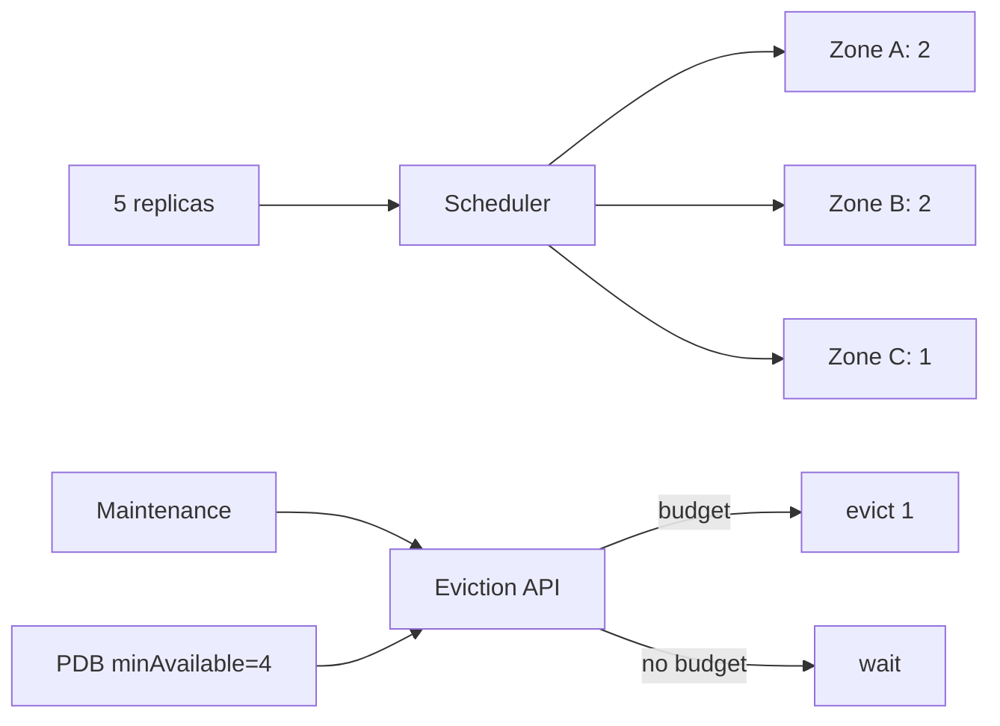

# Kubernetes Failure Domains, Topology Spread & PodDisruptionBudget

**Seviye:** Mid → Principal  
**Alan:** Cloud / DevOps / SRE

## Mental model
Replica sayısı availability'nin yalnız bir girdisidir. Kopyalar aynı failure domain'deyse correlated failure hepsini götürebilir. Placement, capacity ve disruption policy birlikte tasarlanır.

## Temel mekanikler
`topologySpreadConstraints`, matching Pod'ları node/zone gibi topology domain'leri arasında dağıtır. `maxSkew` izin verilen dengesizliği sınırlar; `DoNotSchedule` hard constraint, `ScheduleAnyway` soft preference'tır. PDB ise placement yapmaz: Eviction API üzerinden voluntary disruption sırasında `minAvailable` veya `maxUnavailable` sınırını uygular.

PDB involuntary node/cloud failure'ını önlemez. Ayrıca doğrudan Pod/Deployment silme PDB'yi bypass edebilir. Bu nedenle production HA; topology placement, readiness, graceful termination, spare capacity, autoscaling ve disruption policy'nin bileşimidir.

## Mülakat soruları
1. Üç replica neden HA garantisi değildir?
2. Topology spread ile anti-affinity farkı nedir?
3. PDB hangi disruption'ları kapsar?
4. 5 üyeli quorum sisteminde budget nasıl seçilir?
5. PDB + autoscaler + hard spread constraint nasıl operasyonel deadlock üretebilir?
6. N+1 zone kaybı için kapasiteyi nasıl planlarsın?

## Beklenen cevap derinliği
- **Mid:** node/zone failure domain, spread ve PDB ayrımı.
- **Senior:** quorum, readiness, drain ve capacity headroom.
- **Staff/Principal:** scheduler/autoscaler etkileşimi, maintenance throughput, blast radius ve availability economics.

## Mini alıştırma
3 zone'da 5 replica'yı `maxSkew: 1` ile dağıt. `minAvailable: 4` için voluntary eviction limitini hesapla. Bir zone tamamen kaybolduğunda PDB'nin neden koruma sağlayamadığını açıkla.

## Proje
5 replica'lı HTTP servisine topology spread + PDB ekle. Node drain ve zone-capacity-loss senaryolarında ready replicas, pending pods, eviction wait ve request error rate ölç.

## Failure modes ve production
PDB'yi HA garantisi sanmak, replacement için boş kapasite bırakmamak, tüm replica'ları tek zone'a koymak ve aşırı katı budget ile upgrade'i kilitlemek tipik hatalardır. `disruptionsAllowed`, ready replicas, pending pods, topology dağılımı, drain duration ve SLO error budget birlikte izlenmelidir.

## Kaynaklar
- Kubernetes — Disruptions: https://kubernetes.io/docs/concepts/workloads/pods/disruptions/
- Kubernetes — Pod Topology Spread Constraints: https://kubernetes.io/docs/concepts/scheduling-eviction/topology-spread-constraints/
- Kubernetes — Configure PDB: https://kubernetes.io/docs/tasks/run-application/configure-pdb/
- Kubernetes API — PDB: https://kubernetes.io/docs/reference/kubernetes-api/policy/pod-disruption-budget-v1/
