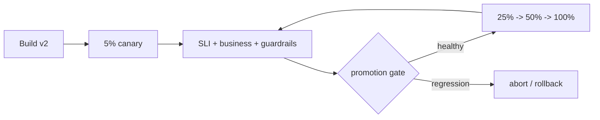

# Canary Analysis, Rollback Signals & Progressive Delivery

## Neden önemli?
Rolling deployment artifact dağıtımını kademelendirir; progressive delivery ise kullanıcı exposure'ını ölçüm ve karar döngüsüyle yönetir. Canary'nin amacı küçük blast radius altında yeni versiyonun baseline'a göre güvenli olup olmadığını production sinyalleriyle test etmektir.

## Mental model

Canary = küçük production deneyi + otomatik risk bütçesi. Traffic percentage tek başına güvenlik değildir; cohort temsil gücü, sinyal kalitesi, rollback kabiliyeti ve state compatibility birlikte gerekir.

## İçeride ne oluyor?
- Deployment ile release/exposure farklıdır; traffic routing veya feature flags bu katmanları ayırabilir.
- Canary cohort baseline ile benzer workload/failure-domain dağılımına sahip olmalıdır; aksi halde comparison bias oluşur.
- Promotion gate yalnız 5xx değil latency quantiles, saturation, queue depth, dependency errors ve business KPI içerebilir.
- Observation window ile minimum sample birlikte düşünülmelidir: kısa pencere rare failure'ları kaçırır, uzun pencere delivery'yi yavaşlatır.
- Rollback binary'yi geri alabilir ama schema/data side-effect'lerini otomatik geri almaz; expand/contract migration gerekebilir.
- Feature-flag evaluation failure'ında güvenli default kritik olabilir. OpenFeature specification abnormal evaluation'da supplied default value dönülmesini tanımlar.
- Evaluation context targeting için kullanılabilir; deterministik targeting key fractional rollout'ta cohort stability sağlar.
- Telemetry hooks flag evaluation'ını observability/tracking sistemine bağlayabilir.

## Mülakat soruları
1. Rolling deployment ile canary release farkı nedir?
2. Promotion gate için hangi metrikleri seçersin?
3. p50 iyi, p99 kötüleşirse ne yaparsın?
4. Canary cohort bias nasıl oluşur?
5. Database migration rollback'i neden zorlaştırır?
6. Noisy metric rollout oscillation'ı nasıl üretir?
7. Organization-wide promotion policy ve exception governance nasıl tasarlanır?
8. Reliability, velocity ve false rollback maliyetini nasıl dengelersin?

## Seviyeye göre cevap derinliği
- **Mid:** canary, rollback, health metric, traffic split.
- **Senior:** baseline comparison, sample/window, dependency ve schema compatibility.
- **Staff:** automated analysis, blast radius, guardrails, metric quality ve rollback semantics.
- **Principal:** platform policy, auditability, exception process, developer velocity ve cost.

## Mini alıştırma
Checkout servisi için 5%→25%→50%→100% rollout planı yaz. Her aşamada minimum observation window, p99 latency, error rate ve payment-success guardrail tanımla. Latency sağlıklı ama payment success %0.7 düşerse promotion kararını gerekçelendir.

## Proje fikri
`progressive-delivery-lab`: iki service version'ı deploy et; weighted routing ile canary traffic üret. Baseline/canary error-rate ve latency metriklerinden otomatik promote/abort kararı veren küçük controller yaz. Expand/contract schema migration ekle.

## Failure modes / trade-off / production
Canary node'larını farklı zone/hardware'a koyup sonucu version etkisi sanmak, yalnız aggregate metric kullanmak, düşük sample'da karar vermek, rollback'in data mutation'larını geri aldığını varsaymak, stale flag'leri temizlememek ve kill switch'i hiç tatbik etmemek yaygın failure mode'lardır. Progressive delivery ancak observability, compatibility ve incident response ile birlikte gerçek güvenlik mekanizmasına dönüşür.

## Kaynaklar
- OpenFeature Flag Evaluation: https://openfeature.dev/specification/sections/flag-evaluation/
- OpenFeature Evaluation Context: https://openfeature.dev/specification/sections/evaluation-context/
- OpenFeature Hooks: https://openfeature.dev/specification/sections/hooks/
- Argo Rollouts Canary: https://argoproj.github.io/argo-rollouts/features/canary/
