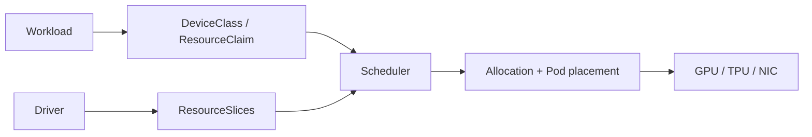

# Kubernetes Dynamic Resource Allocation for GPUs & Specialized Devices

## Neden önemli?
GPU, TPU ve NIC gibi cihazlarda yalnız adet istemek; model, memory, topology, sharing ve policy ihtiyaçlarını ifade etmekte yetersiz kalabilir. Kubernetes Dynamic Resource Allocation (DRA), cihaz seçimini structured claim modeline taşır. Core `resource.k8s.io/v1` API'leri Kubernetes 1.34'te GA oldu; 1.37'de DRA Extended Resource support da GA oldu.

## Mental model

Scheduler claim'e uygun cihazı ve o cihaza erişebilen node placement'ını birlikte çözmelidir.

## API rolleri
- `ResourceSlice`: driver'ın kullanılabilir device inventory'si.
- `DeviceClass`: admin tarafından tanımlanan reusable device sınıfı/policy yüzeyi.
- `ResourceClaim` / `ResourceClaimTemplate`: workload'un device ihtiyacı.
- Scheduler: claim allocation ile Pod placement koordinasyonu.
- Prioritized alternatives 1.36'dan beri stable; tercih edilen device yoksa kabul edilebilir fallback seçilebilir.
- 1.37 Extended Resource support legacy request yüzeyinden DRA-backed allocation'a migration köprüsü sunar.

## Mülakat derinliği
Senior aday claim/class/slice akışını; Staff topology, fragmentation, sharing ve RBAC'ı; Principal/CTO ise multi-cluster accelerator platformu, utilization, capacity, vendor ve inference/training unit economics trade-off'larını tartışmalıdır.

## Failure modes ve production
Stale inventory, driver/control-plane version skew, Pending claim, yanlış admin access, topology kaynaklı stranded capacity, fragmentation ve SLO'yu bozan fallback tipik risklerdir. Claim pending age, allocation latency, unschedulable reason, device utilization, fragmentation/idle capacity, driver health ve cost per workload unit izlenir.

## Alıştırma / proje
Heterogeneous A100/H100 cluster için DeviceClass ve prioritized request tasarla; H100 dolunca fallback'in latency/cost etkisini hesapla. Test cluster'da DRA inventory/allocation dashboard'u kur ve driver outage/device shortage fault injection uygula.

## Kaynaklar
- Kubernetes 1.37 DRA Updates (3 Eylül 2026): https://kubernetes.io/blog/2026/09/03/kubernetes-v1-37-dra-updates/
- DRA API Objects: https://kubernetes.io/docs/concepts/resource-management/dynamic-resource-allocation/dra-api/
- Kubernetes 1.34 DRA GA: https://kubernetes.io/blog/2025/09/01/kubernetes-v1-34-dra-updates/
- Kubernetes 1.36 release: https://kubernetes.io/blog/2026/04/22/kubernetes-v1-36-release/
- DRA cluster-admin good practices: https://kubernetes.io/docs/concepts/cluster-administration/dra/
