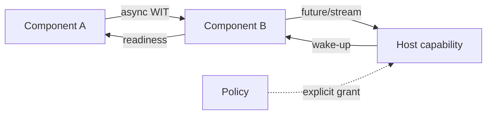

# WASI 0.3 Native Async, Component Boundaries & Capability Security

## Konu anlatımı
WebAssembly Component Model, farklı dillerdeki bileşenleri WIT typed interface'leri ve Canonical ABI üzerinden compose eder. WASI 0.3.0 (11 Haziran 2026) `async func`, `stream<T>` ve `future<T>` primitive'lerini Canonical ABI'ye taşıdı. Böylece 0.2'de component-local `wasi:io` pollable modelinin zorlandığı chained wake-up propagation, component sınırları boyunca native async olarak ifade edilebilir. WASI 0.3.1, 11 Ağustos 2026'da `map<K,V>` ile `implements`/`external-id` annotation'larını ekledi; Wasmtime 46+ 0.3'ü varsayılan destekler.

## Mental model

**Invariant:** component yalnız host'un bağladığı capability/interface yüzeyinden effect üretir; native async readiness component zincirinde compose olur.

## İçeride ne oluyor?
- WIT language-neutral interface contract'tır.
- Canonical ABI farklı dil memory/layout temsilini sınırda lower/lift eder.
- `async func`, `future<T>`, `stream<T>` asynchronous composition'ı ABI seviyesine taşır.
- Host 0.2 ve 0.3'ü yan yana destekleyebilir veya adapter/polyfill kullanabilir.
- Capability grant business authorization değildir; ikisi ayrı policy katmanlarıdır.
- WIT/runtime/toolchain version pinning deployment contract'ının parçasıdır.

## Mülakat soruları
1. Core Wasm module ile component farkı nedir?
2. WIT ve Canonical ABI hangi problemleri çözer?
3. WASI 0.3 native async neden daha composable?
4. `future<T>` ve `stream<T>` ne zaman kullanılır?
5. Capability-based binding ambient authority'yi nasıl azaltır?
6. Senior: migration/cancellation/backpressure riskleri nelerdir?
7. Staff/Principal: untrusted plugin platformunda tenant isolation ve resource quota nasıl tasarlanır?

## Beklenen cevap seviyesi
- **Mid:** module/component, WIT ve capability'yi ayırır.
- **Senior:** async composition, adapters, pinning, cancellation/backpressure ve limits'i tartışır.
- **Staff:** multi-language plugin platformu ve compatibility rollout tasarlar.
- **Principal:** runtime standardization, supply-chain trust, blast radius ve economics'i bağlar.

## Mini alıştırma
A component'i B'den streaming veri okuyup host object store'a yazsın. WIT sınırlarını, capability grant'leri, cancellation/backpressure akışını ve tenant authorization noktasını çiz.

## Proje fikri
`wasi-p3-plugin-lab`: iki dilde component, async WIT stream ve Wasmtime host. Minimum filesystem/network capability, denied-capability testleri ve slow-consumer backpressure ölçümü ekle.

## Failure modes / trade-off / production
Sandbox'ı business authorization sanmak, broad grant, version drift, unbounded buffering, cancellation propagation eksikliği ve CPU/memory/fuel limitsizliği tipik hatalardır. Instantiation latency, trap/error, capability denial, memory/CPU/fuel, backlog, cancellation latency ve version dağılımı izlenir.

## Kaynaklar
- WASI 0.3: https://wasi.dev/releases/wasi-p3
- WASI releases: https://wasi.dev/releases
- Native Async: https://component-model.bytecodealliance.org/design/async.html
- Canonical ABI: https://component-model.bytecodealliance.org/advanced/canonical-abi.html
- Wasmtime: https://component-model.bytecodealliance.org/running-components/wasmtime.html
