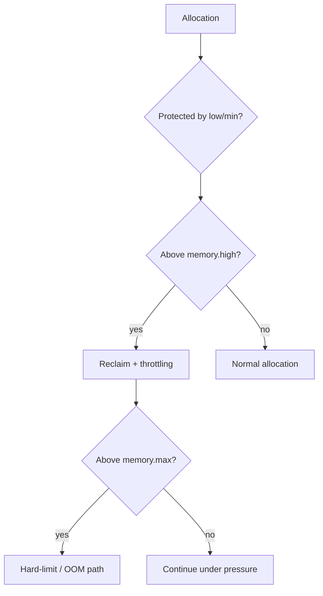

# Kubernetes Memory QoS, cgroup v2 & Memory Pressure Control

**Seviye:** Mid → Principal  
**Alan:** Cloud / DevOps / SRE

## Konu anlatımı
Kubernetes memory `request` scheduler placement'ına, `limit` hard resource boundary'ye katkı verir. Linux cgroup v2 ise runtime memory pressure davranışını `memory.min`, `memory.low`, `memory.high` ve `memory.max` gibi kontrollerle daha ayrıntılı yönetebilir. Kubernetes 1.37'de Memory QoS Beta'ya yükseldi ve feature gate varsayılan açık hale geldi. Ancak gate'in açık olması tek başına cgroup memory controls yazılacağı anlamına gelmez; kubelet Memory QoS configuration ayrıca etkinleştirilmelidir.

`memory.min` hard protection, `memory.low` best-effort protection, `memory.high` reclaim/throttling pressure boundary, `memory.max` hard ceiling mental modeliyle ayrılabilir. Memory QoS'un amacı OOM'u sihirli biçimde kaldırmak değil; pressure'ı daha erken görünür ve kontrollü hale getirmektir. Bunun karşılığında reclaim CPU maliyeti ve tail-latency artışı oluşabilir.

## Mental model

**Invariant:** scheduler request ile placement yapar; kernel/cgroup runtime pressure ve enforcement uygular. Reservation, throttling ve hard ceiling ayrı mekanizmalardır.

## İçeride ne oluyor?
- Scheduler request üzerinden node seçer.
- `memory.low` best-effort, `memory.min` hard protection semantiği taşır.
- `memory.high` aşımı reclaim/throttling ile allocation hızını geri besleyebilir.
- `memory.max` hard boundary'dir; reclaim yetmezse OOM mümkündür.
- Application heap/runtime hedefleri cgroup sınırlarıyla birlikte tasarlanmalıdır.
- Toplam protection ve overcommit node allocatable/headroom'dan kopuk olamaz.

## Mülakat soruları
1. Memory request ile limit arasındaki fark nedir?
2. `memory.high` ile `memory.max` neden aynı değildir?
3. `memory.low` ve `memory.min` nasıl ayrılır?
4. Memory QoS neden OOM killer'a göre daha kontrollü pressure feedback sağlayabilir?
5. Reclaim p99 latency'yi nasıl etkiler?
6. Senior: JVM/Go heap target ile cgroup boundary'yi nasıl uyumlarsın?
7. Staff: node overcommit ve workload QoS class'larını nasıl tasarlarsın?
8. Principal: fleet rollout, SLO ve capacity economics'i nasıl dengelersin?

## Beklenen cevap seviyesi
- **Mid:** request/limit/cgroup/OOM ayrımını yapar.
- **Senior:** reclaim, throttling, heap ve tail latency'yi bağlar.
- **Staff:** overcommit, workload class, sidecar ve rollout tasarlar.
- **Principal:** fleet policy, headroom, SLO ve maliyet/risk optimizasyonunu yönetir.

## Mini alıştırma
8 GiB node için üç workload'a request/limit ve pressure protection planı çiz. Bir workload'ın p99 latency'si reclaim yüzünden bozulduğunda hangi metriğe bakacağını ve hangi boundary'yi değiştireceğini yaz.

## Proje fikri
`memory-qos-lab`: cgroup v2 cluster'da bursty allocator, JVM/Go service ve sidecar çalıştır. Memory QoS açık/kapalı karşılaştır; RSS/working-set, PSI, `memory.events`, OOM, reclaim ve p95/p99 latency ölç.

## Failure modes / trade-off / production bağlantısı
Feature gate açık diye policy aktif sanmak, protection toplamını node capacity'den koparmak, `memory.high` latency maliyetini ölçmemek ve yalnız RSS izlemek tipik hatalardır. Production'da working set/RSS, `memory.current/events`, PSI, OOM/eviction, reclaim, p99 latency ve allocatable/headroom izlenir.

## Kaynaklar
- Kubernetes — Memory QoS graduates to Beta, 14 Eylül 2026: https://kubernetes.io/blog/2026/09/14/kubernetes-v1-37-memory-qos-graduates-to-beta/
- Kubernetes 1.37 — 26 Ağustos 2026: https://kubernetes.io/releases/1.37/
- Linux kernel — cgroup v2: https://docs.kernel.org/admin-guide/cgroup-v2.html
- Kubernetes — Resource Management: https://kubernetes.io/docs/concepts/configuration/manage-resources-containers/
