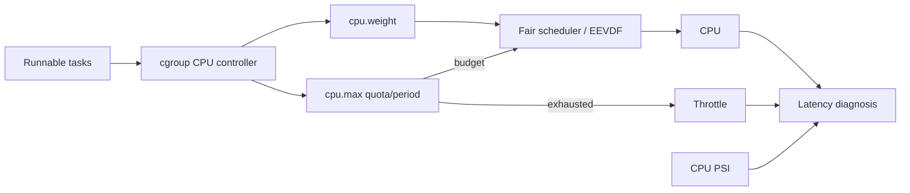

# cgroup CPU Control, Throttling, PSI & Scheduler Latency

**Seviye:** Mid → Principal  
**Alan:** Linux / Cloud / SRE

## Konu anlatımı
Linux scheduler runnable task'lar arasında CPU zamanı dağıtır; cgroup v2 CPU controller ise workload gruplarının CPU payını ve üst sınırını şekillendirir. `cpu.weight` sibling cgroup'lar arasında göreli, work-conserving paydır. `cpu.max` `$MAX $PERIOD` biçiminde bandwidth ceiling uygular. Quota bittiğinde task runnable olsa bile replenishment'a kadar throttle edilebilir. Bu nedenle host CPU utilization tek başına service'in CPU beklemediğini kanıtlamaz.

Modern Linux fair scheduling hattı EEVDF yönüne geçmiştir. Scheduler'ın “hangi runnable task?” kararı ile cgroup'un “bu grubun budget'ı var mı?” enforcement'ı ayrı katmanlardır.

## Mental model
İki kapı düşün: scheduler kapısı runnable task'lar arasından sıradakini seçer; cgroup budget kapısı grubun CPU kullanıp kullanamayacağını sınırlar. Utilization, throttling ve pressure aynı metrik değildir.

## İçeride ne oluyor?
1. Task runnable olup runqueue'ya girer.
2. Scheduler fairness/priority kurallarıyla execution sırasını belirler.
3. `cpu.weight` contention altında göreli payı etkiler.
4. `cpu.max` quota/period ile hard bandwidth ceiling uygular.
5. `cpu.stat` throttling etkisini görünür kılar; ancestor cgroup limitleri descendant'ları da etkileyebilir.
6. PSI CPU/memory/I/O contention nedeniyle workload'un ne kadar stall olduğunu ölçer; per-cgroup pressure dosyaları workload-local teşhis sağlar.

## Mülakat soruları
1. `nice`, `cpu.weight` ve `cpu.max` farkı nedir?
2. Node CPU düşük görünürken container neden throttled olabilir?
3. Quota/period neden yalnız “core sayısı” değildir?
4. CPU PSI ile utilization/load average farkı nedir?
5. p99 yükselirken hangi `cpu.stat`, PSI ve scheduler sinyallerini korele edersin?
6. Ancestor cgroup quota blast radius'unu nasıl teşhis edersin?

## Beklenen cevap seviyesi
- **Mid:** runnable, weight ve quota ayrımı.
- **Senior:** throttling, burstiness, PSI ve tail latency korelasyonu.
- **Staff/Principal:** hierarchy, noisy-neighbor, workload classes, SLO/capacity policy ve ölçüm planı.

## Mini alıştırma
`cpu.max = 200000 100000` için teorik CPU-core eşdeğerini hesapla. Node CPU %55 iken throttled time ve CPU PSI yükseliyorsa üç hipotez ve doğrulama metriği yaz.

## Proje fikri
`cpu-pressure-lab`: latency-sensitive HTTP worker ile CPU-bound batch worker'ı cgroup v2 altında çalıştır. `cpu.weight`/`cpu.max` kombinasyonlarını değiştir; throughput, p50/p99, `cpu.stat`, host ve per-cgroup PSI ölç.

## Failure modes / trade-off / production
Average utilization'a bakarak CPU limitini küçültmek bursty workload'da p99'u bozabilir. Gevşek limit noisy-neighbor riskini, sıkı quota throttling'i artırır. `cpu.weight` garanti edilmiş kapasite değildir. PSI semptomu ölçer, root cause'u tek başına vermez. Kubernetes/container CPU request/limit davranışını teşhis ederken kernel cgroup metriklerine inmek gerekir.

## Kaynaklar
- Linux Kernel — Control Group v2: https://docs.kernel.org/admin-guide/cgroup-v2.html
- Linux Kernel — PSI: https://docs.kernel.org/accounting/psi.html
- Linux Kernel — EEVDF Scheduler: https://docs.kernel.org/scheduler/sched-eevdf.html
