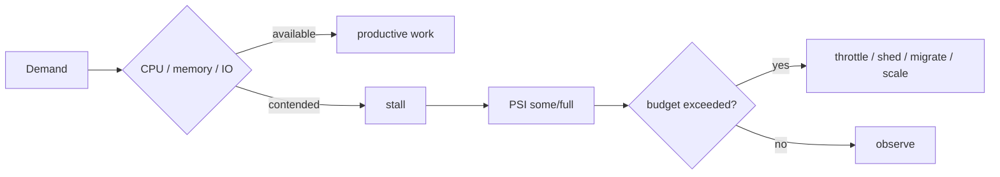

# Linux PSI, Stall Budgets & Pressure-Aware Load Shedding

## Konu anlatımı
Linux Pressure Stall Information (PSI), CPU, memory ve I/O kıtlığının workload ilerlemesini ne kadar süre durdurduğunu ölçer. Utilization kapasitenin ne kadar kullanıldığını, PSI ise saturation'ın uygulamaya verdiği zaman kaybını gösterir. Sistem düzeyi `/proc/pressure/{cpu,memory,io}`, cgroup v2 düzeyi ise `cpu.pressure`, `memory.pressure`, `io.pressure` dosyalarıdır.

`some`, en az bir işin resource beklediği zaman payını; `full`, tüm non-idle işlerin aynı anda stall olduğu ağır baskıyı gösterir. `avg10`, `avg60`, `avg300` trendleri; `total` toplam stall süresini verir. Kernel threshold trigger API'si, belirli bir zaman penceresinde stall budget aşılınca `poll/epoll` ile event üretir.

## Mental model

**Invariant:** utilization ile stall aynı sinyal değildir; overload policy gerçek workload ilerleme kaybını da ölçmelidir.

## İçeride ne oluyor?
- Kernel resource bekleme sürelerini aggregate eder.
- `some` kısmi, `full` sistem/workload çapında ağır stall durumunu ayırır.
- cgroup PSI multi-tenant workload isolation analizinde host PSI'dan daha lokal sinyal sağlar.
- Trigger formatı `<some|full> <stall_us> <window_us>` şeklindedir.
- Event-driven userspace controller pressure oluşunca admission/concurrency/load-shed kararı verebilir.

## Mülakat soruları
1. Utilization ve saturation neden farklıdır?
2. PSI some/full nasıl yorumlanır?
3. Memory PSI yüksek ama RSS sabitse ne araştırırsın?
4. I/O PSI ile disk throughput neden aynı şey değildir?
5. cgroup PSI ile host PSI birlikte nasıl kullanılır?
6. Staff: autoscaling yerine ne zaman admission control seçersin?
7. Principal: stall budget'ı SLO ve capacity economics'e nasıl bağlarsın?

## Beklenen cevap seviyesi
- **Mid:** utilization/saturation/stall ayrımını doğru yapar.
- **Senior:** PSI'ı reclaim, queue, latency ve cgroup telemetry ile korele eder.
- **Staff:** hysteresis/cooldown içeren pressure-aware control loop tasarlar.
- **Principal:** workload sınıfına göre stall budget ve isolation standardı belirler.

## Mini alıştırma
CPU %45, `memory.pressure some avg10=18`, `full avg10=7`, p99 latency 4x olan bir pod için beş dakikalık incident planı ve load-shed threshold'u yaz.

## Proje fikri
`psi-pressure-controller`: cgroup PSI threshold aşılınca worker concurrency azaltan daemon. Synthetic pressure altında p99 latency, throughput, some/full, shed ratio ve recovery time ölç.

## Failure modes / trade-off / production bağlantısı
PSI'ı utilization sanmak, yalnız uzun ortalamaya bakmak, host ve cgroup sinyalini karıştırmak, workload baseline olmadan threshold kopyalamak ve hysteresis olmadan controller çalıştırmak tipik hatalardır. Production'da PSI; latency, queue depth/age, reclaim, OOM, throttling ve shed rate ile birlikte izlenir.

## Kaynaklar
- Linux Kernel PSI: https://docs.kernel.org/accounting/psi.html
- Linux Kernel cgroup v2: https://docs.kernel.org/admin-guide/cgroup-v2.html
