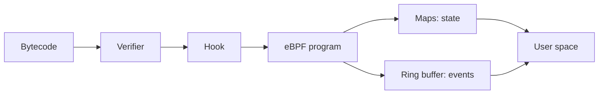

# eBPF Verifier, Maps, Ring Buffer & Production Observability

## Neden önemli?
eBPF; tracing, networking ve security telemetry'sini kernel path'ine yakın noktada programlanabilir biçimde toplar. Production tasarımında asıl konu yalnız hook yazmak değil, verifier safety modelini, state/event taşıma mekanizmalarını ve observability overhead budget'ını birlikte yönetmektir.

## Mental model

**Verifier = proof gate; map = shared state; ring buffer = event conveyor.**

## Verifier
Verifier register/stack state, pointer type, bounds/alignment ve execution paths hakkında bilgi izleyerek unsafe memory access gibi durumları reddeder. State pruning analizin gereksiz path explosion'ını azaltır. Verifier rejection çoğu zaman programın kernel'in kanıtlayabildiği güvenli alt kümeye uymadığını gösterir.

## Maps ve event taşıma
BPF maps kernel ile user-space arasında state paylaşır. Hash/array/per-CPU gibi tasarımlar farklı contention, memory ve aggregation özellikleri taşır. Per-CPU aggregation hot shared counters'ı azaltabilir; global görünüm için merge gerekir.

`BPF_MAP_TYPE_RINGBUF` event stream için ortak MPSC ring buffer sağlar. Linux kernel dokümantasyonu tasarım motivasyonları arasında CPU'lar arasında daha verimli memory kullanımı ve sequential cross-CPU event ordering'i korumayı sayar.

## Production tasarım ilkeleri
- Raw-event streaming yerine mümkün olduğunda kernel-side aggregation değerlendir.
- Cardinality, event rate, lost-event/drop oranı, agent CPU/RSS ve application p99'u birlikte ölç.
- Kernel/capability compatibility matrix tut.
- Privilege boundary'yi minimum yetkiyle tasarla.
- Canary, overhead budget ve kill-switch ile fleet rollout yap.
- Per-CPU state'in merge semantics'ini açıkça tanımla.

## Mülakat derinliği
- **Mid:** verifier, hook, map ve user-space agent zinciri.
- **Senior:** pointer/bounds safety, per-CPU maps, ring-buffer loss ve overhead.
- **Staff:** sampling/aggregation, compatibility, rollout ve SLO budget.
- **Principal:** fleet governance, privilege model, blast radius ve observability platform economics.

## Failure modes / trade-off
Her eventi user-space'e göndermek CPU/copy/serialization maliyeti yaratır. Fazla kernel-side aggregation debugging ayrıntısını kaybettirir. Shared maps contention yaratabilir; per-CPU maps memory/merge maliyeti getirir. Observability aracının kendisi latency ve availability riskidir; overhead ayrı bir production SLO olarak izlenmelidir.

## Kaynaklar
- Linux Kernel — eBPF verifier: https://docs.kernel.org/bpf/verifier.html
- Linux Kernel — BPF maps: https://docs.kernel.org/bpf/maps.html
- Linux Kernel — BPF ring buffer: https://docs.kernel.org/bpf/ringbuf.html
