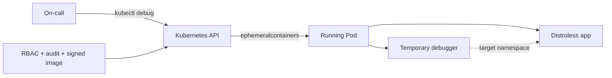

# Kubernetes Ephemeral Containers, Distroless Debugging & Privilege Boundaries

## Konu anlatımı
Minimal/distroless container image'ları attack surface ve dependency yükünü azaltır; fakat production debugging sırasında shell ve teşhis araçları bulunmayabilir. Kubernetes ephemeral containers, çalışan Pod'u yeniden build/restart etmeden geçici bir debug container eklemeyi sağlar. Bunlar normal sidecar değildir: application lifecycle'ın kalıcı parçası olmak için tasarlanmamıştır ve container spec'in port/probe/resources gibi bazı alanlarını desteklemez.

`kubectl debug` pratik giriş noktasıdır. `--target` ile hedef container'ın process namespace'ine erişim runtime desteğine bağlıdır. Güçlü debug profilleri Linux capabilities ve namespace görünürlüğünü genişletebildiğinden ephemeral debugging aynı zamanda bir security-boundary problemidir.

## Mental model

**Invariant:** Debug araçlarını production image'a kalıcı koymak zorunda değilsin; debug container'a verilen yetki ise production trust boundary'sinin parçasıdır.

## İçeride ne oluyor?
1. Ephemeral container özel `ephemeralcontainers` subresource'u üzerinden mevcut Pod'a eklenir.
2. Pod'un network/storage bağlamının bir kısmını paylaşabilir; process görünürlüğü namespace/runtime desteğine bağlıdır.
3. Ephemeral container workload/sidecar yerine kullanılmamalıdır; lifecycle ve spec yetenekleri farklıdır.
4. Distroless app image ile tooling/debug image ayrıştırılabilir.
5. Pod debug ile node debug farklı blast radius'lara sahiptir; node debug host görünürlüğünü ciddi biçimde artırabilir.
6. RBAC, audit, image provenance, JIT access ve incident prosedürü birlikte tasarlanmalıdır.

## Mülakat soruları
- Distroless image neden faydalı, neden debugging'i zorlaştırır?
- Ephemeral container ile sidecar arasındaki fark nedir?
- `kubectl exec` yerine `kubectl debug` ne zaman gerekir?
- `--target` neyi amaçlar?
- Senior: privileged debug erişimini nasıl sınırlandırırsın?
- Staff: signed debug image + RBAC + audit + JIT authorization modelini nasıl kurarsın?

## Beklenen cevap seviyesi
- **Junior:** minimal image ve ephemeral debugger ayrımını bilir.
- **Mid:** namespace/lifecycle kısıtlarını ve debug akışını açıklar.
- **Senior:** capabilities, RBAC, audit ve least privilege'ı bağlar.
- **Staff:** incident access'i supply-chain policy ve forensic evidence ile sistemleştirir.

## Kısa alıştırma
Shell içermeyen bir API Pod'unda DNS timeout için `logs → ephemeral nslookup/curl → gerekiyorsa packet capture` sırasını tasarla ve her adımın minimum privilege'ını yaz.

## Proje fikri
`k8s-debug-lab`: distroless HTTP app deploy et, `kubectl exec` kısıtını gözle, ephemeral container ile process/network teşhisi yap ve farklı debug profillerini least-privilege açısından karşılaştır.

## Failure modes / trade-off / production
Aşırı yetkili debugger isolation'ı zayıflatabilir. Rastgele registry image'ı supply-chain riskidir. Packet capture secret/müşteri verisi taşıyabilir. Debug container zaten baskı altındaki node'u zorlayabilir. Production'da debug subresource audit event'leri, image digest, privilege profile, session süresi ve node pressure izlenmelidir.

## Kaynaklar
- Kubernetes — Ephemeral Containers: https://kubernetes.io/docs/concepts/workloads/pods/ephemeral-containers/
- Kubernetes — Debug Running Pods: https://kubernetes.io/docs/tasks/debug/debug-application/debug-running-pod/
- Kubernetes — kubectl debug: https://kubernetes.io/docs/reference/kubectl/generated/kubectl_debug/
