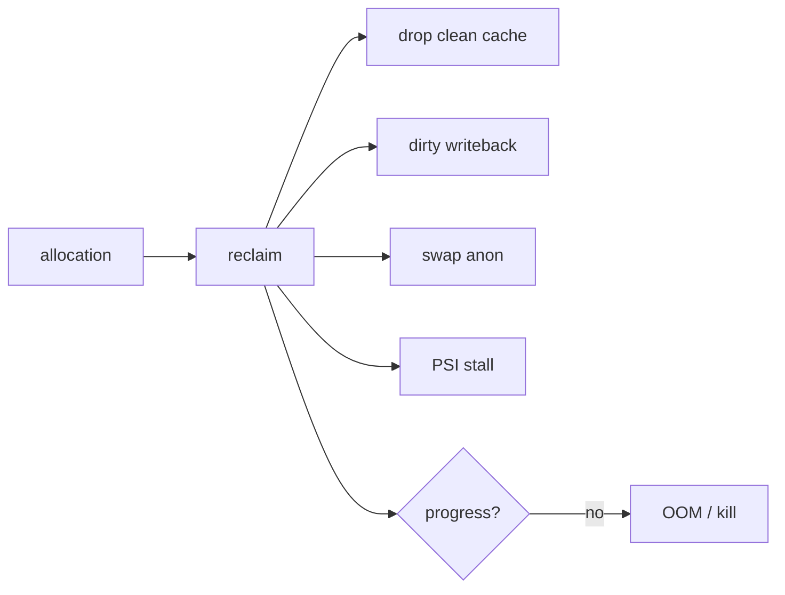

# Linux Memory Reclaim, PSI, cgroup v2 & OOM

## Neden önemli?
Linux'ta düşük `free memory` tek başına arıza değildir; page cache RAM'i faydalı kullanır. Production sorusu allocation baskısı geldiğinde kernel'in belleği ne kadar hızlı reclaim edebildiği ve bunun uygulama latency'sine nasıl yansıdığıdır.

## Mental model

RAM depo doluluğu değil, sürekli devreden working set'tir. Reclaim raf boşaltma; PSI ise çalışanların kaynak beklerken kaybettiği zamandır.

## İçeride ne oluyor?
- Clean file-backed pages yeniden okunabildiği için reclaim edilebilir; dirty pages writeback ister.
- Anonymous memory swap varsa dışarı taşınabilir; yoksa reclaim seçenekleri daralır.
- Direct reclaim request thread'inin tail latency'sini yükseltebilir.
- cgroup v2'de `memory.low` best-effort protection, `memory.min` hard protection, `memory.high` reclaim/throttling boundary, `memory.max` hard limit sağlar.
- PSI `some` en az bazı task'ların, `full` ise tüm non-idle task'ların aynı anda stall olduğu zamanı görünür kılar.
- Reclaim ilerleyemezken allocation/limit baskısı sürerse OOM kararı oluşabilir.

## Mülakat soruları
1. Neden düşük free RAM tek başına problem değildir?
2. Page cache ile anonymous memory reclaim açısından nasıl farklıdır?
3. Direct reclaim p99 latency'yi nasıl etkiler?
4. `memory.high` ile `memory.max` farkı nedir?
5. RSS normal görünürken PSI neden yüksek olabilir?
6. Staff/Principal: multi-tenant platformda memory protection ve OOM blast radius politikasını nasıl kurarsın?

## Beklenen cevap seviyesi
- **Mid:** page cache, anon, reclaim, swap, OOM.
- **Senior:** direct/background reclaim, dirty writeback, cgroup v2, PSI.
- **Staff:** isolation, pressure SLO, capacity headroom ve latency correlation.
- **Principal:** fleet defaults, noisy-neighbor containment ve cost/headroom standardı.

## Mini alıştırma
RSS 6 GiB, `memory.max=8GiB`; p99 yükselirken `memory.pressure some` artıyor. OOM beklemeden `memory.current/events`, PSI, page faults, reclaim ve swap I/O zincirini inceleyen incident planı yaz.

## Proje fikri
`memory-pressure-lab`: cgroup v2 altında anon ve file-cache workload üret; `memory.high/max` değiştirerek PSI, reclaim, major faults ve latency'yi kaydet.

## Failure modes / trade-off / production bağlantısı
Yalnız RSS/OOM izlemek reclaim stall'larını geç yakalar. Aşırı `memory.min` diğer workload'ları aç bırakabilir. Swap kapasite sağlar ama tail latency maliyeti yaratabilir. PSI, working set/RSS, faults, reclaim, swap I/O, OOM ve app p95/p99 birlikte korele edilmelidir.

## Kaynaklar
- Linux kernel — PSI: https://docs.kernel.org/accounting/psi.html
- Linux kernel — cgroup v2 memory controller: https://docs.kernel.org/admin-guide/cgroup-v2.html
- Linux kernel — Multi-Gen LRU: https://docs.kernel.org/admin-guide/mm/multigen_lru.html
