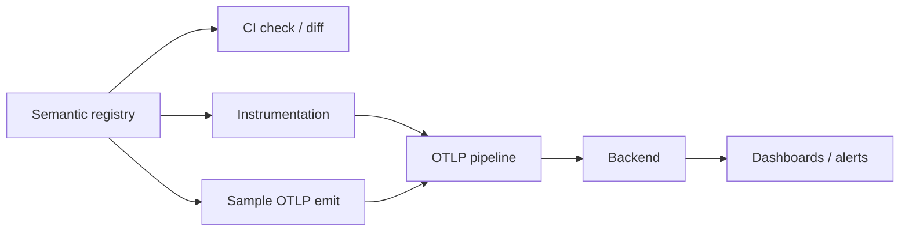

# OpenTelemetry Weaver, Semantic Registries & Telemetry Contracts

## Neden önemli?
Observability'nin ölçek problemi yalnız telemetry taşımak değildir; metric/log/trace verisinin anlam sözleşmesini takımlar arasında korumaktır. OpenTelemetry semantic conventions ortak vocabulary sağlar. Weaver registry validation, diff ve sample telemetry üretimini CI/CD'ye taşıyarak telemetry schema'yı API contract gibi yönetmeyi sağlar.

## Mental model

**Invariant:** producer ve consumer aynı semantic contract'ı paylaşmalıdır; isim aynı olsa bile unit/anlam/cardinality drift'i observability correctness'ini bozar.

## İçeride ne oluyor?
- Registry attribute/entity/signal semantic'lerini versionlanabilir tanımlar.
- Weaver `registry check` schema ve policy consistency'yi CI'da doğrular.
- Registry diff telemetry evolution'ını review edilebilir yapar.
- `registry emit` uygulama instrumentation'ı hazır olmadan sample OTLP üretip dashboard/alert contract'ını test eder.
- Custom registry upstream OTel conventions'ı domain-specific vocabulary ile extend edebilir.
- Unit, allowed values, stability ve cardinality backend correctness/maliyet sözleşmesidir.

## Mülakat soruları
1. Semantic convention neden naming convention'dan fazlasıdır?
2. Metric unit değişimi neden breaking olabilir?
3. High-cardinality attribute hangi production sorunlarını doğurur?
4. Registry CI gate'in faydası nedir?
5. Sample telemetry dashboard geliştirmeyi nasıl öne çeker?
6. Senior: schema rename migration'ında compatibility nasıl korunur?
7. Staff: company registry ile upstream OTel ownership nasıl yönetilir?
8. Staff: runtime telemetry drift nasıl tespit edilir?

## Beklenen cevap derinliği
- **Junior:** metric/log/trace ve attribute ayrımı.
- **Mid:** semantic convention, unit ve cardinality etkisi.
- **Senior:** schema evolution, compatibility, CI validation ve ingest cost.
- **Staff:** telemetry governance, registry ownership ve rollout standardı.

## Mini alıştırma
Checkout servisi için duration/result/customer-segment contract'ı tasarla. Unit, allowed values ve cardinality yaz; duration unit migration planı çıkar.

## Proje
`telemetry-contract-lab`: custom registry + CI check + sample OTLP emit; iki version arasında breaking diff ve dashboard contract testleri üret.

## Failure modes / production
Serbest attribute naming, request/user ID'yi metric label yapmak, unit'i önemsiz sanmak, rename'i tek deploy'da yapmak ve registry owner koymamak tipik hatalardır. Unknown/deprecated attribute, cardinality growth, ingest cost, dropped points, schema adoption ve broken alert/query sinyalleri izlenir.

## Güncel not
OpenTelemetry declarative SDK configuration modelinin temel parçaları 5 Mart 2026'da stable ilan edildi. Instrumentation behavior ile telemetry schema ayrı fakat versionlanabilir contracts olarak yönetilebilir.

## Kaynaklar
- OpenTelemetry — Semantic Convention Registry: https://opentelemetry.io/docs/specs/semconv/registry/
- OpenTelemetry — Observability by Design / Weaver: https://opentelemetry.io/blog/2025/otel-weaver/
- OpenTelemetry — Declarative configuration stable, 5 Mart 2026: https://opentelemetry.io/blog/2026/stable-declarative-config/
