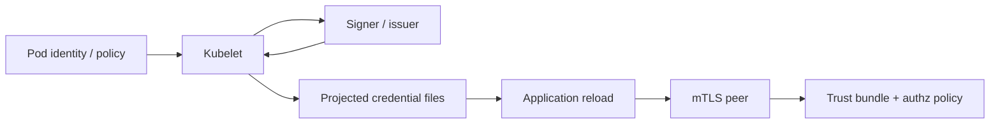

# Kubernetes Pod Certificates, Workload Identity & Rotation Semantics

## Konu anlatımı
Kubernetes `podCertificate` projected volume, Pod'a client veya server kimliği olarak kullanılabilecek private key + X.509 certificate chain sağlar. Özellik v1.34'te alpha olarak başladı ve güncel Kubernetes v1.37 dokümantasyonunda stable/enabled-by-default durumundadır. Kubelet credential'ı expiration yaklaşınca yeniler; uygulamanın dosya değişimini izleyip yeni credential'ı reload etmesi gerekir.

Short-lived workload identity static Secret dağıtımına göre credential theft'in faydalı ömrünü küçültebilir, ancak authentication authorization değildir. Sertifikanın hangi resource/action için yetki verdiği ayrıca policy katmanında tanımlanmalıdır.

SPIFFE benzer problemi workload-centric identity modeliyle ele alır: SPIFFE ID kimliği, X509-SVID cryptographic proof'u, trust bundle doğrulama köklerini taşır. Kubernetes podCertificate ve SPIFFE aynı ürün değildir; issuance, rotation, identity binding, trust distribution ve authorization sınırlarıyla karşılaştırılmalıdır.

## Mental model

**Invariant:** Rotation ancak consumer yeni key/certificate'i reload ederse tamamlanır; authentication kimliği kanıtlar, authorization yetkiyi ayrıca belirler.

## İçeride ne oluyor?
- `signerName` issuer/signer seçer; signer isteği reddedebilir.
- `keyType` ED25519, ECDSA ve RSA seçeneklerini destekler.
- `maxExpirationSeconds` kabul edilen üst lifetime sınırıdır; signer daha kısa lifetime verebilir.
- Kubelet key/certificate chain'i projection'a yazar ve expiry yaklaşınca refresh eder.
- Uygulama `inotify`, polling veya library callback ile reload etmelidir.
- SPIFFE X509-SVID'de SPIFFE ID URI SAN içinde taşınır; trust bundle peer doğrulamasında kullanılır.

## Yüksek getirili mülakat soruları
1. Static Secret ile short-lived workload certificate arasındaki risk farkı nedir?
2. Rotation neden yalnız issuer/kubelet problemi değildir?
3. Authentication ve authorization nasıl ayrılır?
4. mTLS'de trust bundle ne işe yarar?
5. Çok kısa lifetime hangi availability/cost sorunlarını yaratır?
6. Senior: reload başarısızlığını production'da nasıl tespit edersin?
7. Staff: signer outage sırasında mevcut ve yeni bağlantılar nasıl davranmalı?
8. Principal: native pod certificates, SPIFFE/SPIRE veya service-mesh identity arasında nasıl seçim yaparsın?

## Seviyeye göre cevap derinliği
- **Mid:** certificate/key/trust bundle ve rotation lifecycle.
- **Senior:** reload, expiry, clock skew, issuer outage ve mTLS failure.
- **Staff:** identity binding, federation, policy distribution ve telemetry.
- **Principal:** platform standardı, CA blast radius, migration, interoperability ve compliance.

## Kısa alıştırma
30 dakikalık certificate kullanan servis için refresh başlangıcını, 10 dakikalık signer outage retry/backoff'unu ve reload'u kanıtlayan metric/log'u tasarla.

## Proje fikri
`pod-cert-rotation-lab`: iki demo servis arasında mTLS kur; certificate serial/expiry, reload latency ve issuer outage davranışını ölç. Eski connection ile yeni handshake'i ayrı gözlemle.

## Failure modes / trade-off / production bağlantısı
Mount edip reload'u unutmak, identity'yi authorization sanmak, aşırı kısa TTL ile issuer load'unu artırmak, clock skew/CA rotation/trust-bundle rollout'unu atlamak ve private-key permission'larını gevşek bırakmak tipik hatalardır. Certificate time-to-expiry, refresh/reload success, issuance latency/error, TLS handshake failure, authorization deny, signer availability ve trust-bundle version izlenir.

## Kaynaklar
- Kubernetes Projected Volumes — podCertificate: https://kubernetes.io/docs/concepts/storage/projected-volumes/
- Kubernetes v1.34 docs — alpha başlangıcı: https://v1-34.docs.kubernetes.io/docs/concepts/storage/projected-volumes/
- SPIFFE — Working with SVIDs: https://spiffe.io/docs/latest/deploying/svids/
- SPIFFE — X509-SVID: https://spiffe.io/docs/latest/spiffe-specs/x509-svid/
