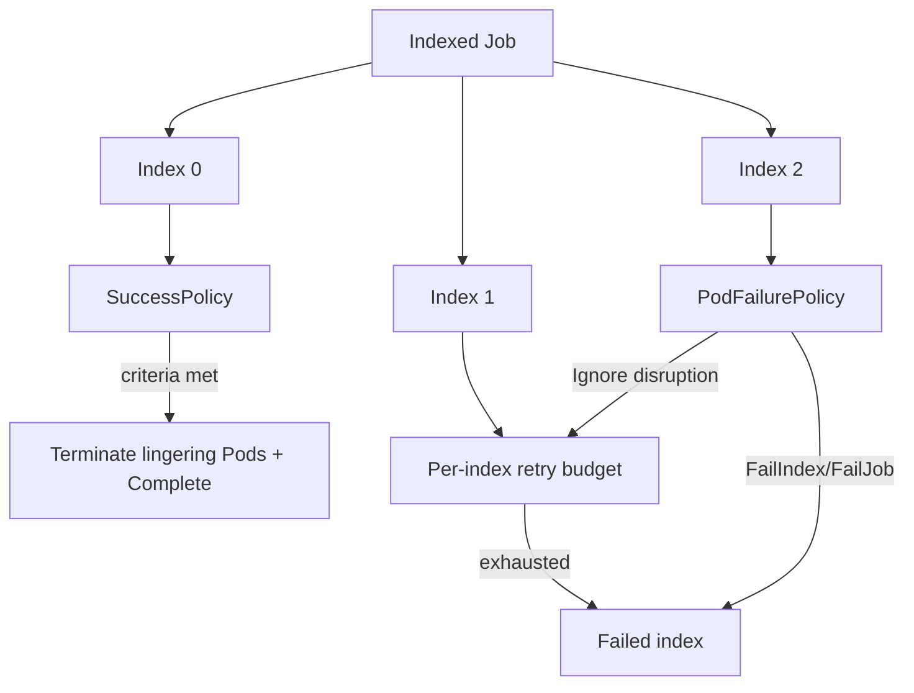

# Kubernetes Indexed Jobs, SuccessPolicy & Failure Budgets

## Konu anlatımı
Kubernetes Indexed Jobs büyük batch işlerini deterministik index'lere böler. Modern Job API'si başarı ve failure semantics'i politika olarak ifade eder: `successPolicy` ve `backoffLimitPerIndex` v1.33'te stable/GA, `podFailurePolicy` v1.31'den beri stable'dır. Bu model simulation, ML evaluation, test sharding ve paralel data processing için retry maliyetini correctness'ten ayırmaya yardım eder.

## Mental model

**Invariant:** Retry transient failure içindir; deterministic bug'ı tekrar çalıştırmak reliability değil kaynak tüketimidir.

## İçeride ne oluyor?
- `completionMode: Indexed` Pod'lara stabil completion index verir.
- `backoffLimitPerIndex` poison shard'ın diğer shard retry bütçesini tüketmesini engeller.
- `maxFailedIndexes` toplam kabul edilebilir failed-index sınırıdır.
- `podFailurePolicy` exit code veya Pod condition'a göre `Ignore`, `Count`, `FailIndex`, `FailJob` seçebilir ve `restartPolicy: Never` gerektirir.
- `successPolicy`, belirli index'ler veya başarılı index sayısı üzerinden erken başarı tanımlayabilir; kriter sağlanınca kalan Pod'lar sonlandırılır.

## Mülakat soruları
1. Job ile Deployment lifecycle farkı nedir?
2. Global backoff neden heterojen shard'larda kötüdür?
3. Hangi failure `Ignore`, `Count`, `FailIndex`, `FailJob` olmalıdır?
4. Erken başarı correctness'i ne zaman bozar?
5. Senior: spot/preemptible node batch maliyeti nasıl düşürülür?
6. Staff: 100k shard için retry storm ve API-server pressure nasıl sınırlanır?
7. Staff: `%99 shard success` ile `tüm kritik shard'lar success` nasıl modellenir?

## Beklenen cevap derinliği
- **Junior:** Job/Pod, completion ve retry.
- **Mid:** indexed shard, per-index backoff ve failure policy.
- **Senior:** deterministic/transient/disruption sınıflandırması, cost ve deadline.
- **Staff:** workload-level success semantics, capacity isolation, observability ve scale.

## Mini alıştırma
20 index'li test Job'unda exit 42 deterministic bug, 137 memory pressure, `DisruptionTarget` node disruption olsun. Her biri için policy aksiyonu, retry bütçesi ve Job success kriteri belirle.

## Proje fikri
30 shard'lı Indexed Job kur; deterministic ve transient failure enjekte et. `backoffLimitPerIndex`, `maxFailedIndexes`, `podFailurePolicy`, `successPolicy` kombinasyonlarında Pod starts, completion time ve wasted CPU-seconds ölç.

## Failure modes / trade-off / production
Her hatayı retry etmek, exit-code contract'ını belgesiz bırakmak, disruption'ı app failure saymak, success policy ile eksik sonucu sessiz kabul etmek, aşırı parallelism ve cleanup eksikliği başlıca risklerdir. Completed/failed index, retry/index, exit reason, queue-to-start latency, active Pods, CPU/GPU waste, deadline miss ve result completeness izlenmelidir.

## Kaynaklar
- https://kubernetes.io/docs/concepts/workloads/controllers/job/
- https://kubernetes.io/blog/2025/05/15/kubernetes-1-33-jobs-success-policy-goes-ga/
- https://kubernetes.io/blog/2025/05/13/kubernetes-1-33-jobs-backoff-limit-per-index-goes-ga/
- https://kubernetes.io/docs/tasks/job/pod-failure-policy/
