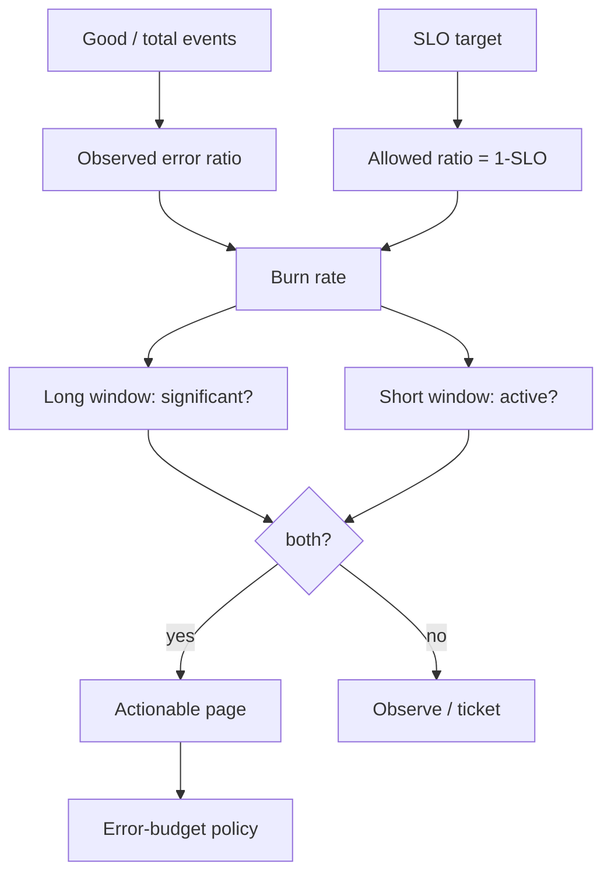

# Multiwindow Multi-Burn-Rate SLO Alerting & Reliability Governance

**Seviye:** Senior → CTO  
**Alan:** Cloud / SRE / Leadership

## Konu anlatımı
SLO, kullanıcıya sunulan reliability hedefidir; error budget `1-SLO` ile ürün hızına harcanabilecek reliability riskini nicelleştirir. Burn rate, gözlenen hata oranının izin verilen hata oranına göre hızıdır. Burn=1 bütçeyi SLO penceresinde; burn=10 yaklaşık onda bir sürede tüketir.

Tek kısa alert window hızlı ama gürültülü, tek uzun window hassas ama geç reset olur. Multiwindow multi-burn-rate yaklaşımı uzun pencerede anlamlı budget tüketimini ve kısa pencerede problemin hâlâ aktif olmasını birlikte doğrular. 30 günlük 99.9% SLO için Google SRE başlangıç örneğinde 14.4x burn 1h+5m pencerelerinde page, 6x burn 6h+30m pencerelerinde ikinci page katmanı olarak kullanılır.

## Mental model

**Invariant:** İnsan yalnız user-facing reliability riski var ve insan aksiyonu gerekli olduğunda page edilmelidir.

## İçeride ne oluyor?
- Availability için allowed error ratio `1-SLO`; 99.9% için 0.001.
- Burn rate yaklaşık `observed_error_ratio / allowed_error_ratio`.
- 14.4x/1h yaklaşık 30 günlük budget'ın %2'sini hedefler; 5m kısa window recovery sonrası reset'i hızlandırır.
- 6x/6h + 30m daha yavaş kalıcı incident'ları yakalar.
- Low-traffic servislerde tek failure çok büyük burn üretebilir; synthetic traffic, aggregation veya SLO/product redesign gerekebilir.
- SLO alert root cause değildir; diagnosis için deploy/dependency/saturation/resource telemetry gerekir.

## Mülakat soruları
1. SLI, SLO, SLA ve error budget nasıl ayrılır?
2. Burn rate=10 ne demektir?
3. Neden `error_rate > X for 10m` tek başına zayıftır?
4. Multiwindow neden precision/reset-time dengesini iyileştirir?
5. Senior: low-traffic false page nasıl azaltılır?
6. Staff: shared dependency kaynaklı page storm nasıl önlenir?
7. CTO: error budget tükendiğinde release velocity nasıl yönetilir?

## Seviyeye göre cevap derinliği
- **Senior:** user-centric SLI ve budget/burn hesabını kurar.
- **Staff:** alert rules, dependency correlation, ownership ve routing tasarlar.
- **Principal/EM:** error-budget policy'yi release governance ve capacity ile bağlar.
- **CTO:** reliability target'ını müşteri etkisi, gelir/ceza riski, engineering cost ve velocity ile müzakere eder.

## Kısa alıştırma
30 günlük 99.9% SLO ve 10M request/month için failure budget'ı hesapla. %5 error rate 20 dakika sürerse burn rate'i bul ve fast-burn page davranışını açıkla. Sonra saatte 10 request alan serviste aynı kuralı eleştir.

## Proje fikri
`slo-burn-lab`: Prometheus recording rules ile 5m/30m/1h/6h error-ratio pencereleri ve 14.4x/6x multiwindow alerts kur. Short spike, sustained degradation ve low-traffic replay'lerinde detection/reset süresi ile page sayısını ölç.

## Failure modes / trade-off / production
CPU threshold gibi symptom metric'i doğrudan page etmek, user experience'tan kopuk SLO, low-traffic istatistiğini yok saymak, burn katmanlarını dedupe etmemek ve budget'ı delivery kararlarına bağlamamak tipik failure mode'lardır. Budget remaining, burn layers, page precision, MTTA/MTTR, false-positive rate, deploy correlation ve incident başına budget spend izlenmelidir.

## Kaynaklar
- Google SRE Workbook — Alerting on SLOs: https://sre.google/workbook/alerting-on-slos/
- Google SRE Workbook — Implementing SLOs: https://sre.google/workbook/implementing-slos/
- Google SRE Workbook — Error Budget Policy: https://sre.google/workbook/error-budget-policy/
