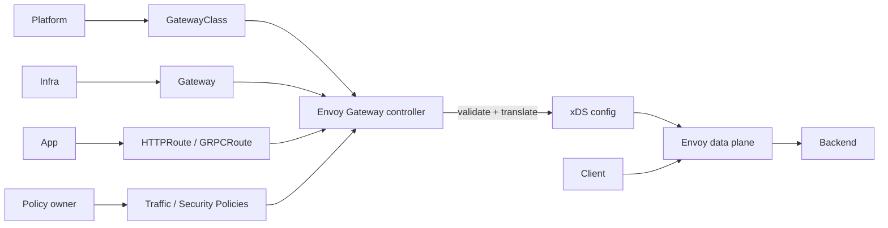

# Envoy Gateway, Gateway API Policy Attachment & Control/Data Plane Boundaries

## Konu anlatımı
Modern Kubernetes edge platformu yalnız host→Service eşlemesi değildir; routing, TLS, authentication, rate limit, timeout/retry, traffic shaping ve observability politikalarının farklı ekiplerce güvenli yönetilmesini gerektirir. Gateway API bu rolleri `GatewayClass`, `Gateway`, `HTTPRoute`/`GRPCRoute` gibi kaynaklarla ayırır. Envoy Gateway bu desired state'i izleyen control plane'dir; kaynakları doğrular ve Envoy data plane'e xDS konfigürasyonu üretir.

Kritik ayrım: Kubernetes API'deki desired state request hot path değildir. Controller unavailable olduğunda mevcut Envoy config'i trafik taşımaya devam edebilir, fakat yeni değişiklikler converge etmez. Bu nedenle control-plane availability, data-plane availability ve config freshness ayrı SLI'lardır.

Envoy Gateway v1.6 hattı production ayrıntılarını iyi gösterir: upstream TLS SNI/SAN davranışları sıkılaştırıldı, OIDC refresh-token davranışı değişti ve status/update coalescing iyileştirildi. v1.6.7 büyük workload'larda translation maliyetini düşüren preprocessed resource maps yaklaşımını ekledi.

## Mental model

**Invariant:** control plane config'i hesaplar; data plane kabul edilmiş config ile request'i işler. Resource status end-to-end trafik başarısının kendisi değildir.

## İçeride ne oluyor?
- `GatewayClass` implementation/ownership, `Gateway` listener/infra, Route kaynakları application routing intent sınırıdır.
- Policy attachment'ta target scope, precedence, merge ve conflict semantiği deterministic olmalıdır.
- Reconciliation idempotent olmalı; debounce/coalescing event storm'larında CPU ve API-server write amplification'ı azaltır.
- Partially invalid resource mümkün olduğunca sağlıklı route'ları bozmadan status ile ayrıştırılmalıdır.
- Downstream TLS termination ve upstream TLS ayrı trust boundary'lerdir; SNI/SAN doğrulaması identity'nin parçasıdır.
- Low-level extension/patch mekanizmaları platform-level blast radius taşır ve tenant'lara sınırsız açılmamalıdır.

## Mülakat soruları
1. Gateway API klasik Ingress'ten hangi ownership avantajlarını sağlar?
2. Control plane down iken data plane neden çalışmaya devam edebilir?
3. `Accepted=True` route neden yine 5xx üretebilir?
4. Reconciliation storm nasıl azaltılır?
5. Cross-namespace policy/reference governance nasıl kurulur?
6. Shared gateway ile tenant başına gateway'i isolation, cost ve blast radius açısından karşılaştır.

## Beklenen cevap seviyesi
- **Mid:** GatewayClass/Gateway/Route ve controller→xDS→proxy akışını anlatır.
- **Senior:** stale config, status, TLS identity, rollout ve reconcile failure mode'larını tartışır.
- **Staff:** multi-tenant policy ownership, config validation, canary ve cross-namespace güvenliği tasarlar.
- **Principal:** topology, platform API, upgrade strategy, maliyet ve regional blast radius'u birlikte yönetir.

## Mini alıştırma
İki takımın aynı Gateway'i kullandığı sistemde global auth, takım bazlı timeout ve yalnız platform ekibinin değiştirebildiği upstream TLS policy tasarla. Çakışan iki policy için deterministic precedence yaz.

## Proje fikri
`gateway-policy-lab`: kind/k3d + Envoy Gateway üzerinde HTTPRoute/GRPCRoute, retry/timeout, rate-limit ve upstream TLS senaryoları kur. Controller'ı durdurup mevcut trafik ile yeni config convergence'ını ayrı ölç. Invalid BackendRef ve route-storm fault injection ekle.

## Failure modes / trade-off / production bağlantısı
Control plane'i request path sanmak, status'u end-to-end health yerine kullanmak, cross-namespace reference'ları sınırsız bırakmak, low-level extension'ları tenant'lara açmak, upstream TLS SAN/SNI kontrolünü gevşetmek ve CRD/controller upgrade sırasını önemsememek tipik hatalardır. Production'da reconcile latency, rejection reason, xDS push/reject, config version skew, proxy 4xx/5xx, TLS failures, route cardinality ve API-server write rate izlenmelidir.

## Kaynaklar
- Envoy Gateway v1.6: https://gateway.envoyproxy.io/news/releases/v1.6/
- Envoy Gateway v1.6.7: https://gateway.envoyproxy.io/news/releases/notes/v1.6.7/
- Gateway API: https://gateway-api.sigs.k8s.io/
- Envoy xDS protocol: https://www.envoyproxy.io/docs/envoy/latest/api-docs/xds_protocol
