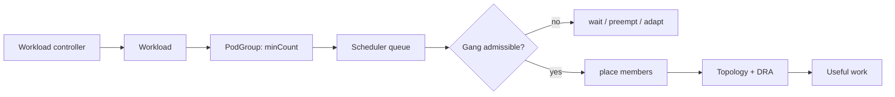

# Kubernetes Workload-Aware Scheduling, Gang Scheduling & Elastic AI Workloads

## Neden önemli?
Distributed training ve topology-sensitive batch workload'larda tek Pod'u schedule etmek useful work üretmeyebilir. Kubernetes v1.37'de Workload/PodGroup API'leri ve gang scheduling Beta'ya geçti; PodGroup scheduler queue'da first-class unit oldu ve `minCount` mutable hale geldi.

## Mental model

**Pod placement değil, useful-work admission.** Yeterli kaynak seti yoksa partial allocation pahalı accelerator'ları tüketip job'u ilerletmeyebilir.

## İçeride ne oluyor?
- PodGroup bir workload'un birlikte ilerlemesi gereken Pod grubunu ve minimum sayıyı ifade eder.
- v1.37'de PodGroup first-class queueing unit olduğundan grup üyelerinin ayrı ayrı queue churn yaratması azaltılabilir.
- Mutable `minCount` elastic workload'lara uyum sağlar; controller correctness/performance semantics'iyle birlikte yönetilmelidir.
- Workload-Aware Preemption workload düzeyinde disruption kararları için Beta'dır.
- Shared DRA ResourceClaims accelerator taleplerini PodGroup semantics'iyle bağlar.
- CompositePodGroup, heterojen/hiyerarşik workload yapıları için v1.37'de Alpha yüzeydir.
- Topology, network locality ve collective communication maliyetini etkiler; toplam GPU sayısı tek başına yeterli capacity ölçüsü değildir.

## Mülakat soruları
1. Gang scheduling hangi problemi çözer?
2. `minCount` ile desired replica count arasındaki fark nedir?
3. 64-GPU job ile sekiz 8-GPU job arasında fairness nasıl kurulur?
4. Preemption'ın checkpoint/wasted-compute maliyeti nasıl hesaba katılır?
5. Topology, DRA ve queue policy nasıl ortak admission modeline bağlanır?
6. Accelerator fleet'inde utilization ile researcher wait time nasıl dengelenir?

## Beklenen cevap seviyesi
- **Senior:** gang, minCount, topology ve preemption trade-off'larını açıklar.
- **Staff:** fairness, starvation, checkpoint-aware preemption ve fragmentation tasarlar.
- **Principal:** multi-cluster admission, accelerator classes, quotas ve topology'yi platform contract'ına dönüştürür.
- **CTO:** GPU maliyeti, utilization, experiment throughput, time-to-train ve roadmap etkisini birlikte yönetir.

## Mini alıştırma
İki rack'te 32'şer GPU var. Job A `minCount=48`, Job B `minCount=16`. A'yı bekletme, B'yi backfill etme ve A için preemption seçeneklerini utilization, starvation ve topology açısından karşılaştır.

## Proje fikri
`gang-scheduler-sim`: `minCount`, priority, topology ve duration alanlarıyla discrete-event scheduler simulator yaz. FIFO, backfill ve priority+aging politikalarında GPU utilization, p95 queue wait, preempted GPU-hours ve completion time ölç.

## Failure modes / trade-off
- Partial allocation ile GPU'ları kilitlemek.
- Büyük job'ları starvation'a bırakmak.
- Preemption/checkpoint maliyetini sıfır varsaymak.
- Topology'yi yalnız toplam capacity sayısı olarak görmek.
- Mutable `minCount`'u workload correctness'inden bağımsız değiştirmek.
- Alpha/Beta API maturity'sini rollout planında yok saymak.

## Production bağlantısı
Distributed ML training, MPI/HPC, accelerator batch ve topology-sensitive workloads. Queue wait, admission latency, unschedulable reason, gang success rate, preempted GPU-hours, topology fragmentation, accelerator utilization ve checkpoint recovery time izlenmelidir.

## Kaynaklar
- Kubernetes, *Advancing Workload-Aware Scheduling*, 8 Eylül 2026: https://kubernetes.io/blog/2026/09/08/kubernetes-v1-37-advancing-workload-aware-scheduling/
- Kubernetes v1.37 release announcement, 26 Ağustos 2026: https://kubernetes.io/blog/2026/08/26/kubernetes-v1-37-release/
