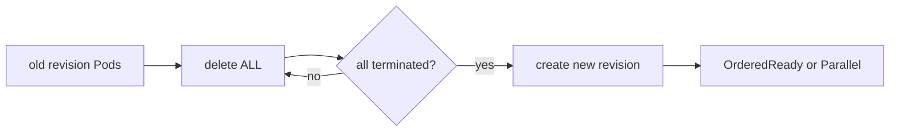

# Kubernetes v1.37 StatefulSet Recreate Strategy & Stateful Rollout Safety

## Neden önemli?
StatefulSet'in varsayılan `RollingUpdate` stratejisi availability odaklıdır; fakat bazı stateful sistemlerde eski ve yeni binary/protocol/on-disk-format sürümlerinin aynı anda çalışması kabul edilemez. Kubernetes v1.37, Alpha `StatefulSetRecreateStrategy` feature gate'i ile `Recreate` stratejisini ekledi.

## Mental model

`Recreate` tüm eski Pod'ları siler, tamamen terminate olmalarını bekler ve ancak sonra yeni revision'ı oluşturur. Böylece old/new revision overlap olmaz; karşılığında planlı downtime oluşur.

## Semantics
- `RollingUpdate`: ters ordinal sırayla kontrollü rolling replacement; readiness progress gate'tir.
- `OnDelete`: Pod replacement kullanıcı/controller silmesine bağlıdır.
- `Recreate`: önce bütün eski Pod'lar terminate olur; sonra create başlar.
- Create concurrency `podManagementPolicy`'ye bağlıdır: `OrderedReady` ordinal sırayla, `Parallel` birlikte.
- StatefulSet sticky identity/PVC association sağlar; bu application-level schema veya data compatibility garantisi değildir.

## Failure modes ve trade-off
Recreate'i zero-downtime sanmak, backup/restore test etmeden stop-the-world cutover yapmak, finalizer/volume detach sürelerini outage budget'a katmamak, `Parallel` bootstrap'ın quorum etkisini göz ardı etmek ve Alpha feature'ı fleet çapında canary'siz açmak risklidir. Controller strategy data migration veya rollback protokolünün yerine geçmez.

## Mülakat soruları
1. StatefulSet rollout semantics neden Deployment'tan farklıdır?
2. RollingUpdate, OnDelete ve Recreate hangi invariant'ları optimize eder?
3. Recreate neden otomatik olarak daha güvenli değildir?
4. Yeni revision açılmazsa recovery planı ne olmalı?
5. Backward-incompatible on-disk format migration'ında backup/checkpoint/rollback nasıl tasarlanır?
6. Planned outage ile corruption riskini SLO ve ürün etkisi açısından nasıl kıyaslarsın?

## Production checklist
Preflight compatibility check, tested restore, explicit maintenance window, termination/volume-attach timeout, abort condition, revision pinning ve post-upgrade validation tanımlanmalı. Rollout phase, termination latency, attach latency, readiness latency, restore RTO/RPO ve failed-upgrade count izlenmelidir.

## Mini proje
Old/new revision compatibility matrix, termination time, readiness time ve `OrderedReady|Parallel` parametreleriyle rollout simulator yaz. Availability, mixed-version overlap, outage duration ve rollback feasibility ölç.

## Kaynaklar
- Kubernetes StatefulSet resmi dokümantasyonu: https://kubernetes.io/docs/concepts/workloads/controllers/statefulset/
- Kubernetes v1.37 release announcement, 26 Ağustos 2026: https://kubernetes.io/blog/2026/08/26/kubernetes-v1-37-release/
- KEP-3541 tracking: https://github.com/kubernetes/enhancements/issues/3541
