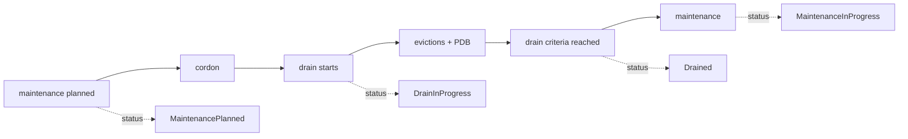

# Kubernetes v1.37 Node Lifecycle Conditions, Drain & Maintenance Coordination

## Neden önemli?
`Ready=True`, bir node'un maintenance için uygun veya drain'in tamamlanmış olduğu anlamına gelmez. Kubernetes v1.37, node lifecycle işlerini ortak bir status vocabulary'siyle görünür kılmak için `DrainInProgress`, `Drained`, `MaintenancePlanned`, `MaintenanceInProgress` ve `GracefulNodeShutdownInProgress` condition'larını tanımlar.

## Mental model

**Temel invariant:** lifecycle condition bir actuator değil, gözlemlenebilir durum sinyalidir. Scheduling ve eviction davranışı cordon, drain, taint, PDB ve workload-specific mekanizmalarla yönetilir.

## İçeride ne oluyor?
- Condition'lar `Node.status.conditions` üzerinden lifecycle otomasyonlarının ortak dilini oluşturur.
- `Drained`, administrator'ın seçtiği drain kriterinin karşılandığını bildirir; evrensel olarak “node üzerinde sıfır Pod” anlamına gelmez.
- `MaintenancePlanned` gelecekteki değişimi, `MaintenanceInProgress` aktif bakım durumunu bildirir.
- `GracefulNodeShutdownInProgress` shutdown sürecini diğer maintenance state'lerinden ayırır.
- Condition'lar autoscaler, remediation, maintenance controller ve insan operatör arasında visibility sağlar; ownership/locking problemini tek başına çözmez.

## Mülakat soruları
1. Node `Ready` ile lifecycle condition neden farklı problemleri çözer?
2. Condition ile command/actuator ayrımı neden önemlidir?
3. `Drained=True` neden “node tamamen boş” diye yorumlanmamalıdır?
4. Senior: PDB yüzünden drain takılırsa ne yaparsın?
5. Staff: autoscaler ile maintenance controller yarışını nasıl önlersin?
6. Principal: 10 bin node'luk fleet için maintenance state machine ve blast-radius control nasıl tasarlanır?

## Beklenen cevap derinliği
- **Mid:** readiness, cordon, drain, taint ve condition farkını açıklar.
- **Senior:** PDB, eviction, timeout, stuck drain ve graceful shutdown failure mode'larını bağlar.
- **Staff:** ownership, idempotency, reconciliation ve zone-level concurrency tasarlar.
- **Principal:** rollout waves, auditability, SLO, emergency override ve provider integration standardı kurar.

## Mini alıştırma
`Normal → Planned → Cordoned → Draining → Drained → Maintenance → Returning → Normal` state machine'i çiz. Her transition için precondition, timeout, retry ve abort davranışı yaz. PDB'nin 20 dakika blokladığı senaryoyu ekle.

## Proje fikri
`node-maintenance-controller`: maintenance intent CRD'sini okuyup test cluster'ında cordon/drain yapan, lifecycle condition'larını raporlayan ve Prometheus metrics çıkaran controller. Dry-run, idempotent reconcile, per-zone concurrency limit ve stuck-drain alarmı ekle.

## Failure modes / trade-off / production
Condition'ı actuator sanmak, stale condition, controller yarışları, PDB nedeniyle sonsuz drain, aynı failure domain'de aşırı eşzamanlı bakım ve maintenance sonrası uncordon'u unutmak başlıca risklerdir. Production'da state duration, drain latency, eviction failures, unavailable replicas, zone-level concurrent maintenance, stuck conditions ve manual overrides izlenmelidir.

## Kaynaklar
- Kubernetes v1.37 Node Lifecycle Conditions, 9 Eylül 2026: https://kubernetes.io/blog/2026/09/09/kubernetes-v1-37-node-lifecycle-conditions/
- kubectl drain: https://kubernetes.io/docs/reference/kubectl/generated/kubectl_drain/
- Pod Disruption Budgets: https://kubernetes.io/docs/tasks/run-application/configure-pdb/
