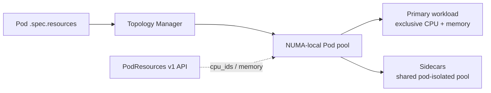

# Kubernetes Pod-Level Resource Managers, NUMA Locality & Sidecar Economics

## Neden önemli?
Latency-sensitive inference, HPC ve packet-processing workload'larında yalnız toplam CPU/memory miktarı değil, kaynakların hangi NUMA node'da ve hangi fiziksel CPU'larda bulunduğu da önemlidir. Kubernetes v1.37'de `PodLevelResourceManagers` Beta'ya geçti; varsayılan olarak kapalıdır. Kubelet'in Topology, CPU ve Memory Manager bileşenleri Pod'un `.spec.resources` bütçesini allocation ve NUMA alignment kararlarında kullanabilir.

## Mental model

Pod resource budget bir NUMA-local zarf; container'lar zarf içinde exclusive veya shared pay kullanabilir.

## İçeride ne oluyor?
- Topology Manager CPU, memory ve device locality hint'lerini uzlaştırır.
- CPU Manager latency-sensitive primary container'a exclusive CPU sağlayabilir.
- Non-Guaranteed yardımcı container'lar Pod'a izole shared pool'da kalabilir; sidecar başına pahalı dedicated core ayırma zorunluluğu azalır.
- Memory Manager CPU locality ile uyumlu memory placement hedefler; remote NUMA memory p99 ve bandwidth'i bozabilir.
- Kubernetes v1.37 PodResources v1 gRPC API top-level `cpu_ids` ve `memory` alanlarıyla Pod-level exclusive assignment'ları raporlar.
- Feature Beta fakat disabled-by-default olduğu için node-pool canary, capability detection ve rollback gerekir.

## Mülakat soruları
1. NUMA neden tail latency'yi etkiler?
2. CPU Manager, Memory Manager ve Topology Manager nasıl ayrılır?
3. Pod-level budget sidecar resource waste'i nasıl azaltır?
4. Senior: GPU inference Pod'unda main + telemetry sidecar modelini kur.
5. Staff: mixed-version node pool'da rollout'u nasıl yaparsın?
6. Principal: p99, fragmentation ve utilization arasında nasıl karar verirsin?

## Beklenen cevap derinliği
- **Mid:** requests/limits, NUMA, CPU pinning, locality.
- **Senior:** topology policy, sidecar placement, p99 ve isolation.
- **Staff:** heterogeneous nodes, feature gates, fragmentation, capacity.
- **Principal:** inference/HPC fleet policy, cost, utilization ve SLO.

## Mini alıştırma
İki NUMA node'lu host: node başına 16 CPU/64 GiB. Pod toplam 10 CPU/32 GiB; main 8 exclusive CPU, iki sidecar toplam 2 CPU. Container-by-container exclusive allocation ile Pod-level pool'u çiz. Remote NUMA access p99'u %15 artırıyorsa placement invariant'ını yaz.

## Proje fikri
`numa-pod-lab`: latency-sensitive worker + telemetry sidecar çalıştır. Pod-level managers açık/kapalı varyantlarda CPU IDs, NUMA locality, p50/p99, throughput ve reserved-but-idle CPU ölç.

## Failure modes / trade-off / production
Fleet-wide big-bang enablement, PodResources değerlerini container toplamıyla double-count etmek, locality uğruna fragmentation, sidecar starvation ve benchmark yapmadan topology varsaymak başlıca risklerdir. Production'da p95/p99, CPU throttling, NUMA-local/remote memory, exclusive CPU utilization, pending Pods, fragmentation, OOM/eviction ve assignment'lar izlenmelidir.

## Kaynaklar
- Kubernetes, 15 Eylül 2026 — Pod-Level Resource Managers Beta: https://kubernetes.io/blog/2026/09/15/kubernetes-v1-37-pod-level-resource-managers-beta/
- Kubernetes v1.37 release: https://kubernetes.io/blog/2026/08/26/kubernetes-v1-37-release/
