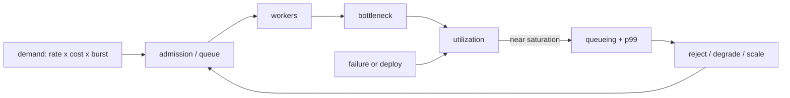

# Capacity Modeling, Queueing, Headroom & Overload

## Neden önemli?
Production capacity “maksimum QPS” değildir. Güvenli kapasite, belirli request mix'i ve failure varsayımları altında latency/SLO'yu koruyabildiğin çalışma zarfıdır. Request rate, request cost, concurrency, burst, downstream bottleneck, deploy/failure kaybı ve autoscaling lag birlikte modellenmelidir.

## Mental model

Capacity bir hız limiti değil latency hedefiyle tanımlanan güvenli çalışma zarfıdır. Headroom burst/failure için satın alınmış opsiyondur. Queue kapasite üretmez; işi geleceğe taşır.

## Temel model
Kararlı durumda Little's Law sanity check'i `L = λW` ilişkisini verir. 2,000 req/s ve 50 ms residence time yaklaşık 100 concurrent request demektir. Bu ortalama ilişki burst dağılımını çözmez. Utilization doygunluğa yaklaşınca queueing delay hızla büyüyebilir; bu yüzden sustainable throughput saturation knee öncesinde seçilir.

## İçeride ne oluyor?
- QPS farklı request maliyetlerini gizleyebilir; weighted work units veya dominant-resource sinyali gerekebilir.
- Load test throughput–utilization–latency eğrisini ve ilk bottleneck'i bulmalıdır.
- Uzun queue kısa burst'leri absorbe eder; sustained overload'da memory ve latency büyütür.
- Autoscaling provisioning/warmup süresince kapasite yaratamaz; headroom gerekir.
- Deploy, host/zone kaybı ve downstream quota peak demand ile birlikte test edilmelidir.
- Admission control, priority, load shedding ve graceful degradation overload'un blast radius'unu sınırlar.

## Mülakat soruları
1. Throughput, concurrency ve latency nasıl ilişkilidir?
2. Max benchmark QPS neden production capacity değildir?
3. Queue ne zaman faydalı, ne zaman zararlıdır?
4. Autoscaling varken neden headroom gerekir?
5. Zonal failure capacity planı nasıl doğrulanır?
6. Request mix değişince QPS modeli nasıl düzeltilir?
7. Load shedding ile retry policy nasıl birlikte tasarlanır?
8. CTO: headroom maliyetini revenue/reliability riskiyle nasıl karşılaştırırsın?

## Seviyeye göre cevap derinliği
- **Junior:** throughput, latency, utilization, queue.
- **Mid:** Little's Law, bottleneck, load-test curve.
- **Senior:** saturation knee, burst, autoscaling lag, load shedding.
- **Staff/Principal:** failure capacity, weighted demand, capacity SLO ve release gates.
- **CTO:** growth forecast, headroom cost, revenue-at-risk ve reliability investment.

## Kısa alıştırma
Bir instance SLO altında 400 req/s taşıyor; peak 4,800 req/s. Bir zone kaybında toplam kapasitenin %33'ü kaybolacak ve deploy sırasında ayrıca bir instance unavailable olabilir. Minimum instance hesabını yaparken failure headroom, autoscaling warmup ve request-mix varsayımlarını açıkça yaz.

## Proje fikri
`capacity-envelope-lab`: ucuz/pahalı request mix'li HTTP servisi load-test et. Utilization–throughput–p99 eğrisini çıkar; bounded queue, admission control ve autoscaling benzetimi ekle. Saturation knee, rejected work ve cost/request raporla.

## Failure modes / trade-off / production
- Ortalama latency p99 collapse'ı gizler.
- QPS request-cost değişimini gizler.
- Uzun queue overload'u erteler fakat latency/memory maliyetini büyütür.
- Autoscaler telemetry/provisioning gecikmesine yenilebilir.
- Aşırı headroom maliyet; yetersiz headroom cascading-failure riskidir.
- Dashboard: demand mix, concurrency, queue depth/age, utilization, rejected/degraded traffic, p95/p99 ve downstream saturation.

## Kaynaklar
- Google SRE — Addressing Cascading Failures: https://sre.google/sre-book/addressing-cascading-failures/
- Google SRE — Handling Overload: https://sre.google/sre-book/handling-overload/
- Google SRE — Production Environment: https://sre.google/sre-book/production-environment/
