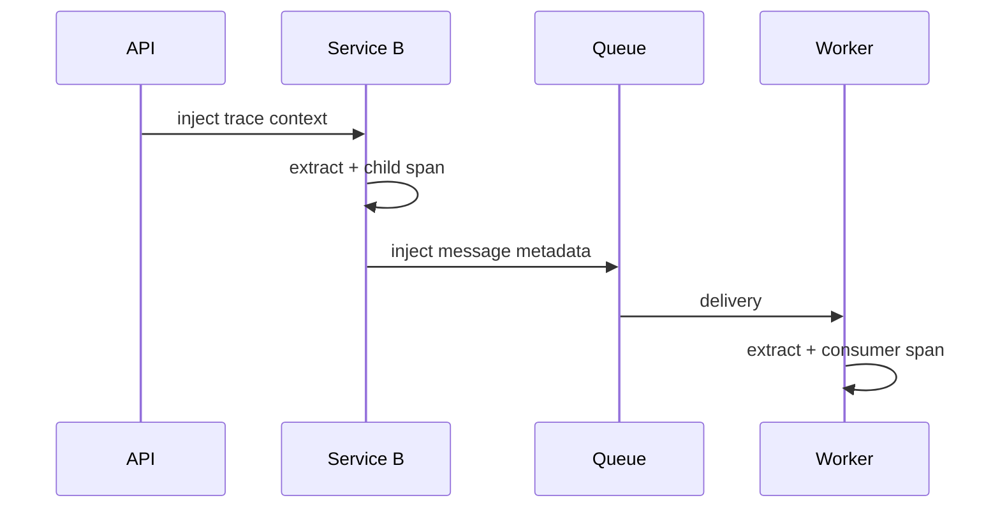

# OpenTelemetry Context Propagation, TraceContext & Baggage

## Neden önemli?
Distributed trace, servisler aynı request zincirini ilişkilendirebildiğinde anlamlıdır. Context propagation span context gibi cross-cutting state'i transport carrier'ına inject eder ve downstream'de extract eder.

## Mental model

Trace context = correlation identity; baggage = taşınan application context; propagator = context ile wire carrier arasındaki codec/boundary.

## Temel kavramlar
- OpenTelemetry `TextMapPropagator`, context'i HTTP headers veya message metadata gibi text carrier'lara taşır.
- `inject`: current context → carrier.
- `extract`: carrier → local context.
- W3C Trace Context yaygın trace propagation formatıdır.
- Baggage request boyunca taşınan key/value context'tir; span attribute ile aynı şey değildir.
- PII, credential ve secret baggage'a konmamalıdır.
- Untrusted inbound context sanitize/ignore edilebilmelidir.

## Production akışı
1. Inbound request'te context extract edilir.
2. Server span parent context ile başlar.
3. Outbound request öncesi current context inject edilir.
4. Messaging publish/consume boundary ayrıca instrument edilir.
5. Sampling state downstream'e taşınabilir.
6. Trust boundary'de propagation policy uygulanır.

## Mülakat soruları
1. Propagation olmazsa distributed trace nasıl görünür?
2. Inject/extract ne yapar?
3. Trace context ile baggage farkı nedir?
4. Baggage neden PII/secret için kötü yerdir?
5. Async consumer span'ını producer ile nasıl ilişkilendirirsin?
6. Forged inbound trace headers için trust policy nasıl tasarlanır?
7. Multi-language fleet'te propagation standardizasyonu nasıl yapılır?

## Seviyeye göre cevap derinliği
- **Junior:** trace/span parent-child ve header propagation.
- **Mid:** carrier, inject/extract, TraceContext ve baggage.
- **Senior:** async boundary, sampling, sanitization, cardinality ve overhead.
- **Staff:** fleet-wide propagator policy, migration ve observability governance.

## Kısa alıştırma
API → payment → Kafka → worker zincirinde inject/extract noktalarını çiz. `tenant_id`, `user_email`, `debug=true` değerlerini baggage açısından riskleriyle değerlendir.

## Proje
İki HTTP servis + queue worker kur. OpenTelemetry context'ini HTTP ve message headers üzerinden geçir; propagation'ı kasıtlı kırıp orphan trace üret ve boundary testleriyle yakala.

## Failure modes / trade-off
Eksik propagation trace'i parçalar. Büyük baggage bandwidth/CPU ve data-leak riski yaratır. Forged inbound context telemetry'yi manipüle edebilir. High-cardinality baggage'ı metric label'a çevirmek telemetry maliyetini patlatabilir.

## Production gözlemleri
Orphan/root span oranı, propagation parse failures, baggage size, exporter drops ve sampling davranışını izle.

## Kaynaklar
- OpenTelemetry Context Propagators API: https://opentelemetry.io/docs/specs/otel/context/api-propagators/
- OpenTelemetry Baggage API: https://opentelemetry.io/docs/specs/otel/baggage/api/
- OpenTelemetry Context Propagation: https://opentelemetry.io/docs/concepts/context-propagation/
- W3C Trace Context: https://www.w3.org/TR/trace-context/
