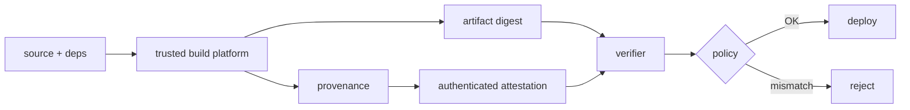

# SLSA Provenance, in-toto Attestations & Build Trust Boundaries

**Seviye:** Mid → CTO  
**Alan:** Cloud/DevOps/SRE + Cybersecurity

## Konu anlatımı
Artifact imzası byte'ların signer tarafından onaylandığını gösterebilir; provenance ise artifact'i source revision, build workflow, dependencies ve builder kimliği gibi üretim bağlamına bağlar. SLSA Build Provenance, in-toto attestation modelinde artifact digest'lerini `subject` olarak build metadata'sına bağlar.

Güven zinciri yalnız attestation bulunmasına dayanmaz. Consumer envelope/signature authentication'ını doğrular, deploy edilen artifact digest'inin `subject.digest` ile eşleştiğini kontrol eder ve builder/source/build-type/dependency policy'sini uygular. User-controlled build step trusted provenance alanlarını serbestçe belirleyebiliyorsa sistem saldırganın iddiasını imzalamış olabilir.

## Mental model

`artifact signature ≠ complete provenance`  
`attestation exists ≠ policy accepted`

## İçeride ne oluyor?
1. Build platform output digest'lerini `subject` olarak kaydeder.
2. Build definition build type ve external parameters'ı tanımlar.
3. Resolved dependencies exact revision/digest ile kaydedilmeye çalışılır.
4. `builder.id` trusted build platform boundary'sini temsil eder.
5. Attestation authenticated envelope içinde taşınır.
6. Admission/release policy digest + trusted claims üzerinde karar verir.
7. Provenance ve verification evidence audit/incident response için saklanır.

## Mülakat soruları
- SBOM ile provenance farkı nedir?
- Artifact signature neden provenance yerine geçmez?
- `subject.digest` neden kritik?
- `builder.id` hangi trust boundary'yi temsil eder?
- User-controlled CI step provenance üretirse sorun nedir?
- CTO: organization-wide enforcement'ı legacy pipeline ve developer velocity ile nasıl dengelersin?

## Beklenen cevap seviyesi
- **Mid:** artifact, digest, signature, provenance ve attestation ayrımını yapar.
- **Senior:** subject/predicate/builder/dependency ve verification sırasını açıklar.
- **Staff:** trusted control plane, admission gate ve migration tasarlar.
- **Principal:** multi-platform trust roots, retention ve break-glass yönetir.
- **CTO:** enforcement seviyesini supply-chain risk, compliance ve platform yatırım maliyetiyle bağlar.

## Mini alıştırma
Yalnız `repo X/main` kaynaklı, approved hosted builder'da üretilmiş ve deploy digest'i provenance `subject.digest` ile eşleşen image'ların production'a girdiği policy'yi tasarla; trusted ve untrusted claim'leri ayır.

## Proje fikri
`provenance-gate-lab`: container build'inde artifact digest + SLSA-style provenance üret; verifier digest, builder identity ve source revision kontrol etsin. Replay, builder-id ve source mismatch testleri ekle.

## Failure modes / trade-off / production
Provenance üretip doğrulamamak security theater'dır. Mutable tag'e güvenmek replay/TOCTOU riskini artırır. Build worker'a signing/trusted-metadata yetkisi vermek boundary'yi bozar. Production'da provenance coverage, reject reason, unattested artifact, builder identity, policy version, break-glass ve deployed-vs-attested digest eşleşmesi izlenir.

## Kaynaklar
- SLSA v1.2 Build Provenance: https://slsa.dev/spec/v1.2/build-provenance
- SLSA v1.2 Provenance: https://slsa.dev/spec/v1.2/provenance
- in-toto Attestation Framework v1.2: https://github.com/in-toto/attestation/blob/main/spec/README.md
