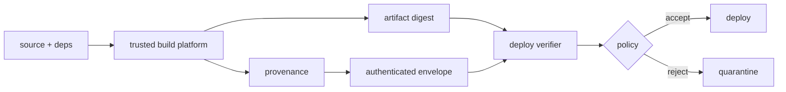

# SLSA Provenance, in-toto Attestations & Build Trust Boundaries

## Neden var?
Artifact signature byte'ları signer'a bağlar; provenance ise artifact'in nerede, nasıl ve hangi inputs ile üretildiğine dair doğrulanabilir metadata sağlar. SLSA Build Provenance, in-toto attestation framework üzerinde artifact subject digest'lerini build definition ve run details ile ilişkilendirir.

## Mental model

`artifact signature ≠ complete provenance`; `attestation exists ≠ policy accepted`.

## İçeride ne oluyor?
1. Output digest'leri attestation `subject` alanına bağlanır.
2. Build definition `buildType` ve external parameters'ı tanımlar.
3. Resolved dependencies mümkün olduğunca exact revision/digest ile kaydedilir.
4. `builder.id`, provenance doğruluğu için güvenilen build-platform trust boundary'sini temsil eder.
5. Statement/predicate authenticated envelope içinde taşınır.
6. Consumer önce authentication ve artifact digest eşleşmesini, sonra builder/source/dependency policy'sini doğrular.
7. Verification evidence audit ve incident response için saklanır.

## Mülakat soruları
1. SBOM ile provenance farkı nedir?
2. Artifact signature neden provenance yerine geçmez?
3. `subject.digest` neden kritiktir?
4. `builder.id` neyi temsil eder?
5. User-controlled build step provenance üretirse trust problemi nedir?
6. Staff: hosted ve self-hosted runner trust boundary'leri nasıl ayrılır?
7. CTO: organization-wide enforcement'ı delivery velocity ve risk ile nasıl dengelersin?

## Beklenen cevap seviyesi
- **Mid:** artifact/digest/signature/provenance/attestation ayrımı.
- **Senior:** subject, predicate, builder, dependency ve verification order.
- **Staff:** trusted control plane, signer-builder policy, admission gate ve migration.
- **Principal:** multi-platform trust roots, break-glass, evidence retention ve incident response.
- **CTO:** supply-chain risk, compliance, lead time ve platform yatırım ekonomisi.

## Kısa alıştırma
Yalnız `repo X/main` kaynaklı, approved hosted builder'da üretilmiş ve deploy digest'i provenance subject digest'iyle eşleşen image'ların production'a girebildiği policy tasarla. Trusted ve untrusted claim'leri ayır.

## Proje fikri
`provenance-gate-lab`: container build için artifact digest + SLSA-style provenance üret. Ayrı verifier digest, builder identity ve source revision policy'sini uygulasın; replay, builder-id mutation ve source mismatch testleri reddedilsin.

## Failure modes / trade-off / production
Provenance üretip verify etmemek security theater'dır. Mutable tag'e güvenmek TOCTOU/replay riskini büyütür. Build worker'ın trusted metadata/signing yetkisine erişmesi trust boundary'yi bozar. Eksik dependency capture forensic değeri azaltır; aşırı sert ilk rollout bypass davranışı yaratabilir. Provenance coverage, reject reason, unattested artifact, builder identity, policy version, break-glass ve deployed-vs-attested digest eşleşmesi izlenmelidir.

## Kaynaklar
- SLSA v1.2 Build Provenance: https://slsa.dev/spec/v1.2/build-provenance
- SLSA v1.2 Provenance overview: https://slsa.dev/spec/v1.2/provenance
- in-toto Attestation Framework v1.2: https://github.com/in-toto/attestation/blob/main/spec/README.md
