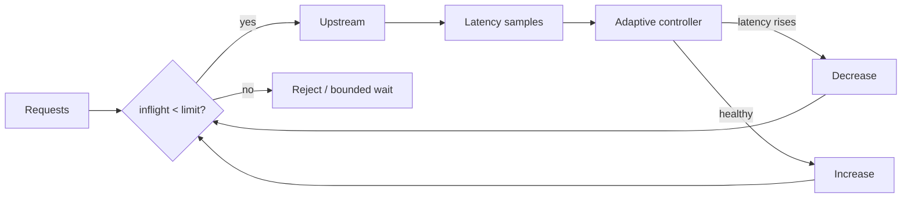

# Adaptive Concurrency Control & Queue Collapse

## Amaç
Rate limit birim zamandaki arrival sayısını, concurrency limit aynı anda sistem içinde bulunan işi kontrol eder. Downstream yavaşladığında aynı RPS daha uzun request lifetime üretir. Little's Law sezgisi `L ≈ λW`: latency büyürse inflight ve queue büyür; bu da daha fazla latency ve sonunda overload feedback loop'u yaratabilir.

## Mental model ve internals
Adaptive limiter statik threshold yerine congestion sinyalinden limit öğrenir. Envoy gradient controller periyodik ideal/no-load'a yakın `minRTT` ile güncel `sampleRTT`'yi karşılaştırır. Basitleştirilmiş formül `gradient = (minRTT + B) / sampleRTT`; buffer `B` normal varyansa tolerans verir. Yeni limit yaklaşık `gradient * old_limit + headroom` ile ayarlanır; latency yükselince limit küçülür, sistem rahatsa headroom büyümeyi sürdürür.

Limiter dolduğunda unbounded queue açmak problemi çözmez, yalnız beklemeyi başka yere taşır. Reject/reset/503 veya sıkı bounded waiting gerekir. Retry ise overload sırasında ek trafik üretmemeli; retry budget, jitter ve mümkünse farklı host seçimiyle birlikte tasarlanmalıdır. Controller bütün trafiği görmüyorsa feedback loop yanlış gözlemle karar verir.

## Mülakat soruları ve beklenen derinlik
1. Rate limiting ile concurrency limiting farkı nedir?
2. Aynı RPS downstream yavaşladığında neden collapse yaratabilir?
3. minRTT neden congestion baseline'ı olarak kullanılabilir?
4. Neden limiter önünde unbounded queue istemezsin?
5. Mid: timeout/retry ile limiter nasıl etkileşir?
6. Senior: minRTT drift ve noisy latency neyi bozar?
7. Staff: farklı endpoint maliyetlerinde tek global limit neden sorun olur?
8. Staff: autoscaler + adaptive limiter oscillation'ını nasıl azaltırsın?

- **Junior:** inflight, queue, latency ve rate/concurrency ayrımını bilir.
- **Mid:** Little's Law sezgisini overload feedback ile bağlar.
- **Senior:** sampling, retry amplification, fairness ve baseline drift'i tartışır.
- **Staff:** per-route isolation, multi-controller interaction ve rollout tasarlar.

## Kısa alıştırma
200 RPS ve 50 ms average latency için yaklaşık inflight `10`; latency 500 ms olduğunda `100`. Connection pool 80 ise ikinci durumda queue/rejection kaçınılmaz hale gelir. Bu hesabın average değer kullandığını ve burst/tail latency'yi gizleyebileceğini de açıkla.

## Proje fikri
Kontrollü latency enjekte edilen küçük bir HTTP upstream kur. Fixed semaphore ile gradient-benzeri adaptive limiter'ı throughput, p50/p99, inflight, reject rate ve queue depth üzerinden karşılaştır.

## Failure modes / trade-off / production
GC pause, cold start ve network jitter congestion sanılabilir. Agresif controller throughput'u gereksiz düşürür; yavaş controller queue collapse'ı engelleyemez. Autoscaler, circuit breaker ve retry policy bağımsız feedback loop'larıdır; yanlış zaman sabitleri oscillation yaratabilir. Health-check gibi ucuz trafik baseline sample'ını bozabilir. Production'da current limit, inflight, rejects, min/sample RTT, queue depth, retry volume, saturation ve p99 birlikte izlenmelidir.

## Kaynaklar
- Envoy — Adaptive Concurrency: https://www.envoyproxy.io/docs/envoy/latest/configuration/http/http_filters/adaptive_concurrency_filter.html
- Envoy — Adaptive Concurrency v3 API: https://www.envoyproxy.io/docs/envoy/latest/api-v3/extensions/filters/http/adaptive_concurrency/v3/adaptive_concurrency.proto
- Netflix — concurrency-limits: https://github.com/Netflix/concurrency-limits
