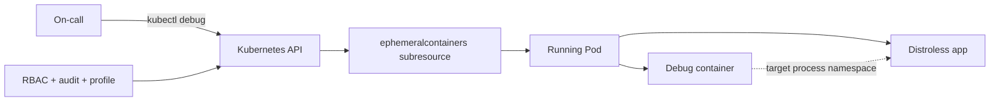

# Kubernetes Ephemeral Containers, Distroless Debugging & Privilege Boundaries

**Seviye:** Junior → Staff | **Alan:** Cloud / DevOps / SRE / Cybersecurity

## Konu anlatımı
Minimal ve distroless container image'ları attack surface ve dependency yükünü azaltır; buna karşılık shell ve klasik debug araçlarını da ortadan kaldırabilir. Kubernetes Ephemeral Containers, çalışan Pod'u yeniden build veya restart etmeden geçici debug tooling eklemek için tasarlanmıştır ve v1.25'ten beri stable'dır.

Ephemeral container workload sidecar'ı değildir: otomatik restart garantisi yoktur; ports, liveness/readiness probe ve resources gibi bazı normal ContainerSpec alanları kullanılamaz. Pod spec'e sıradan container eklemek yerine `ephemeralcontainers` subresource'u üzerinden oluşturulur. `kubectl debug` bu mekanizmayı Pod, Pod-copy ve node debugging akışlarında kullanır.

## Mental model

## Internals ve güvenlik sınırı
- `--target`, runtime desteği varsa başka container'ın process namespace'ini hedeflemeyi kolaylaştırır.
- Ephemeral container eklendikten sonra normal container gibi değiştirilemez/silinemez; Pod ile birlikte sonlanır.
- Debug profile'ları securityContext/capability seviyesini değiştirir. `sysadmin` geniş privilege sağlayabildiğinden varsayılan olmamalıdır.
- Node debugging host namespace ve `/host` filesystem görünürlüğü nedeniyle daha büyük blast radius taşır.
- Production debug erişimi RBAC, audit, signed/allowlisted image, JIT authorization ve incident kaydıyla yönetilmelidir.

## Mülakat soruları
1. Distroless image'ın security ve operability trade-off'u nedir?
2. Ephemeral container ile sidecar arasındaki fark nedir?
3. `kubectl exec` yerine ne zaman `kubectl debug` kullanırsın?
4. `--target` hangi namespace problemine yardım eder?
5. Senior: Debug container'a hangi Linux capabilities'i neden verirsin/vermezsin?
6. Staff: Cluster-wide production debugging policy'sini nasıl tasarlarsın?

## Beklenen cevap seviyesi
- **Junior:** minimal image ve ephemeral debug kavramlarını ayırır.
- **Mid:** lifecycle ve namespace davranışını açıklar.
- **Senior:** RBAC/capabilities/audit ile least privilege kurar.
- **Staff:** debug access'i supply chain, JIT authorization ve incident response'a bağlar.

## Mini alıştırma
Distroless bir API Pod'unda DNS timeout teşhis akışı tasarla: logs → ephemeral container → DNS/TCP testleri → gerekiyorsa packet capture. Her aşamanın minimum privilege'ını yaz.

## Proje fikri
`k8s-debug-lab`: distroless servis, ephemeral debug container ve üç farklı debug profile ile process/network görünürlüğünü karşılaştır; sonuçtan production runbook üret.

## Failure modes / trade-off / production
Privileged debug container isolation sınırını zayıflatabilir; rastgele debug image supply-chain riski taşır; packet capture hassas veri görebilir; debug workload'u baskı altındaki node'u daha da zorlayabilir. Audit event, image digest, debug profile, session süresi, node pressure ve incident korelasyonu izlenmelidir.

## Kaynaklar
- Kubernetes — Ephemeral Containers: https://kubernetes.io/docs/concepts/workloads/pods/ephemeral-containers/
- Kubernetes — Debug Running Pods: https://kubernetes.io/docs/tasks/debug/debug-application/debug-running-pod/
- Kubernetes — kubectl debug: https://kubernetes.io/docs/reference/kubectl/generated/kubectl_debug/
