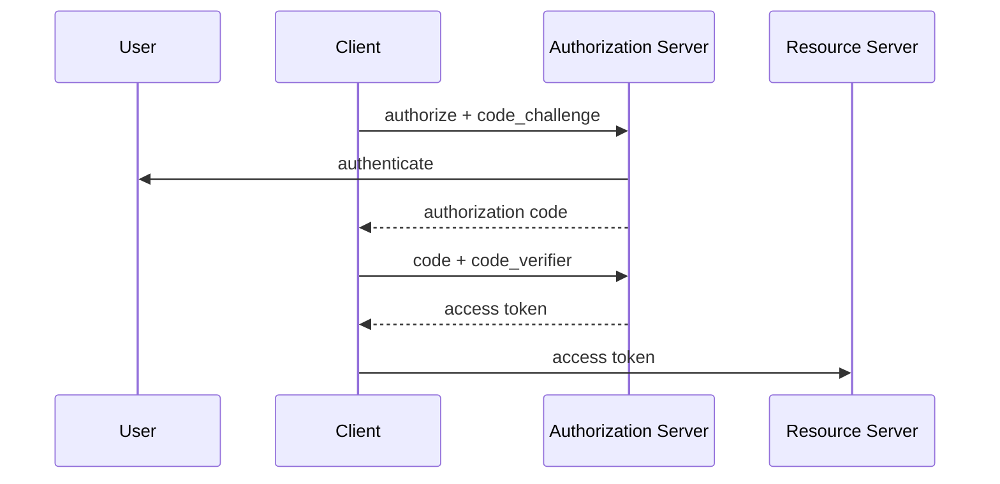

# OAuth 2.0, OpenID Connect, JWT ve PKCE

Bu bölüm kimlik ve yetkilendirme kavramlarını birbirinden ayırmak için tasarlanmıştır.

```text
OAuth 2.0 -> delegated authorization
OIDC      -> authentication / identity layer
JWT       -> claim taşıyabilen token formatı
PKCE      -> authorization code akışını güçlendiren mekanizma
```



## Access token ve ID token

Access token resource server'a erişim içindir. ID token OIDC kapsamında kullanıcı kimliği hakkında bilgi taşır. Birini diğerinin yerine kullanmak tasarım hatasına yol açabilir.

JWT kullanılıyorsa resource server imza yanında `iss`, `aud`, `exp` ve gerekli scope/role bilgilerini doğrulamalıdır.

## Mülakat soruları

### Mid
1. Authentication ve authorization farkı nedir?
2. OAuth ile OIDC farkı nedir?
3. Access token ve ID token farkı nedir?
4. PKCE neden kullanılır?

### Senior
1. Audience ve issuer neden kontrol edilir?
2. Token key rotation nasıl yapılır?
3. Browser/mobile public client neden client secret'a güvenmemelidir?
4. Multi-tenant API'de tenant boundary nerede enforce edilir?

### Staff
1. Merkezi identity platformunun failure domain'i nasıl sınırlandırılır?
2. Service-to-service identity nasıl standartlaştırılır?
3. Policy propagation ve audit nasıl tasarlanır?

## Lab

`identity-security-lab`: OIDC login + PKCE + scope tabanlı API + üç role sahip RBAC + issuer/audience/expiry testleri.

## Habitat bağlantısı

Storage gateway için güven zinciri şöyle düşünülebilir:

```text
identity -> tenant -> resource -> operation -> policy -> storage
```

Merkezi policy katmanı standardizasyon sağlar; bu yüzden least privilege, service identity ve audit kayıtları önemlidir.

## Ana kaynaklar

- RFC 6749 — OAuth 2.0: https://www.rfc-editor.org/rfc/rfc6749
- RFC 7636 — PKCE: https://www.rfc-editor.org/rfc/rfc7636
- OpenID Connect Core: https://openid.net/specs/openid-connect-core-1_0.html
- RFC 7519 — JWT: https://www.rfc-editor.org/rfc/rfc7519
- RFC 9700 — OAuth 2.0 Security BCP: https://www.rfc-editor.org/rfc/rfc9700
