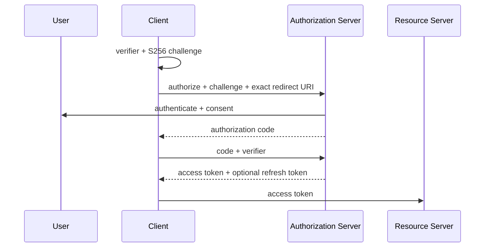
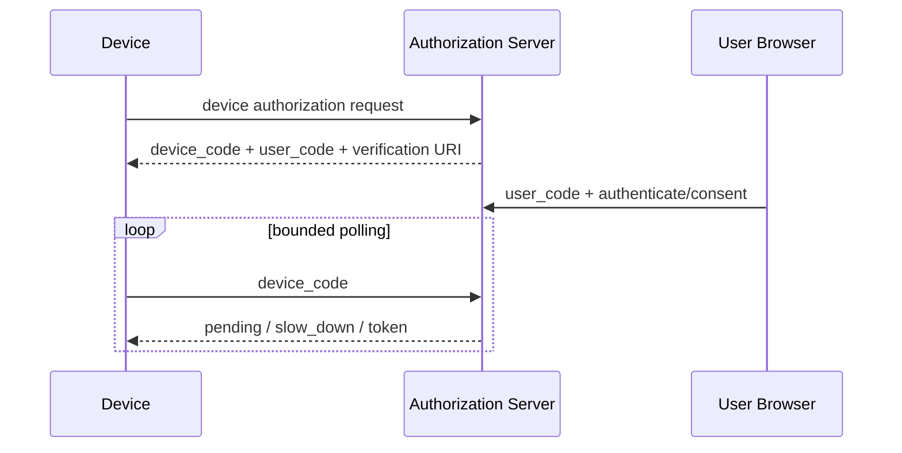

# OAuth 2.0, OpenID Connect, JWT, PKCE, Token Rotation ve Device Flow

Bu bölüm kimlik ve yetkilendirme kavramlarını birbirinden ayırır ve modern OAuth güvenlik pratiğini production failure mode'larıyla bağlar.

```text
OAuth 2.0 -> delegated authorization
OIDC      -> authentication / identity layer
JWT       -> claim taşıyabilen token formatı
PKCE      -> authorization code'u istemci instance'ına bağlayan mekanizma
```

## Authorization Code + PKCE

Redirect tabanlı istemci rastgele `code_verifier` üretir ve `S256` challenge'ını authorization request'e ekler. Authorization code döndüğünde token endpoint verifier'ı challenge ile doğrular. Code ele geçirilse bile verifier olmadan token'a çevrilmesi zorlaşır.



RFC 9700 modern OAuth deployment'larında PKCE, redirect-URI validation ve open-redirector savunmalarını güvenlik profilinin merkezine koyar. `state` transaction/session correlation içindir; PKCE ile aynı problemi çözmez.

## Access token, ID token ve resource-server doğrulaması

Access token resource server'a erişim içindir. ID token OIDC kapsamında kullanıcı kimliği hakkında bilgi taşır. JWT kullanılıyorsa resource server yalnız imzaya bakmamalı; `iss`, `aud`, `exp` ve gerekli scope/authorization bilgisini doğrulamalıdır. Bearer token çalınırsa geçerlilik süresi boyunca replay edilebilir; token lifetime bu nedenle yalnız UX kararı değildir.

## Refresh-token rotation ve reuse detection

Refresh token access token'dan daha uzun ömürlü bir yetki taşıyabilir. Rotation modelinde başarılı refresh sonrasında yeni refresh token verilir ve eski token geçersizleşir. Eski token'ın yeniden görülmesi token theft veya concurrency yarışının sinyali olabilir; implementation token family'yi revoke ederek blast radius'u sınırlayabilir.

Trade-off: rotation replay detection sağlar fakat multi-tab/multi-device concurrency ve network retry davranışı dikkatle modellenmezse meşru istemciler yanlışlıkla revoke edilebilir. Token'ları loglamak, telemetry'ye ham credential koymak veya browser storage kararını threat model olmadan vermek ciddi production riskidir.

## Device Authorization Grant

TV/CLI gibi input-constrained cihazlar kullanıcıyı ayrı browser'a yönlendirebilir. Cihaz `device_code` ile token endpoint'i kontrollü aralıklarla poll eder; kullanıcı kısa `user_code` ile browser'da yetkilendirme yapar.



Device flow phishing'e sihirli çözüm değildir. User-code binding, polling interval/backoff, expiry ve kullanıcının hangi cihazı authorize ettiğini anlayabilmesi threat model'e dahildir.

## Mental model

Authorization code tek kullanımlık bagaj fişi, PKCE verifier yalnız istemcide kalan ikinci parçadır. Refresh token kasa anahtarıdır; daha sıkı korunur ve mümkünse kullanım sonrası yenilenir. Device flow ise klavyesi zayıf cihazın yetkilendirme UI'ını güvenilir browser'a devretmesidir.

## Mülakat soruları

### Mid
1. Authentication ve authorization farkı nedir?
2. OAuth ile OIDC farkı nedir?
3. Access token ve ID token farkı nedir?
4. PKCE hangi saldırıyı azaltır; `state` ile neden aynı değildir?

### Senior
1. Audience ve issuer neden kontrol edilir?
2. Refresh-token rotation ve reuse detection nasıl çalışır?
3. Redirect URI neden exact-match politikasına ihtiyaç duyar?
4. Browser/mobile public client neden client secret'a güvenmemelidir?
5. Device flow'da polling ve phishing riskleri nelerdir?

### Staff / Principal
1. Browser, native mobile, CLI ve TV istemcileri için flow/policy standardını nasıl kurarsın?
2. Merkezi identity platformunun failure domain'i nasıl sınırlandırılır?
3. Token lifetime, revocation, key rotation, auditability ve UX nasıl dengelenir?
4. Multi-tenant API'de tenant boundary ve audience nasıl enforce edilir?

## Kısa alıştırma

SPA, native mobile app ve smart-TV için authorization akışını seç. Redirect URI, PKCE, refresh-token storage/rotation ve logout/revocation davranışını tablo halinde gerekçelendir.

## Proje

`oauth-flow-lab`: authorization-code + PKCE client; callback `state` doğrulaması; issuer/audience/expiry kontrolleri; refresh-token rotation simülasyonu; deliberate code interception ve stale-token reuse testleri.

## Production bağlantısı ve failure mode'lar

Open redirect, gevşek redirect matching, token'ı loglama, aşırı uzun TTL, refresh token'ı uygunsuz saklama ve rotation yarışları temel risklerdir. Production'da token-exchange failure, `invalid_grant`/reuse sinyali, refresh rate, authorization latency ve suspicious redirect/audience hataları izlenmelidir.

## Ana kaynaklar

- RFC 9700 — OAuth 2.0 Security Best Current Practice: https://www.rfc-editor.org/rfc/rfc9700.html
- RFC 7636 — PKCE: https://www.rfc-editor.org/rfc/rfc7636.html
- RFC 8628 — Device Authorization Grant: https://www.rfc-editor.org/rfc/rfc8628.html
- OpenID Connect Core: https://openid.net/specs/openid-connect-core-1_0.html
- RFC 7519 — JWT: https://www.rfc-editor.org/rfc/rfc7519