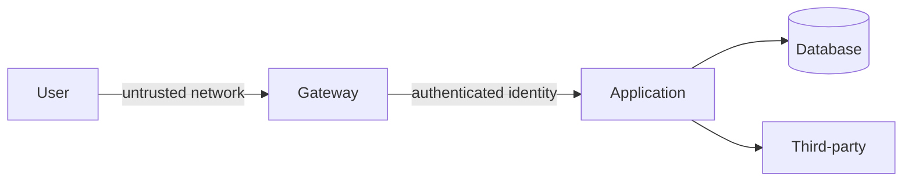

# Threat Modeling ve Trust Boundaries

Threat modeling, sistemi adversarial bakışla inceleyen tekrarlanabilir bir tasarım sürecidir. İlk soru 'hangi exploit?' değil, 'ne inşa ediyoruz?' olmalıdır. Component, data flow, asset, identity, external dependency ve trust boundary'leri çıkar; tehditleri belirle, riskleri önceliklendir, mitigation seç ve doğrula.

## Trust boundary
Veri veya identity farklı güven varsayımlarına sahip bir alana geçtiğinde boundary oluşur. Bu geçişlerde authentication, authorization, validation, confidentiality, integrity ve audit soruları tekrar sorulmalıdır.

## Mülakat yaklaşımı
1. Scope ve assets.
2. Data-flow diagram.
3. Entry points ve trust boundaries.
4. Threat identification ve risk ranking.
5. Mitigation + owner.
6. Validation ve residual risk.

## Failure modes
Checklist'e indirgemek; gerçek data flow'u modellememek; tüm riskleri eşit görmek; owner atamamak; architecture değişince modeli güncellememek.

## Habitat bağlantısı
Multi-tenant storage platformunda tenant -> control plane -> adapter -> external backend zinciri açık trust boundaries üretir. Credential erişimi, tenant isolation ve external dependency sınırları tasarım incelemesinde görünür olmalıdır.

## Kaynaklar
- https://cheatsheetseries.owasp.org/cheatsheets/Threat_Modeling_Cheat_Sheet.html
- https://owasp.org/www-community/Threat_Modeling
