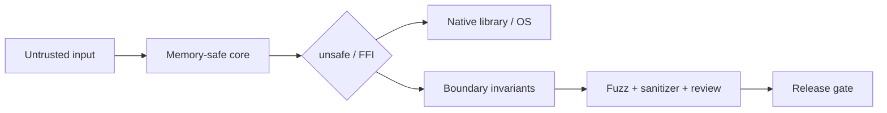

# Memory Safety, Rust FFI & Secure-by-Design Migration

## Neden önemli?
Memory safety; use-after-free, out-of-bounds, double free ve invalid pointer gibi hata sınıflarını azaltır. Memory-safe dil seçimi önemli bir secure-by-design kontrolüdür; fakat native/OS/FFI sınırları ve Rust `unsafe` bölgeleri explicit invariant gerektirir.

## Mental model

## Temel kavramlar
- **Ownership/lifetime:** dangling reference ve use-after-free sınıfını compile-time modellemeye yardım eder.
- **Bounds:** güvenli API'ler index/pointer erişimini kontrol eder.
- **`unsafe`:** compiler'ın kanıtlayamadığı safety contract'ını geliştiriciye bırakır; safety gereksinimini ortadan kaldırmaz.
- **FFI:** pointer validity, length/capacity, ownership transfer, allocator, ABI, unwind/panic ve thread-safety contract'ları ister.
- **Risk-weighted migration:** internet-facing parser, privileged component ve attacker-controlled input path'leri öncelemek çoğu organizasyonda full rewrite'tan daha kontrollü bir yoldur.

## Secure-by-design bağlamı
CISA/FBI'nin 11 Şubat 2025 uyarısı buffer overflow sınıfını azaltmak/ortadan kaldırmak için memory-safe dilleri öncelikli yöntemlerden biri olarak önerir. NIST SP 800-218 SSDF 1.1 finaldir; 17 Aralık 2025 tarihli Rev.1 / SSDF 1.2 dokümanı draft durumundadır. Bu kaynaklar dil seçimini tek kontrol değil, secure SDLC içindeki daha geniş prevention yaklaşımının parçası olarak konumlandırır.

## Mülakat soruları
1. Memory safety ve type safety farkı nedir?
2. Ownership use-after-free riskini nasıl azaltır?
3. `unsafe` ne anlama gelir?
4. FFI boundary'de hangi invariant'ları belgelersin?
5. Fuzzing/sanitizer memory-safe dil ihtiyacını ortadan kaldırır mı?
6. Legacy C/C++ migration'ını nasıl önceliklendirirsin?
7. Staff: migration guardrail ve ölçümlerini nasıl kurarsın?
8. CTO: security exposure, rewrite risk ve delivery velocity nasıl dengelenir?

## Seviyeye göre cevap
- **Mid:** lifetime, bounds, ownership ve temel safety modelini bilir.
- **Senior:** FFI/allocator/concurrency/unsafe invariant ve test stratejisini tartışır.
- **Staff:** component risk scoring, incremental migration ve platform guardrail kurar.
- **CTO:** teknik migration'ı risk economics, staffing ve product roadmap'e bağlar.

## Mini alıştırma
C ABI'dan `(ptr, len)` alan Rust wrapper için null, length, ownership, allocator ve concurrency precondition/postcondition'larını yaz.

## Proje fikri
`ffi-safety-lab`: C parser + Rust wrapper; unsafe tek modülde, fuzz/property test, sanitizer/Miri ve CI release gate.

## Failure modes / trade-off / production
“Memory-safe dil = sıfır vulnerability”, geniş `unsafe`, undocumented ownership transfer, allocator mismatch, ABI drift ve panic/unwind boundary hataları tipiktir. Full rewrite migration defect riskini artırabilir; incremental replacement blast radius'u azaltır ama mixed-language bakım maliyeti getirir. Memory-safety CVE sınıfları, crash signature, unsafe boundary/LOC, fuzz coverage ve native dependency exposure izlenmelidir.

## Kaynaklar
- CISA/FBI Secure by Design — Eliminating Buffer Overflow Vulnerabilities (11 Feb 2025): https://www.cisa.gov/sites/default/files/2025-02/secure-by-design-alert-eliminating-buffer-overflow-vulnerabilities-508c.pdf
- NIST SSDF: https://csrc.nist.gov/projects/ssdf
- NIST SP 800-218 Rev.1 / SSDF 1.2 draft: https://csrc.nist.gov/pubs/sp/800/218/r1/ipd
- Rust Reference — Unsafe: https://doc.rust-lang.org/reference/unsafe-keyword.html
- Rust Nomicon — FFI: https://doc.rust-lang.org/nomicon/ffi.html
