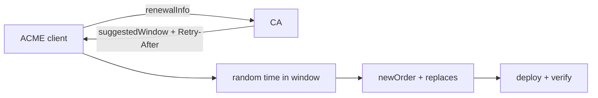

# ACME ARI, Renewal Windows & Certificate Fleet Safety

## Konu anlatımı
Büyük TLS certificate fleet'lerinde sabit `expiry - N days` politikası renewal spike ve CA dependency riski yaratabilir. RFC 9773 ACME Renewal Information (ARI) ile CA'nın `suggestedWindow` yayınlamasını standartlaştırır. Client pencere içinde rastgele zaman seçerek yükü dağıtır; `Retry-After` yeniden sorgulama zamanını yönlendirir. Yeni order'daki `replaces` eski ve yeni sertifika lifecycle'ını ilişkilendirir.

ARI expiration safety'nin yerine geçmez. Endpoint outage, clock skew veya invalid window durumunda bounded retry ve fallback renewal policy gerekir.

## Mental model

## İçeride ne oluyor?
- Directory object ARI `renewalInfo` endpoint'ini ilan eder.
- Client certificate identifier ile renewal bilgisini sorgular.
- Suggested window fleet-wide herd etkisini azaltmak için scheduling sinyali sağlar.
- Retry/backoff state process restart'larında kaybolmamalıdır.
- Renewal success ile deployment success ayrı ölçülmelidir.

## Mülakat soruları
1. Sabit renewal günü neden fleet ölçeğinde risklidir?
2. Suggested window neyi çözer, neyi çözmez?
3. Randomization reliability açısından neden değerlidir?
4. Senior: ARI 24 saat unavailable ise state machine nasıl davranır?
5. Staff: emergency revocation ile normal renewal aynı platformda nasıl yönetilir?

## Seviye beklentisi
- **Junior:** expiration ve ACME order temelini açıklar.
- **Mid:** window, jitter, Retry-After ve fallback'i ayırır.
- **Senior:** persistent retry, idempotency, clock skew ve deployment verification ekler.
- **Staff:** fleet SLO, CA rate limits ve incident response'u birlikte tasarlar.

## Alıştırma / proje
1 milyon sertifikayı 48 saatlik window'a uniform dağıtınca ortalama RPS'i hesapla; peak/retry storm için neden ek headroom gerektiğini açıkla. `ari-renewal-sim` ile fixed schedule ve randomized window yaklaşımını peak RPS, retry ve expiration açısından karşılaştır.

## Failure modes / production
ARI outage, bozuk window, clock skew, retry storm ve deployment failure temel risklerdir. `time_to_expiry`, scheduled renewal, renewal/deploy success, ARI latency/error ve retry count izlenmelidir.

## Kaynaklar
- RFC 9773 — ACME Renewal Information Extension: https://www.rfc-editor.org/rfc/rfc9773.html
- RFC 8555 — ACME: https://www.rfc-editor.org/rfc/rfc8555.html
