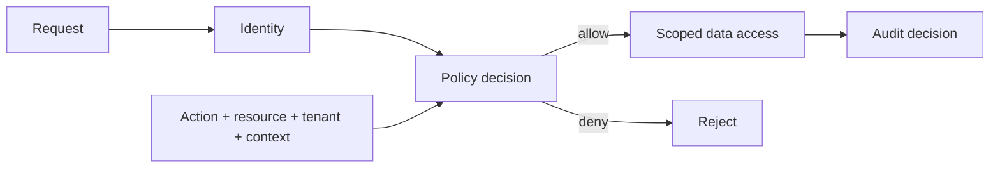

# Object-Level Authorization, BOLA & Deny-by-Default Design

## Konu anlatımı
Authentication principal'ı belirler; authorization `subject + action + resource + context` için erişim kararı verir. Object-level authorization hatasında geçerli oturum sahibi başka kullanıcı/tenant nesnesine yalnız identifier değiştirerek erişebilir. Opaque UUID, UI'da buton gizleme veya yalnız route-level role check authorization değildir.

Sağlam tasarımda resource ownership/tenant scope server-side enforcement'a bağlanır; default deny, least privilege ve auditable decision uygulanır. RBAC kaba capability verirken ownership/tenant/context için ABAC veya resource-scoped policy gerekebilir. OWASP ASVS 5.0.0 güncel stable sürümdür ve authorization kontrollerini test edilebilir gereksinimlere dönüştürmek için kullanılabilir.

## Mental model

**Invariant:** resource ID bilgisi erişim yetkisi değildir; her hassas object access policy scope'uyla doğrulanır.

## Mülakat soruları
1. Authentication ve authorization farkı?
2. BOLA/IDOR nasıl oluşur?
3. UUID neden kontrol değildir?
4. RBAC neden ownership için yetersiz kalabilir?
5. Multi-tenant query isolation nasıl enforce edilir?
6. Authorization cache hangi stale-permission riskini taşır?
7. Staff: merkezi policy ve local enforcement nasıl dengelenir?
8. CTO: authorization standardı compliance ve incident süreçlerine nasıl bağlanır?

## Beklenen cevap seviyesi
- **Junior:** server-side ownership check ve authn/authz ayrımını bilir.
- **Mid:** RBAC/ABAC, tenant scoping, deny-by-default ve negatif testleri açıklar.
- **Senior:** stale cache, TOCTOU, confused deputy, audit ve service identity'yi tartışır.
- **Staff:** policy architecture, migration, telemetry ve blast radius tasarlar.
- **CTO:** secure defaults, compliance evidence ve organizasyon standardını yönetir.

## Mini alıştırma
Viewer/editor/admin rolleri için `GET/PATCH /projects/{id}` subject-action-resource matrisi çıkar. Cross-tenant ID, silinmiş membership ve stale cache için negatif testler ekle.

## Proje fikri
`authz-contract-lab`: tenant-scoped REST API, deny-by-default middleware, policy decision audit log ve property-based cross-tenant testleri.

## Failure modes / trade-off / production
UI-only checks, client tenant ID'sine güvenmek, dağınık admin bypass, stale policy cache, endpoint'ler arası scope drift ve hassas audit log tipik hatalardır. Merkezi policy tutarlılık fakat latency/availability dependency; local policy hız fakat drift getirir. Deny/allow oranı, cross-tenant denemeleri, policy latency/errors, privileged actions ve policy-version dağılımı izlenmelidir.

## Kaynaklar
- OWASP ASVS 5.0.0: https://owasp.org/projects/asvs
- OWASP ASVS repository: https://github.com/OWASP/ASVS/tree/v5.0.0
- OWASP Cornucopia Authorization mapping: https://cornucopia.owasp.org/cards/AZ2
