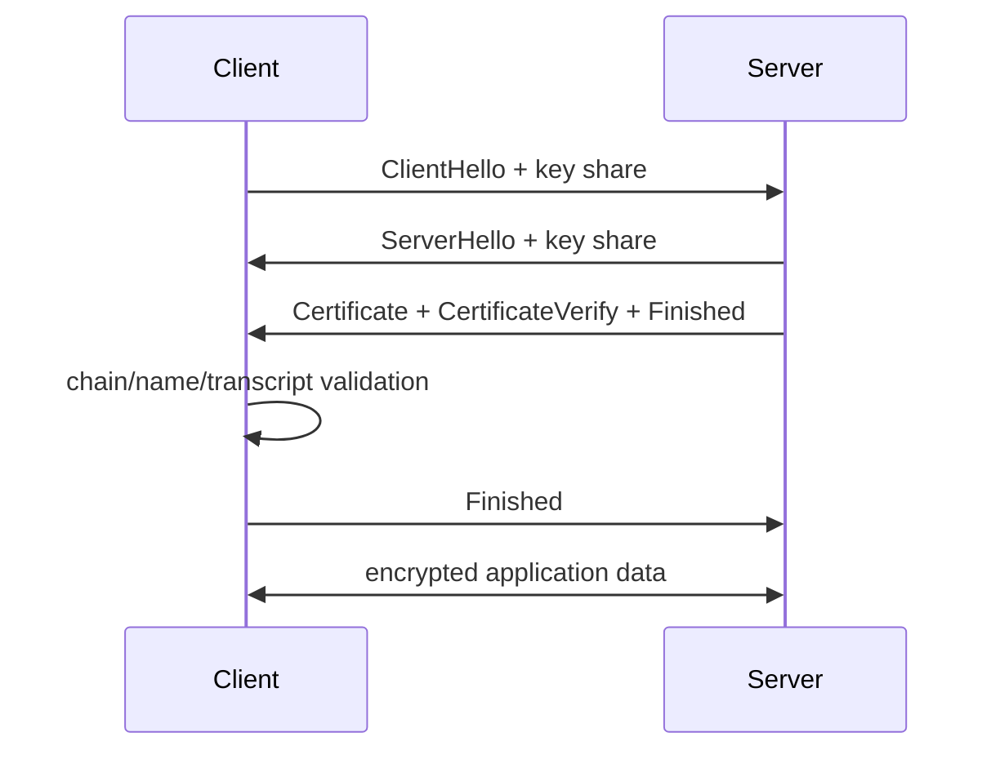

# TLS 1.3 Handshake, PKI, Resumption & 0-RTT

## Konu anlatımı
TLS yalnız encryption değildir: endpoint authentication, confidentiality ve integrity sağlar. TLS 1.3 handshake'inde client/server cryptographic parameters ve ephemeral key share üzerinde anlaşır; server certificate chain ile identity kanıtlar; transcript doğrulamasından sonra application traffic keys kullanılır. Ephemeral key agreement forward secrecy sağlar.

PKI validation; chain'i trust anchor'a kadar doğrulama, validity, key usage ve hostname/SAN kontrolünü içerir. Session resumption önceki bağlantıdan türetilen PSK ile setup maliyetini azaltır. 0-RTT ise resumed connection'da application data'yı ilk flight'ta taşıyabilir fakat replay riski nedeniyle normal 1-RTT data ile aynı security semantics'e sahip değildir.

## İçeride ne oluyor?
- ClientHello supported versions/extensions ve key share taşır.
- Certificate private key bulk traffic'i doğrudan şifrelemez; handshake authentication'a katılır.
- SNI virtual hosting/site seçimine; ALPN application protocol negotiation'a yardım eder.
- Finished mesajları handshake transcript bütünlüğünü doğrular.
- Resumption PSK/session ticket latency ve public-key work'ü azaltabilir.
- 0-RTT replay-safe değildir; application yalnız replay edilmesi kabul edilebilir işlemleri early data'ya koymalıdır.
- Single-use tickets veya ClientHello recording anti-replay state/cost getirir.
- Multi-region anti-replay state replication latency/cost ile replay window arasında trade-off yaratır.

## Mülakat soruları
1. TLS hangi güvenlik özelliklerini sağlar?
2. Certificate ile symmetric traffic key farkı nedir?
3. Certificate chain validation nasıl çalışır?
4. Forward secrecy neden önemlidir?
5. SNI ve ALPN ne yapar?
6. Senior: resumption ne kazandırır?
7. Staff: 0-RTT payment/side-effect endpoint'lerinde neden risklidir?
8. Principal: edge termination, internal mTLS, rotation ve 0-RTT policy'sini nasıl standardize edersin?

## Beklenen cevap seviyesi
- **Mid:** handshake, certificate, symmetric encryption ve hostname validation.
- **Senior:** ephemeral key exchange, transcript, resumption, SNI/ALPN ve rotation.
- **Staff:** replay, mTLS identity, termination boundaries ve distributed anti-replay state.
- **Principal:** PKI governance, crypto agility, latency/security economics ve incident response.

## Mini alıştırma
Static GET, product-search GET, `POST /checkout` ve `POST /transfer` endpoint'lerini 0-RTT açısından sınıflandır. Her biri için “replay olursa hangi side effect tekrar eder?” sorusunu cevapla; yalnız HTTP method adına güvenme.

## Proje fikri
`tls-inspector-lab`: negotiated TLS version/cipher, ALPN, SAN, issuer, validity ve chain bilgisini raporlayan CLI yaz. Expiry alarmı ve handshake latency histogramı ekle; ardından replay-safe endpoint metadata'sına göre 0-RTT policy üreten küçük gateway kuralı ekle.

## Failure modes / production
TLS'i yalnız encryption sanmak, hostname validation'ı atlamak, expiry/rotation'ı manuel bırakmak, 0-RTT'yi replay-safe olmayan endpoint'lerde açmak ve termination sonrası plaintext trust boundary'sini belgelememek tipik hatalardır. Handshake failure rate, negotiated version, expiry horizon, resumption ratio, 0-RTT accept/reject, replay-defense hits ve handshake latency izlenir.

## Kaynaklar
- RFC 9846 — TLS 1.3: https://www.rfc-editor.org/rfc/rfc9846.html
- RFC 5280 — X.509 PKI: https://www.rfc-editor.org/rfc/rfc5280
- RFC 6066 — TLS Extensions / SNI: https://www.rfc-editor.org/rfc/rfc6066
- RFC 7301 — ALPN: https://www.rfc-editor.org/rfc/rfc7301
- RFC 9001 — TLS in QUIC: https://www.rfc-editor.org/rfc/rfc9001.html
