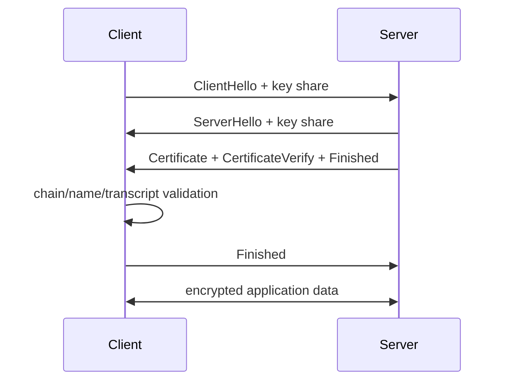

# TLS 1.3 Handshake, PKI, Resumption & 0-RTT

## Konu anlatımı
TLS; endpoint authentication, confidentiality ve integrity sağlar. TLS 1.3 handshake'inde taraflar cryptographic parameters/key share üzerinde anlaşır; server certificate chain ile kimliğini kanıtlar; handshake transcript doğrulandıktan sonra application traffic keys ile veri taşınır. Ephemeral key exchange forward secrecy sağlar.

PKI doğrulaması yalnız certificate'teki hostname'e bakmak değildir: chain güvenilen trust anchor'a kadar doğrulanır; validity, usage ve name kontrolleri yapılır. Session resumption PSK/session ticket ile handshake maliyetini azaltabilir. 0-RTT early data latency kazandırabilir fakat replay riski taşır; replay-safe olmayan side effect'lerde dikkat gerektirir.

## İçeride ne oluyor?
- ClientHello supported versions, cipher suites/extensions ve key share taşır.
- Certificate private key bulk application traffic'i doğrudan şifrelemez; ephemeral agreement sonrası symmetric traffic keys kullanılır.
- Certificate chain leaf → intermediate → trusted root modelidir.
- SNI doğru virtual host/certificate seçimine, ALPN application protocol negotiation'a yardım eder.
- Finished mesajları handshake transcript bütünlüğünü doğrular.
- Resumption round-trip ve public-key maliyetini azaltabilir.
- TLS 1.3 0-RTT data replay edilebilir; application replay riskini yönetmelidir.
- TLS termination trust boundary'dir; termination sonrası plaintext açıkça modellenmelidir.

## Mülakat soruları
1. TLS'in temel güvenlik özellikleri nelerdir?
2. Certificate ile symmetric session key aynı şey midir?
3. Certificate chain nasıl doğrulanır?
4. Forward secrecy nedir?
5. SNI ile ALPN ne işe yarar?
6. Senior: resumption ne kazandırır?
7. Staff: 0-RTT neden payment/POST gibi işlemlerde risklidir?
8. Principal: edge TLS, internal mTLS ve certificate rotation politikasını nasıl tasarlarsın?

## Beklenen cevap seviyesi
- **Mid:** handshake, certificate, symmetric encryption ve hostname validation.
- **Senior:** ephemeral key exchange, transcript integrity, resumption, SNI/ALPN ve rotation.
- **Staff:** 0-RTT replay, mTLS identity, termination boundaries ve observability.
- **Principal:** enterprise PKI, trust-domain segmentation, crypto agility, incident response ve compliance.

## Mini alıştırma
TLS edge'de terminate edilen ve gateway→service trafiği plaintext olan API için network observer, compromised gateway, compromised service node ve stolen certificate key threat model'i çıkar. Internal mTLS sonrası değişen trust boundary'leri işaretle.

## Proje fikri
`tls-inspector-lab`: hostname'e bağlanıp TLS version/cipher, ALPN, leaf SAN, issuer, validity window ve chain bilgisi raporlayan CLI yaz. Expiry threshold alarmı ve handshake latency histogramı ekle.

## Failure modes / production
TLS'i yalnız encryption sanmak, private key'in session traffic'i doğrudan şifrelediğini düşünmek, hostname validation'ı atlamak, certificate rotation'ı manuel bırakmak ve 0-RTT'yi replay-safe olmayan endpoint'lerde açmak tipik hatalardır. Handshake failure rate, negotiated version/protocol, certificate expiry horizon, resumption ratio, handshake latency ve mTLS auth failures izlenir.

## Kaynaklar
- RFC 8446 — TLS 1.3: https://www.rfc-editor.org/rfc/rfc8446
- RFC 5280 — X.509 PKI: https://www.rfc-editor.org/rfc/rfc5280
- RFC 6066 — TLS Extensions / SNI: https://www.rfc-editor.org/rfc/rfc6066
- RFC 7301 — ALPN: https://www.rfc-editor.org/rfc/rfc7301
