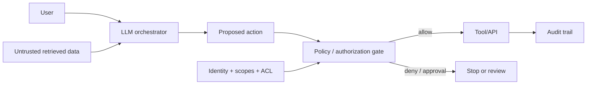

# RAG Trust Boundaries, Prompt Injection & Tool Authorization

**Seviye:** Senior → CTO  
**Alan:** Cybersecurity, LLM, Agentic Systems

## Konu anlatımı
LLM uygulamasında retrieved document, web page, email ve tool output güvenilir instruction değildir; untrusted data olarak modellenmelidir. RAG retrieval kanalını yeni bir input boundary haline getirir. Saldırgan içerik model davranışını etkileyebilir; tool erişimi olan agent'ta sonuç yanlış cevaptan unauthorized action'a kadar büyüyebilir.

Model kararı authorization kararı değildir. Model bir tool call önerebilir; deterministic policy katmanı identity, scope, resource ACL, typed schema, parameter validation ve gerektiğinde human approval uygular. Least privilege, retrieval ACL, provenance ve action validation defense-in-depth oluşturur.

## Mental model
LLM'yi güvenilir administrator değil, öneri üreten untrusted planner gibi düşün. Güvenlik sınırı prompt değil; tool'un önündeki deterministic authorization gate'tir.

## İçeride ne oluyor?
- Prompt injection user input'tan doğrudan veya retrieved/web/tool content üzerinden dolaylı gelebilir.
- Prompt hiyerarşisi tek başına security boundary değildir.
- Retrieval authorization kullanıcı/resource ACL'lerini enforce etmelidir; modelin erişmemesi gereken veri context'e hiç girmemelidir.
- Tool çağrıları typed schema, parameter validation, resource-level authz ve least-privilege credential ile sınırlandırılır.
- High-impact write/delete/send/payment eylemleri risk-tiered approval gerektirebilir.
- Model output'unu SQL/shell/HTML/API parametresi olarak doğrudan yürütmek injection zincirini büyütür.
- Provenance, correlation ID ve audit log incident investigation için gereklidir.
- Security evaluation answer quality yanında attack-success ve unauthorized-action oranlarını da ölçmelidir.

## Yüksek getirili mülakat soruları
1. RAG prompt injection riskini neden ortadan kaldırmaz?
2. Indirect prompt injection nedir?
3. Model neden authorization engine olmamalıdır?
4. Tool-use agent'ta least privilege nasıl uygulanır?
5. Retrieval tenant isolation nerede enforce edilmelidir?
6. Staff: email okuyup ticket açan agent için trust boundaries çiz.
7. Principal: adversarial evaluation pipeline'ını nasıl tasarlarsın?
8. CTO: agentic automation için risk appetite, approval ve audit modelini nasıl kurarsın?

## Seviyeye göre cevap derinliği
- **Senior:** untrusted context, indirect injection, validation, least privilege.
- **Staff:** identity propagation, resource ACL, approval gates, provenance.
- **Principal:** adversarial evaluation, platform policy, cross-tenant isolation, containment.
- **CTO:** impact classification, automation risk, governance, vendor/compliance evidence.

## Kısa alıştırma
Support agent müşteri dokümanlarını retrieve ediyor, CRM okuyor ve ticket açıyor. Dört trust boundary çiz. Retrieved document'ın başka müşterinin kayıtlarını istemeye çalıştığı senaryoda hangi deterministic kontrollerin erişimi engellemesi gerektiğini yaz. Modelin kendi kendine reddetmesini kontrol sayma.

## Proje fikri
`rag-security-gateway`: retrieval sonuçlarına provenance/tenant metadata ekleyen, tool çağrılarını JSON Schema ile doğrulayan ve resource-level policy gate üzerinden geçiren orchestrator kur. Adversarial corpus ile unauthorized-action rate ve benign-task success rate ölç.

## Failure modes / trade-off / production bağlantısı
Prompt filtering'i tek savunma sanmak, modelin kendi yetkisini belirlemesine izin vermek, shared retrieval index'te ACL uygulamamak, broad credential kullanmak, model output'unu doğrudan executable context'e geçirmek ve audit trail tutmamak tipik hatalardır. Sıkı gates güvenliği artırırken latency/UX friction yaratır; risk-tiered approval ana trade-off'tur. Production'da denied tool-call rate, approval rate, cross-tenant access attempts, provenance coverage, attack-success evaluation ve high-impact action audit completeness izlenir.

## Kaynaklar
- NIST AI RMF Generative AI Profile (NIST AI 600-1, 26 Temmuz 2024): https://www.nist.gov/publications/artificial-intelligence-risk-management-framework-generative-artificial-intelligence
- NIST AI Resource Center / TEVV: https://airc.nist.gov/
- OWASP Top 10 for LLM Applications — Prompt Injection: https://genai.owasp.org/llmrisk/llm01-prompt-injection/
