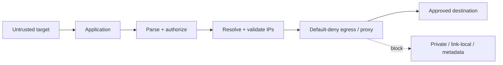

# SSRF: URL Parsing, DNS Rebinding, Egress Policy & Cloud Metadata

## Konu anlatımı
Server-Side Request Forgery, saldırganın server'ın outbound request yeteneğini kendi etkilediği hedefe yönlendirmesidir. Risk internal APIs, admin/control-plane endpoints, cloud metadata ve workload identity ile erişilebilen kaynakları kapsar. SSRF yalnız string validation değil, request capability ve network policy problemidir.

## Mental model
`parse -> canonicalize -> authorize -> resolve -> validate -> connect under egress policy -> redirectte tekrar authorize`.

Application capability ile network capability'yi ayrı savunma katmanları yap. Kullanıcı bir validation bypass bulsa bile process'in default-deny egress policy'si blast radius'u sınırlamalıdır.

## İçeride ne oluyor?
- Battle-tested URL parser kullan; scheme/host/port'u ayrı policy girdileri yap.
- Mümkünse arbitrary URL yerine predefined destination veya strict allowlist kullan.
- Redirect her hop'ta yeniden authorize edilmelidir.
- A/AAAA sonuçlarının tümünü değerlendir; loopback, link-local, private/internal ve special-use ranges için policy uygula.
- DNS validation ile gerçek socket connection arasındaki re-resolution/TOCTOU ve rebinding riskini hesaba kat.
- Merkezi egress proxy, default-deny firewall/network policy, segmentation ve least privilege kullan.
- Internal servisleri yalnız private network'te oldukları için trusted sayma; authentication/authorization uygula.
- Cloud metadata kullanılmıyorsa kapat. AWS EC2'de IMDSv2 session token kullanır; `HttpTokens=required` IMDSv1'i kapatabilir. Bu defense-in-depth'tir, SSRF fix'i değildir.

## Mülakat soruları
1. SSRF neden yalnız URL validation değildir?
2. Allowlist neden denylist'ten güçlüdür?
3. DNS rebinding/pinning bypass nedir?
4. Redirect handling kontrolü nasıl bypass eder?
5. `resolve -> validate -> connect` TOCTOU problemi nedir?
6. Egress proxy/network policy blast radius'u nasıl azaltır?
7. Arbitrary external URL gerektiren webhook/fetcher nasıl güvenli tasarlanır?
8. Organization-wide SSRF guardrail'i metadata, identity, internal auth ve observability ile nasıl kurarsın?

## Seviye beklentisi
- **Mid:** SSRF, private/link-local risk, allowlist, redirect, metadata.
- **Senior:** canonicalization, DNS rebinding/TOCTOU, IPv4/IPv6, egress.
- **Staff:** reusable outbound gateway, tenant policy, auditability.
- **Principal:** secure-by-default networking, metadata hardening, policy-as-code, exception governance.

## Mini alıştırma
`GET /proxy?url=...` endpoint'i yalnız `https://` prefix ve `hostname != localhost` kontrol ediyor. En az altı failure mode çıkar; allowlist + DNS/IP validation + redirect revalidation + default-deny egress akışı tasarla.

## Proje fikri
`safe-fetch-gateway`: HTTPS-only, explicit destination/port policy, DNS result validation, redirect revalidation, response-size/time budget ve structured audit log. IPv4/IPv6 loopback, link-local/private ranges, redirect chain ve DNS-answer-change testleri ekle.

## Failure modes / trade-off / production
Regex/substring URL kontrolü parser edge-case'lerinde kırılır. Hostname allowlist tek başına DNS rebinding'i çözmez. IP blocklist IPv6 ve special-use ranges'te eksik kalabilir. Redirect kapatmak güvenliği sadeleştirir ama compatibility azaltabilir. Egress proxy audit/control sağlar fakat latency ve availability dependency'si yaratır. Webhook, URL preview, PDF/image fetch ve import-from-URL ortak SSRF yüzeyleridir.

## Kaynaklar
- OWASP SSRF Prevention Cheat Sheet: https://cheatsheetseries.owasp.org/cheatsheets/Server_Side_Request_Forgery_Prevention_Cheat_Sheet.html
- AWS EC2 IMDS: https://docs.aws.amazon.com/AWSEC2/latest/UserGuide/configuring-instance-metadata-service.html
- AWS EC2 metadata options: https://docs.aws.amazon.com/AWSEC2/latest/UserGuide/configuring-instance-metadata-options.html
- AWS API InstanceMetadataOptionsRequest: https://docs.aws.amazon.com/AWSEC2/latest/APIReference/API_InstanceMetadataOptionsRequest.html
