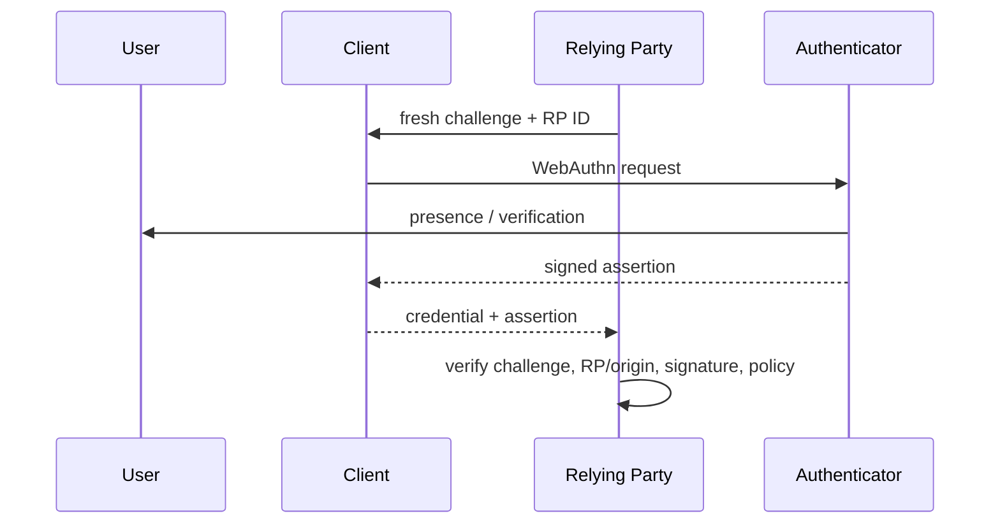

# WebAuthn, Passkeys, RP Binding & Account Recovery

## Konu anlatımı
WebAuthn public-key credential kullanır: private key authenticator/passkey provider tarafında kalır, relying party (RP) public key'i saklar. Authentication sırasında server fresh challenge üretir; authenticator RP/origin bağlamında assertion imzalar; RP challenge, origin/RP binding, credential ve signature'ı doğrular.

Passkey'i yalnız "biometric login" olarak düşünmek yanlıştır. Biometric/PIN genellikle authenticator'ı yerelde unlock eder; biometric template RP'ye gönderilmez. Güvenlik özelliğinin çekirdeği asymmetric challenge-response ve credential'ın verifier/RP bağlamına bağlı olmasıdır. W3C, Web Authentication Level 3'ü 25 Ağustos 2026'da Recommendation olarak yayımladı.

## Mental model
**Password:** kullanıcı reusable secret'ı siteye taşır. **Passkey:** RP fresh challenge gönderir; doğru RP'ye scoped private key cryptographic proof üretir. Güçlü authentication'a rağmen zayıf recovery/fallback bütün assurance seviyesini aşağı çekebilir.

## Registration ve authentication
Registration'da RP fresh challenge üretir; authenticator RP'ye scoped key pair oluşturur; RP credential ID ve public key'i kaydeder. Authentication'da fresh challenge replay'i engeller. Client/authenticator RP/origin bağlamını doğrulama zincirine bağlar. RP assertion signature'ını ve policy'yi doğrular.

User presence ile user verification aynı kavram değildir. Synced passkey device replacement ve usability'yi kolaylaştırabilir; device-bound credential daha yüksek device assurance ihtiyacına uygun olabilir. Attestation authenticator özellikleri hakkında ek kanıt sağlayabilir fakat privacy, ecosystem interoperability ve operasyon maliyeti trade-off'ları taşır.

## Account recovery ve lifecycle
Credential enrollment, birden fazla credential, revoke, device loss ve account recovery ilk günden tasarlanmalıdır. Legacy password fallback veya zayıf help-desk recovery, phishing-resistant primary authentication'ı bypass eden daha zayıf bir alternate path oluşturabilir. Recovery bu nedenle ayrı UX özelliği değil authentication trust boundary'sidir.

## Yüksek getirili mülakat soruları
1. WebAuthn password'dan hangi trust boundary açısından farklıdır?
2. Passkey neden phishing-resistant kabul edilir?
3. Challenge neyi, RP/origin binding neyi önler?
4. Synced ve device-bound passkey arasında hangi assurance/usability trade-off'u vardır?
5. Biometric data RP server'a gider mi?
6. Recovery flow passkey assurance'ını nasıl düşürebilir?
7. Attestation ne zaman değerlidir, ne zaman privacy/ops maliyetidir?
8. Workforce, consumer ve privileged-admin policy'lerini nasıl farklılaştırırsın?

## Seviyeye göre cevap derinliği
- **Junior:** public/private key, challenge-response ve password taşımama.
- **Mid/Senior:** RP/origin binding, replay, user verification ve credential lifecycle.
- **Staff:** recovery, attestation, synced/device-bound policy, telemetry ve migration.
- **Principal/CTO:** assurance tiers, regulatory/risk model, fleet/ecosystem strategy ve fallback governance.

## Kısa alıştırma
Password+TOTP ile passkey login için server breach, phishing proxy, device loss, account recovery ve replay saldırılarını karşılaştıran trust-boundary tablosu çıkar. Her satırda hangi kontrolün riski azalttığını belirt.

## Proje fikri
`passkey-lab`: registration/login, multiple credentials, revoke, recovery-code fallback ve audit log içeren küçük bir RP kur. Challenge reuse, yanlış RP/origin ve revoked credential için negatif testler yaz.

## Failure modes / trade-off / production bağlantısı
Zayıf recovery, legacy password fallback veya help-desk social engineering passkey assurance'ını bypass edebilir. Challenge reuse, credential lifecycle eksikleri ve yanlış RP configuration güvenlik açığı yaratabilir. Production'da login success/failure, recovery usage, enrollment, fallback rate ve suspicious recovery sinyalleri izlenmelidir.

## Kaynaklar
- W3C WebAuthn Level 3 Recommendation: https://www.w3.org/TR/webauthn-3/
- W3C Recommendation announcement, 25 August 2026: https://www.w3.org/news/2026/web-authentication-an-api-for-accessing-public-key-credentials-level-3-is-now-a-w3c-recommendation/
- FIDO specifications: https://fidoalliance.org/specifications/
- FIDO passkeys: https://fidoalliance.org/passkeys/
