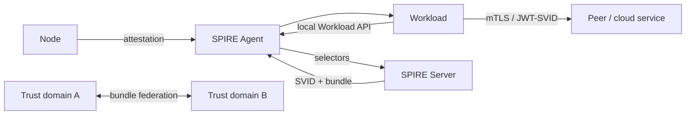

# SPIFFE/SPIRE — Workload Identity, Attestation, SVIDs ve Federation

## Problem
Uzun ömürlü API key/client secret dağıtımı credential leakage, rotation ve bootstrap riskini büyütür. Workload identity'nin amacı process/node bağlamından doğrulanmış, kısa ömürlü ve otomatik yenilenen machine identity üretmektir.

SPIFFE `spiffe://trust-domain/path` kimlik namespace'ini ve SVID kimlik belgelerini tanımlar. SPIRE, node/workload attestation ve Workload API üzerinden bu modeli production'da uygular.

## Mental model
SVID workload'un kısa ömürlü kimlik kartıdır; SPIFFE ID kart üzerindeki kimliktir; trust domain kimliği veren otorite sınırıdır. Federation iki domain'i tek CA yapmak yerine birbirinin trust bundle'ını kontrollü tanımalarını sağlar.

## Internals
1. Agent node attestation ile bulunduğu node'u doğrular.
2. Local Workload API çağrısında workload selectors toplanır.
3. Registration entry selectors'ı SPIFFE ID ile eşler.
4. Workload X.509-SVID veya JWT-SVID alabilir; rotation statik secret deployment'ından ayrılır.
5. X.509-SVID mTLS peer authentication için; JWT-SVID token/OIDC-compatible integration için uygundur.
6. Authentication authorization değildir: SPIFFE ID ayrıca policy ile yetkilendirilmelidir.
7. Federation trust bundle exchange ile ayrı trust domain'ler arasında doğrulamayı mümkün kılar.

## Mülakat soruları
- SPIFFE ID ile SVID farkı nedir?
- Node ve workload attestation neden ayrıdır?
- X.509-SVID ve JWT-SVID seçim kriterleri nelerdir?
- Trust domain sınırı nasıl seçilir?
- Federation blast radius'u nasıl etkiler?
- Static credential elimination'ın migration ve platform maliyeti nasıl değerlendirilir?

## Seviye beklentisi
- **Mid:** ID, SVID, Workload API, short-lived credentials.
- **Senior:** attestation, selectors, rotation, authn/authz ayrımı.
- **Staff/Principal:** trust topology, federation, HA, policy ve incident containment.
- **CTO:** platform ownership, compliance evidence, developer experience ve breach-risk economics.

## Alıştırma
Kubernetes `payments/api` workload'unun static AWS key olmadan remote servise erişimini tasarla: SPIFFE ID, selectors, JWT audience, IAM mapping, rotation ve incident revocation adımlarını belirt.

## Proje
İki workload'u SPIRE ile X.509-SVID mTLS üzerinden konuştur; sonra ikinci trust domain ve federation ekle. Credential'ı container image içine koymadan rotation ve authorization failure testleri yap.

## Failure modes / production
Geniş selectors identity confusion; hatalı federation blast-radius büyümesi; control-plane outage renewal riski; authorization eksikliği excessive privilege yaratır. SVID renewal errors, expiry headroom, attestation failures, bundle freshness, denied identities, federation health ve policy audit trail izlenmelidir.

## Kaynaklar
- SPIRE Concepts: https://spiffe.io/docs/latest/spire-about/spire-concepts/
- Working with SVIDs: https://spiffe.io/docs/latest/deploying/svids/
- Registering workloads: https://spiffe.io/docs/latest/deploying/registering/
- Federation architecture: https://spiffe.io/docs/latest/architecture/federation/readme/
- OIDC/AWS federation: https://spiffe.io/docs/latest/keyless/oidc-federation-aws/
