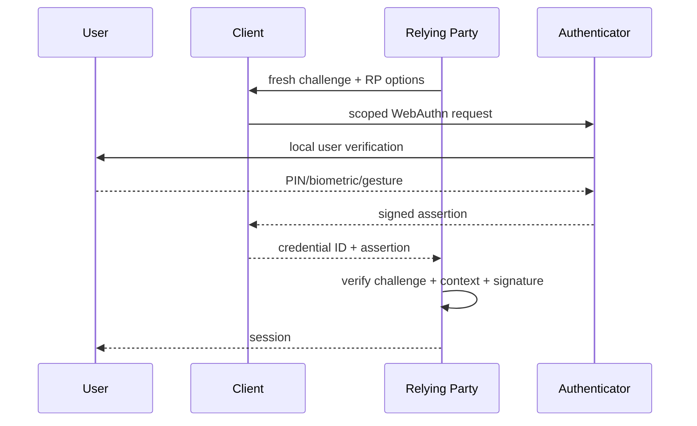

# WebAuthn, Passkeys, Phishing Resistance & Account Recovery

**Seviye:** Junior → Principal  
**Alan:** Cybersecurity / Backend / Identity

## Neden önemli?
Password authentication shared secret'in kullanıcı tarafından başka origin'e verilebilmesi nedeniyle phishing'e açıktır. WebAuthn authentication'ı RP-scoped public-key challenge/response'a taşır. Passkey deployment'ında asıl production problemi yalnız cryptography değil; registration, multi-device UX, recovery, enrollment authorization, session security ve legacy fallback'in aynı assurance seviyesinde tutulmasıdır.

W3C, WebAuthn Level 3'ü 25 Ağustos 2026'da Recommendation olarak yayımladı.

## Mental model
Password: "Sırrı biliyor musun?"  
WebAuthn: "Bu RP'ye bağlı private key ile fresh challenge'ı imzalayabiliyor musun?"

Private key RP'ye gitmez. Biometric/PIN genellikle authenticator içindeki local user verification'dır; biometric template RP'ye gönderilmez.

## Registration ve authentication
Registration'da RP random challenge üretir; authenticator credential key pair oluşturur ve public doğrulama materyali RP'ye döner. Authentication'da yeni challenge imzalanır. Server challenge freshness/reuse, expected RP/origin context ve signature gibi invariants'ı doğrular.

User presence ile user verification aynı değildir. Bir gesture presence gösterebilir; PIN/biometric gibi mekanizmalar local verification sağlayabilir. Assurance policy bunu açıkça tanımlamalıdır.

## Synced vs device-bound passkeys
Synced passkeys cross-device erişim ve recovery UX'ini iyileştirir. Device-bound credential cihazla daha sıkı bağ ve bazı yüksek-assurance kullanım alanlarında daha güçlü policy sağlayabilir. "Synced = güvensiz" veya "device-bound = her zaman doğru" genellemeleri yanlıştır; threat model, support/recovery yükü ve kullanıcı kitlesi belirleyicidir.

## Attestation
Attestation authenticator özellikleri hakkında cryptographic evidence sağlayabilir. Workforce veya regüle/high-assurance ortamlarda policy enforcement için değerli olabilir. Consumer sistemlerde zorunlu attestation device compatibility ve privacy maliyeti yaratabilir. RP yalnız gerçekten kullandığı assurance sinyalini toplamalıdır.

## Recovery, enrollment ve session güvenliği
Account recovery alternatif authentication yoludur. Login phishing-resistant iken recovery email/SMS'e kolayca düşüyorsa sistem downgrade olur. Yeni passkey enrollment da hassas operasyondur: yalnız mevcut session var diye otomatik güvenmek yerine riskli durumda re-authentication gerekir.

Passkey ayrıca çalınmış session cookie'yi geriye dönük korumaz. Session rotation, cookie hardening, anomaly detection ve sensitive-action re-authentication ayrı kontrollerdir.

## Yüksek getirili mülakat soruları
1. WebAuthn password database breach riskini nasıl değiştirir?
2. Passkey neden biometric ile eş anlamlı değildir?
3. Challenge replay nasıl engellenir?
4. RP/origin binding phishing resistance'a nasıl katkı verir?
5. Synced ve device-bound credential trade-off'ları nelerdir?
6. Attestation ne zaman gerekli olabilir?
7. Passkey migration'da recovery downgrade nasıl engellenir?
8. Çalınmış session cookie karşısında neden ayrıca session security gerekir?
9. Staff/Principal: consumer ve workforce policy'lerini neden farklı tasarlarsın?

## Seviyeye göre cevap derinliği
- **Junior:** public/private key, challenge, authenticator ve local verification.
- **Mid:** registration/authentication ceremony, replay ve RP binding.
- **Senior:** attestation, sync/device-bound, enrollment, recovery ve session theft.
- **Staff:** fleet/browser compatibility, migration, policy ve fraud telemetry.
- **Principal:** assurance, accessibility, support cost, fraud loss ve adoption economics.

## Mini alıştırma
Fintech hesabında iki passkey kayıtlı olsun. (1) yeni passkey enrollment, (2) bütün passkey'lerin kaybı, (3) yüksek riskli para transferi için authentication/recovery gate'lerini çiz. Email-only recovery'nin login assurance'ını nasıl düşürdüğünü threat-model et.

## Proje fikri
`passkey-auth-lab`: test RP kur; server-side süreli/tek kullanımlık challenge store, multi-credential account, revoke ekranı ve audit log ekle. Replay challenge, yanlış origin ve ele geçirilmiş session üzerinden enrollment senaryolarını test et.

## Failure modes ve production bağlantısı
- Weak recovery → account takeover.
- Unprotected credential enrollment → attacker persistence.
- Legacy password/SMS fallback → assurance downgrade.
- Over-strict attestation → compatibility/support problemi.
- Session theft → güçlü login'e rağmen hijack.
- Credential-loss UX kötü ise adoption düşer.

Production'da registration/auth success, fallback/recovery rate, credential add/remove, suspicious recovery, re-authentication, session-theft signals ve support volume birlikte izlenmelidir.

## Kaynaklar
- W3C — WebAuthn Level 3 Recommendation announcement, 25 Aug 2026: https://www.w3.org/news/2026/web-authentication-an-api-for-accessing-public-key-credentials-level-3-is-now-a-w3c-recommendation/
- FIDO Alliance — Passkeys: https://fidoalliance.org/passkeys/
- FIDO Alliance — Specifications overview: https://fidoalliance.org/specifications-overview/
- NIST — Syncable Authenticators supplement overview: https://www.nist.gov/news-events/news/2024/04/giving-nist-sp-800-63b-boost-nist-sp-800-63b-supplement-incorporating
- OWASP Authentication Cheat Sheet: https://cheatsheetseries.owasp.org/cheatsheets/Authentication_Cheat_Sheet.html
- OWASP MFA Cheat Sheet: https://cheatsheetseries.owasp.org/cheatsheets/Multifactor_Authentication_Cheat_Sheet.html
