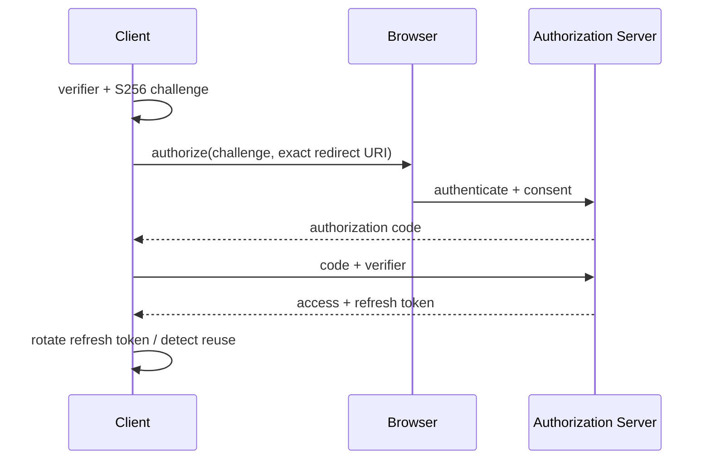

# OAuth 2.0: Authorization Code + PKCE, Token Rotation & Device Flow

## Neden önemli?
OAuth delegated authorization problemidir; authentication için OpenID Connect gibi identity katmanı gerekir. Modern redirect tabanlı istemcilerde Authorization Code + PKCE, authorization code'un ele geçirilmesini tek başına token hırsızlığına dönüştürmeyi zorlaştırır.

## Mental model
Authorization code tek kullanımlık bagaj fişi; `code_verifier` yalnız istemcide kalan ikinci parçadır. Refresh token kasa anahtarıdır: access token'dan daha sıkı korunur ve mümkünse rotation ile kullanılır.

## Temel mekanizma
1. Client yüksek entropili `code_verifier` üretir ve `S256` challenge gönderir.
2. Authorization server code'u challenge ve transaction ile bağlar.
3. Callback'te client `state`/transaction correlation kontrolünü yapar.
4. Token endpoint code + verifier eşleşmesini doğrular.
5. Resource server access token'ın issuer/audience/scope/expiry sözleşmesini doğrular.
6. Refresh-token rotation eski token'ın tekrar kullanımını compromise sinyaline dönüştürebilir.

RFC 9700 (Ocak 2025) OAuth 2.0 Security BCP'dir. Authorization server'ların PKCE desteklemesini, challenge kullanılmışsa verifier'ı enforce etmesini, redirect URI'larda exact matching'i ve open redirector'lardan kaçınmayı öngörür. PKCE yalnız native app tekniği olarak düşünülmemelidir.

## Device Authorization Grant
TV ve CLI gibi input-constrained cihazlar browser interaction'ı ikinci bir cihaza devredebilir. Client `device_code` alır; kullanıcı kısa `user_code` ile browser'da onay verir; cihaz polling/backoff ile sonucu bekler. Device flow phishing veya device-binding problemlerini otomatik çözmez.

## Mülakat soruları
- OAuth ile OIDC farkı nedir?
- PKCE ile `state` hangi farklı riskleri ele alır?
- Neden implicit flow yerine authorization code + PKCE?
- Refresh-token rotation/reuse detection nasıl çalışır?
- Browser, native, CLI ve TV istemcileri için flow nasıl seçilir?
- Staff/Principal: token TTL, revocation, UX, auditability ve migration nasıl standardize edilir?

## Failure modes ve trade-off
Gevşek redirect matching, open redirect, token'ı loglama, uzun TTL, browser'da uygunsuz refresh-token storage ve rotation yarışları risklidir. Kısa TTL blast radius'u azaltır ama refresh yükünü artırır. Rotation compromise detection sağlar fakat concurrency ve recovery tasarımı ister.

## Production bağlantısı
`invalid_grant`, token exchange/refresh failure, refresh reuse, auth latency, redirect mismatch, issuer/audience validation failure ve revoke oranlarını izle. Token değerlerini telemetry'ye yazma; kimlik olaylarını correlation ID ve güvenli metadata ile audit et.

## Kısa alıştırma
SPA, native mobile ve smart-TV için flow, redirect, PKCE, refresh storage/rotation ve logout/revocation davranışını tasarla.

## Proje
`oauth-flow-lab`: authorization-code + PKCE client; callback state kontrolü, refresh rotation ve deliberate interception/reuse testleri.

## Kaynaklar
- RFC 9700 — OAuth 2.0 Security Best Current Practice: https://www.rfc-editor.org/rfc/rfc9700.html
- RFC 7636 — PKCE: https://www.rfc-editor.org/rfc/rfc7636.html
- RFC 8628 — Device Authorization Grant: https://www.rfc-editor.org/rfc/rfc8628.html
