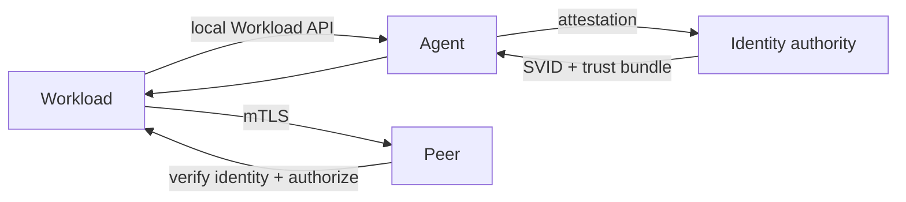

# SPIFFE Workload Identity, SVID Rotation & Trust Domains

## Neden önemli?
IP, hostname veya uzun ömürlü shared secret servis kimliği için zayıf primitive'lerdir. SPIFFE workload identity'yi runtime attestation ile bağlanan, kriptografik olarak doğrulanabilir bir kimliğe dönüştürür.

## Mental model

## Temel kavramlar
- **SPIFFE ID:** `spiffe://trust-domain/path` URI kimliği.
- **SVID:** workload'un kimliği kanıtlama belgesi; X.509 veya JWT olabilir.
- **Trust domain:** identity trust root / administrative security boundary.
- **Workload API:** workload'a SVID, key ve trust bundle sağlayan local API.
- **Federation:** ayrı trust domain'lerin birbirinin identity belgelerini doğrulayabilmesi; authorization değildir.

## Rotation ve güvenlik sınırı
X.509-SVID kısa ömürlü tutulup Workload API üzerinden rotate edilebilir. Client yeni SVID/bundle geldiğinde yeni bağlantıları güncel materyalle kurmalıdır. JWT-SVID bearer token olduğu için replay riski taşır; audience doğrulaması kritik sınırdır. Workload Endpoint bootstrap secret istemez; caller authenticity kernel/orchestrator gibi out-of-band mekanizmalarla belirlenir.

## Mülakat soruları
1. SPIFFE ID, SVID ve trust bundle arasındaki fark nedir?
2. X.509-SVID ile JWT-SVID trade-off'u nedir?
3. Workload API neden doğrudan client credential istemeden güvenli olabilir?
4. Federation neden authorization değildir?
5. Cert rotation sırasında long-lived connection'ları nasıl yönetirsin?
6. Staff: multi-region trust-domain topology ve incident blast radius'u nasıl tasarlarsın?

## Failure modes / production
Tek dev trust domain, stale bundle, JWT audience validation eksikliği, rotation'ın restart'a bağımlı olması ve identity issuance'ı authorization sanmak tipik hatalardır. SVID expiry horizon, rotation failures, attestation errors, mTLS handshake failures, bundle age ve policy denies izlenmelidir.

## Kaynaklar
- https://spiffe.io/docs/latest/spiffe/concepts/
- https://spiffe.io/docs/latest/spiffe-specs/spiffe_workload_api/
- https://spiffe.io/docs/latest/spiffe-specs/spiffe_workload_endpoint/
- https://spiffe.io/docs/latest/deploying/svids/
