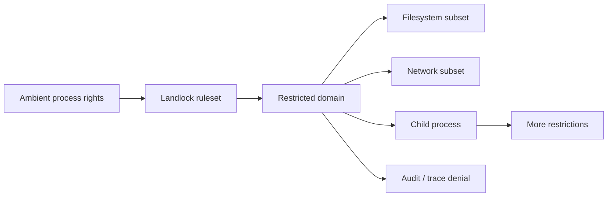

# Landlock LSM, Unprivileged Sandboxing & Denial Observability

## Neden önemli?
Landlock, Linux process'lerinin ambient filesystem/network haklarını unprivileged biçimde yalnız daraltabilmesini sağlayan stackable LSM'dir. Mevcut DAC/LSM politikasını gevşetmez; defense-in-depth katmanı olarak compromised process'in blast radius'unu küçültür.

## Mental model

**Invariant:** Landlock domain'i yalnız daha kısıtlı hale gelebilir; kaybedilmiş hak Landlock üzerinden geri açılamaz.

## İçeride ne oluyor?
- `landlock_create_ruleset()` handled access rights'i tanımlar.
- `landlock_add_rule()` filesystem/network object rule'larını ekler.
- `landlock_restrict_self()` process'i domain'e geçirir ve restriction descendants'a miras kalır.
- Landlock namespaces, seccomp, DAC veya SELinux/AppArmor'un yerine geçmez; bunların üzerine kısıt ekler.
- Network ve IPC scoping farklı resource boundary'leridir.
- Güncel kernel trace events sandbox lifecycle ve denial'ları ftrace/eBPF ile gözlemlenebilir yapar.

## Mülakat soruları
1. Landlock ile namespace arasındaki fark nedir?
2. Unprivileged sandbox neden privilege escalation değildir?
3. Monotonic restriction hangi güvenlik invariant'ını sağlar?
4. Landlock neden SELinux/AppArmor'un tam alternatifi değildir?
5. Filesystem allowlist'te runtime dependency failure'ları nasıl debug edilir?
6. Senior: denial telemetry hassasiyetini nasıl yönetirsin?
7. Staff: seccomp + namespace + Landlock defense-in-depth tasarımı nasıl kurulur?
8. Principal: platform çapında policy versioning/rollout nasıl yapılır?

## Beklenen cevap derinliği
- **Mid:** DAC/LSM/namespace/Landlock ayrımı.
- **Senior:** domain inheritance, filesystem/network ve denial debugging.
- **Staff:** layered sandbox, telemetry security ve compatibility.
- **Principal:** policy lifecycle, exception governance ve sandbox SLO.

## Mini alıştırma
Build worker için source read-only, workdir read-write, artifact write ve yalnız artifact proxy'ye network erişimi olan policy tasarla. Landlock/namespace/seccomp sorumluluklarını ayır.

## Proje
`landlock-runner-lab`: policy dosyasından ruleset kurup child process çalıştıran wrapper; ABI detection, negative tests ve denial telemetry ekle.

## Failure modes / production
Landlock'u tüm container isolation sanmak, runtime dosyalarını allowlist dışında bırakmak, ABI capability kontrol etmemek, denial telemetry'yi aşırı yetkilendirmek ve policy'yi versionlamamak tipik hatalardır. Sandbox setup failure, denied access, policy version, unsupported ABI ve exception rate izlenir.

## Kaynaklar
- Linux Kernel — Landlock userspace API, Ağustos 2026: https://kernel.org/doc/html/next/userspace-api/landlock.html
- Linux Kernel — Landlock LSM design: https://kernel.org/doc/html/next/security/landlock.html
- Linux Kernel — Landlock trace events: https://kernel.org/doc/html/next/trace/events-landlock.html
- Linux Kernel — Landlock audit/system-wide management: https://www.kernel.org/doc/html/latest/admin-guide/LSM/landlock.html
