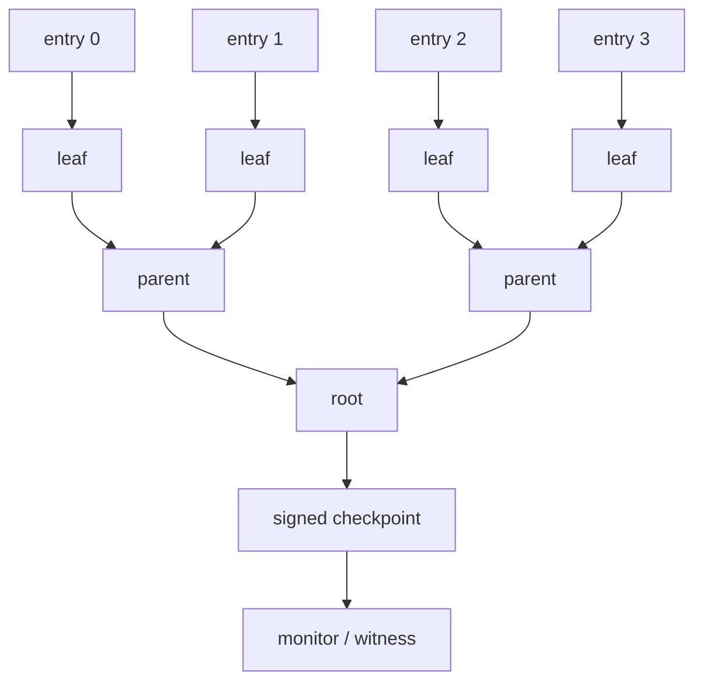

# Transparency Logs, Merkle Inclusion & Consistency Proofs

## Neden var?
Transparency log, audit event'lerini yalnız saklamak yerine geçmişin sessizce rewrite edilmesini kriptografik olarak fark edilebilir hale getirir. Certificate Transparency ve Sigstore/Rekor gibi sistemlerde ordered entries Merkle tree'ye bağlanır ve tree root/checkpoint imzalanır.

## Mental model

- **Inclusion proof:** belirli leaf'in belirli tree size/root altında bulunduğunu sibling hash path ile kanıtlar.
- **Consistency proof:** eski tree head'in yeni tree'nin prefix history'si olduğunu; büyümenin append-only gerçekleştiğini kanıtlar.
- **Signed checkpoint/STH:** tree size + root + time gibi state'i log identity'sine bağlar.

## İçeride ne oluyor?
Leaf ve internal node hash'leri domain-separated biçimde hesaplanabilir. Parent hash child hash'lerden türetilir; root ordered prefix'e commitment olur. Inclusion verifier leaf index ve sibling path ile root'u yeniden üretir. Consistency verifier old/new tree head'lerin aynı geçmiş üzerinde append-only ilişkisini kontrol eder.

Kriptografi tek başına global tek görünüm sağlamaz. Kötü niyetli log farklı istemcilere farklı ama kendi içinde geçerli tree view gösterebilir. Bu nedenle monitor, witness ve checkpoint paylaşımı/gossip trust modelini güçlendirir.

## Mülakat soruları
1. Merkle root neden bütün log'a commitment sağlar?
2. Inclusion ve consistency proof farkı nedir?
3. Proof size neden yaklaşık O(log n)'dir?
4. Signed tree head neyi kanıtlar, neyi kanıtlamaz?
5. Split-view/equivocation nedir?
6. Staff/Principal: witness/monitor topolojisini nasıl tasarlarsın?

## Beklenen cevap seviyesi
- **Mid:** Merkle root, inclusion ve append-only fikri.
- **Senior:** checkpoint/tree size, consistency proof, split-view ve monitoring.
- **Staff:** proof serving/cache, sharding, checkpoint distribution, monitor lag.
- **Principal:** independent trust domains, witness governance, evidence retention ve incident response.

## Kısa alıştırma
8 leaf'li tree çiz ve leaf 3 inclusion path'indeki sibling hash'leri işaretle. Ardından 8-leaf ve 12-leaf root'larını yalnız karşılaştırmanın neden append-only geçmişi kanıtlamadığını açıkla.

## Proje fikri
`transparency-log-lab`: append-only log, Merkle root, inclusion proof verifier, old/new checkpoint consistency verifier ve conflicting checkpoint yakalayan küçük witness geliştir.

## Failure modes / trade-off / production
İmzalı root'u global truth sanmak; inclusion ile consistency'yi karıştırmak; monitor yokken auditability varsaymak tipik hatalardır. Büyük log'da proof serving/cache, sharding ve monitor lag maliyet yaratır. Tree size/checkpoint age, inclusion latency/error, consistency failure, monitor lag, conflicting checkpoint ve signer/witness health izlenmelidir.

## Kaynaklar
- RFC 9162 — Certificate Transparency Version 2.0: https://www.rfc-editor.org/rfc/rfc9162.html
- Sigstore Rekor overview: https://docs.sigstore.dev/logging/overview/
- Sigstore Rekor security model: https://docs.sigstore.dev/about/security/
- Sigstore Rekor sharding: https://docs.sigstore.dev/logging/sharding/
