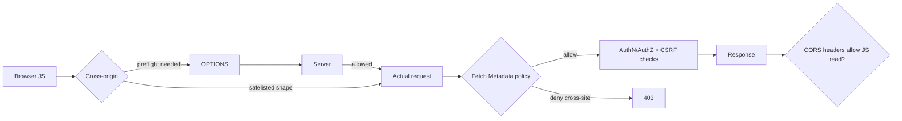

# CORS Preflight, Credentials & Fetch Metadata Resource Isolation

**Seviye:** Junior → Staff  
**Alan:** Frontend / Backend / Cybersecurity

## Neden önemli?
CORS browser'ın cross-origin script erişimini yöneten HTTP-header protokolüdür; server-to-server firewall veya authorization değildir. Preflight bazı cross-origin isteklerde gerçek request öncesi izin kontrolü yapar. Fetch Metadata ise request'in browser bağlamını server'a taşıyarak resource-isolation policy için ek sinyal sağlar.

## Mental model

## CORS akışı
Origin scheme + host + port üçlüsüdür. Browser request mode, method ve header şekline göre CORS protocol'ünü uygular. Gerekli durumda `OPTIONS` preflight gönderir; server `Access-Control-Allow-Origin`, `Access-Control-Allow-Methods` ve `Access-Control-Allow-Headers` ile policy bildirir.

Credentialed cross-origin request'te explicit origin policy gerekir; wildcard origin credential senaryosunda uygun değildir. Preflight request credentials taşımaz. Daha önemlisi, preflight gerektirmeyen form-benzeri cross-site request'ler vardır: bu nedenle CORS, CSRF savunmasının yerine geçmez.

## Fetch Metadata
`Sec-Fetch-Site` request'in same-origin, same-site, cross-site veya doğrudan kullanıcı bağlamından geldiğini bildirir. `Sec-Fetch-Mode`, `Sec-Fetch-Dest` ve `Sec-Fetch-User` kullanım bağlamını tamamlar. Server hassas endpoint'lerde cross-site request'i default-deny edip gerçekten cross-origin olması gereken endpoint'leri allowlist edebilir.

Bu katman authn/authz, SameSite cookie veya CSRF token yerine geçmez; defense-in-depth sağlar. Legacy/non-browser clients ve gerçek cross-origin use-case'leri rollout sırasında hesaba katılmalıdır.

## Mülakat soruları
1. SOP ile CORS ilişkisi nedir?
2. Preflight ne zaman olur ve neyi garanti etmez?
3. CORS neden CSRF koruması değildir?
4. Credentialed request'te wildcard origin neden sorunludur?
5. `Sec-Fetch-Site: cross-site` ne sağlar?
6. Public API ile cookie-authenticated admin endpoint policy'sini nasıl ayırırsın?
7. CDN/cache katmanında origin-varying CORS response'larında neye dikkat edersin?

## Beklenen cevap derinliği
- **Junior:** origin, SOP ve browser enforcement'ı açıklar.
- **Mid:** preflight, credentials ve allow headers akışını bilir.
- **Senior:** CORS/CSRF ayrımını ve Fetch Metadata defense-in-depth modelini kurar.
- **Staff:** CDN caching, allowlist governance, legacy clients ve endpoint sınıflandırmasını production policy'ye bağlar.

## Alıştırma
Cookie kullanan `app.example` → `api.example` request'i ile saldırgan bir cross-site POST'u karşılaştır. JSON + custom-header request ile HTML form-benzeri POST'un preflight davranışını çiz; response okunabilirliği ile side effect oluşmasını ayrı değerlendir.

## Proje
İki origin üzerinde frontend/API kur. Simple, preflighted ve credentialed request örnekleri; strict origin allowlist ve `Sec-Fetch-Site` tabanlı isolation middleware ekle. DevTools ve integration testlerle OPTIONS/actual request akışını doğrula.

## Failure modes / production
Origin'i körlemesine reflect etmek allowlist'i anlamsızlaştırır. CORS'u authz veya CSRF sanmak güvenlik açığı yaratır. CDN cache key/`Vary` hataları farklı origin policy'lerini karıştırabilir. Fetch Metadata'yı sert rollout etmek legitimate legacy/non-browser clients'ı bozabilir. Rejected origin/site, preflight error rate, endpoint sınıfı ve credential mode izlenmelidir.

## Kaynaklar
- MDN — CORS: https://developer.mozilla.org/en-US/docs/Web/HTTP/Guides/CORS
- MDN — Fetch Metadata: https://developer.mozilla.org/en-US/docs/Web/HTTP/Guides/Fetch_metadata
- MDN — Sec-Fetch-Site: https://developer.mozilla.org/en-US/docs/Web/HTTP/Reference/Headers/Sec-Fetch-Site
