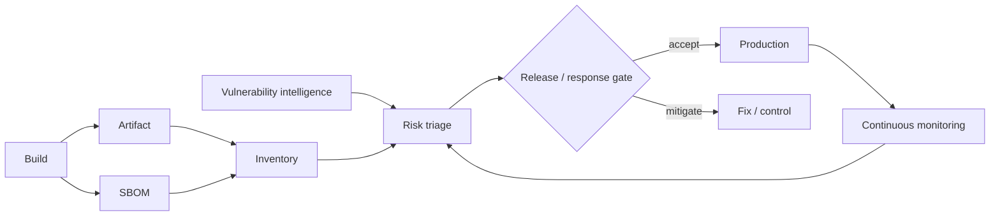

# SBOM as Operational Supply-Chain Control

**Seviye:** Senior → CTO  
**Alan:** Cybersecurity / Leadership / Product

## Konu anlatımı
SBOM bir release artefact'ındaki software component ve ilişkileri makinece işlenebilir biçimde görünür kılar. Production değeri yalnız dosya üretmek değil; SBOM'u doğru artefact/provenance ile bağlayıp vulnerability intelligence, asset inventory, procurement, incident response ve release policy içinde kullanmaktır.

CISA'nın 2025 Minimum Elements güncellemesi baseline'ı Data Fields, Automation Support ve Practices and Processes olarak üç kategoriye ayırır ve kapsamın OSS, AI software ve SaaS dahil farklı software türlerine uygulanabileceğini belirtir.

SBOM risk kararı değildir. Bir CVE'nin component inventory'de bulunması otomatik exploitability anlamına gelmez; absence da güvenlik garantisi değildir. Reachability, deployment context, compensating controls, exploit evidence, asset criticality ve fix availability triage'a girer.

## Mental model

**Invariant:** SBOM inventory evidence'ıdır; exploitability veya trustworthiness'in tek başına kanıtı değildir.

## İçeride ne oluyor?
- Component identity supplier/name/version ve persistent identifiers ile normalize edilir.
- Dependency relationships top-level artefact ile transitive component'leri bağlar.
- Automation-friendly format ingestion/diff/monitoring sağlar.
- SBOM artefact digest/provenance ile bağlanmazsa yanlış binary'yi tarif edebilir.
- Immutable SBOM yeni advisory geldikçe yeni risk bulguları üretebilir.
- Supplier SBOM quality, freshness, completeness ve update SLA ölçülmelidir.

## Mülakat soruları
1. SBOM ile vulnerability scan farkı?
2. Artefact digest binding neden önemli?
3. CVE release'i otomatik bloklamalı mı?
4. Transitive/unknown component nasıl ele alınır?
5. Freshness/completeness nasıl ölçülür?
6. Staff: monorepo/container/base-image aggregation nasıl kurulur?
7. Principal: düşük supplier quality nasıl yönetilir?
8. CTO: block/exception/withdrawal kararı hangi risk evidence'ına dayanır?

## Beklenen cevap seviyesi
- **Senior:** identity, generation, validation, vulnerability correlation.
- **Staff:** CI/CD ingestion, artefact binding, gate, exception, incident workflow.
- **Principal:** org-wide quality standardı, supplier controls, prioritization.
- **CTO:** customer/regulatory expectation, velocity, supplier leverage, incident economics, risk appetite.

## Mini alıştırma
Container image için source dependencies, OS packages ve base image SBOM'unu image digest'e bağla. Kritik CVE için block/exception evidence'ı ve exception expiry yaz.

## Proje fikri
`sbom-risk-gate-lab`: CycloneDX/SPDX SBOM üret, image digest'e bağla, vulnerability feed ile correlate et, severity + exploitability + criticality policy gate ve süreli exception ekle; yeni advisory ile inventory'yi rebuild olmadan yeniden değerlendir.

## Failure modes / production
Artefact binding eksikliği, yalnız direct dependency, stale supplier data, tüm CVE'leri eşit görmek, false-positive nedeniyle sürekli bypass ve süresiz exception temel hatalardır. Coverage/completeness, unknown rate, freshness age, critical finding MTTR, exception age, supplier conformance ve artefact-SBOM verification failure izlenir.

## Kaynaklar
- CISA — Minimum Elements for an SBOM, 2025: https://www.cisa.gov/sites/default/files/2025-08/2025_CISA_SBOM_Minimum_Elements.pdf
- CISA / ESF — Recommended Practices for Managing OSS and SBOMs: https://www.cisa.gov/sites/default/files/2024-08/ESF_SECURING_THE_SOFTWARE_SUPPLY_CHAIN%20RECOMMENDED%20PRACTICES%20FOR%20MANAGING%20OPEN%20SOURCE%20SOFTWARE%20AND%20SOFTWARE%20BILL%20OF%20MATERIALS_508.pdf
