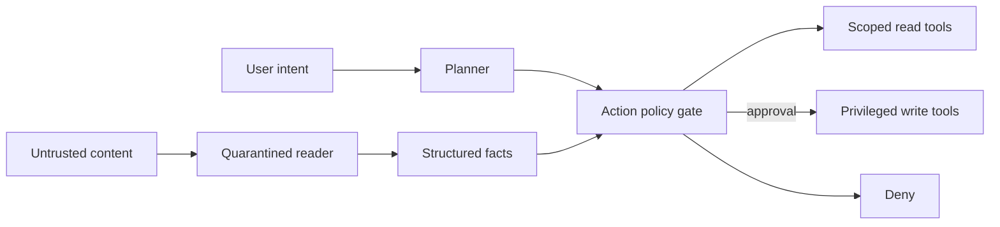

# Indirect Prompt Injection, Tool Isolation & Action Authorization

## Problem
Agent'ın okuduğu web, e-posta, doküman ve RAG içeriği saldırgan kontrollü instruction taşıyabilir. Indirect prompt injection'da saldırgan user prompt'una erişmeden agent davranışını saptırır. Prompt-level filtre bu nedenle tek başına güvenlik sınırı değildir.

## Temel güvenlik modeli
Modelin tool call önermesi authorization değildir. Execution katmanı user intent, verb/resource scope, side-effect riski ve gerektiğinde human approval üzerinden bağımsız karar vermelidir. Read/write capability ayrımı, typed narrow tool schemas, sandbox, egress allowlist ve kısa ömürlü credentials blast radius'u azaltır.

Regex/sanitization defense-in-depth katmanıdır; semantik veya obfuscated injection'a karşı mutlak sınır sayılmaz. Tool output ve retrieved content de untrusted kabul edilmelidir. Audit trail original intent → source → proposed action → policy decision → actual side effect zincirini korumalıdır.

## Mülakat katmanları
- **Senior:** indirect injection, least privilege, action validation.
- **Staff:** trust zones, capability scopes, sandbox/egress, red-team harness.
- **Principal:** ortak policy plane, telemetry, containment standardı.
- **CTO:** risk appetite, approval threshold, audit ve autonomous productivity dengesi.

Sorular: Prompt-only defense neden yetmez? Authorization nerede yapılır? RAG poisoning ile injection farkı nedir? Read browser + deploy tool kombinasyonunda hangi boundary gerekir? Approval fatigue nasıl azaltılır?

## Alıştırma ve proje
“Web'den araştır ve mesaj gönder” agent'ı için trust-boundary tablosu çıkar; harici içerikteki exfiltration instruction'ının hangi katmanda duracağını göster. `agent-action-firewall` projesinde typed actions, resource/verb allowlist, risk score, approval ve immutable audit log uygula; indirect-injection regression fixture'ları ekle.

## Failure modes / production
Prompt-only bypass, over-broad OAuth scope, unrestricted egress, cross-tenant context leakage, second-order injection ve approval fatigue temel risklerdir. Denied/approved action oranı, tool anomalies, egress destinations, policy regression tests ve privileged-action provenance izlenmelidir.

## Kaynaklar
- OWASP — LLM Prompt Injection Prevention: https://cheatsheetseries.owasp.org/cheatsheets/LLM_Prompt_Injection_Prevention_Cheat_Sheet.html
- OpenAI, 22 Dec 2025 — Hardening ChatGPT Atlas against prompt injection: https://openai.com/index/hardening-atlas-against-prompt-injection/
- OWASP — Secure AI Model Ops: https://cheatsheetseries.owasp.org/cheatsheets/Secure_AI_Model_Ops_Cheat_Sheet.html