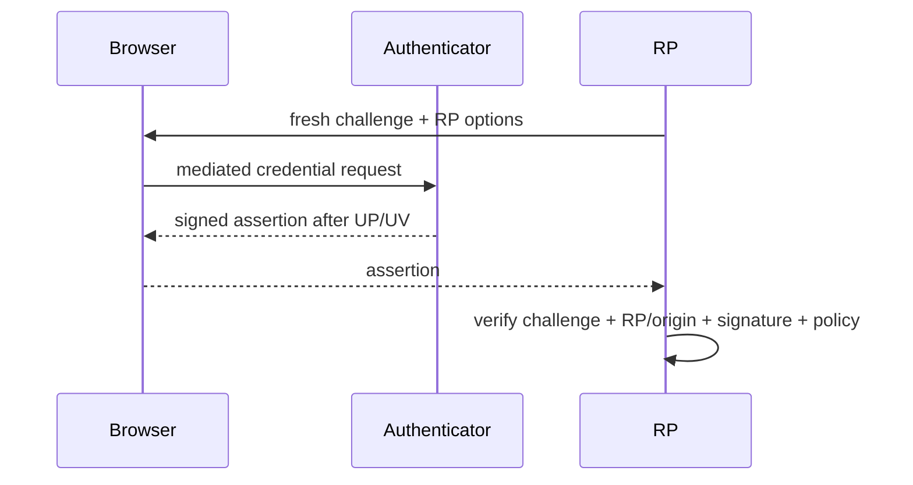

# WebAuthn Level 3, Passkeys, RP Binding & Phishing Resistance

## Neden önemli?
WebAuthn shared-secret tabanlı login yerine RP'ye scoped public-key credentials kullanır. Private key authenticator'dan çıkmaz; server public key tutar. 25 Ağustos 2026'da WebAuthn Level 3 W3C Recommendation oldu.

## Mental model

## Mekanizma
Registration'da authenticator key pair üretir; RP public key ve credential metadata saklar. Authentication'da server-generated challenge replay'i önler. RP/origin binding credential'ın phishing origin'inde kullanılmasını zorlaştırır. User presence ile user verification farklı policy sinyalleridir. Discoverable credentials username-less discovery'ye izin verebilir. Attestation authenticator özellikleri hakkında kanıt sağlayabilir fakat privacy/deployment trade-off'u vardır.

Passkey sync usability sağlar ama recovery ve ecosystem trust boundary'sini genişletebilir. WebAuthn session hijacking, zayıf authorization veya zayıf account recovery'yi tek başına çözmez.

## Mülakat soruları ve cevap derinliği
- **Junior:** public/private key, challenge, signature nedir? `challenge` neden tek kullanımlık olmalı?
- **Mid:** RP/origin binding phishing'i nasıl zorlaştırır? UP ve UV farkı nedir? Discoverable credential nedir?
- **Senior:** attestation ne zaman zorunlu tutulmalı? Password fallback neden güvenlik downgrade'i olabilir?
- **Staff:** passkey migration, enrollment, recovery ve session controls nasıl tasarlanır?
- **Principal:** consumer vs enterprise threat model, fraud telemetry, ecosystem trust ve fleet policy nasıl dengelenir?

İyi cevap yalnız kriptografiyi değil credential lifecycle'ı, fallback/recovery'yi ve authentication sonrası session boundary'sini de kapsar.

## Kısa alıştırma
Password+TOTP ile passkey login'i phishing, credential stuffing, replay, stolen session ve recovery saldırıları açısından tabloyla karşılaştır. Her saldırıda kontrolün nerede çalıştığını işaretle.

## Proje
`passkey-lab`: registration/authentication challenge'larını server-side tek kullanımlık tutan, UV policy varyantları ve discoverable login destekleyen küçük RP geliştir. Credential enrollment/revocation audit log'u ekle.

## Failure modes / trade-off / production
Reused challenge replay riskidir. Zayıf recovery güçlü authenticator'ı bypass eder. Yanlış RP/origin doğrulaması phishing boundary'sini bozar. Kontrolsüz enrollment takeover'ı kolaylaştırır. Sync usability karşılığında yeni trust dependencies getirir. Production'da registration/auth failure, fallback/recovery oranı, credential churn, suspicious enrollment ve session anomalies izlenmelidir.

## Kaynaklar
- W3C WebAuthn Level 3 Recommendation announcement, 2026-08-25: https://www.w3.org/news/2026/web-authentication-an-api-for-accessing-public-key-credentials-level-3-is-now-a-w3c-recommendation/
- W3C Web Authentication Level 3: https://www.w3.org/TR/webauthn-3/
