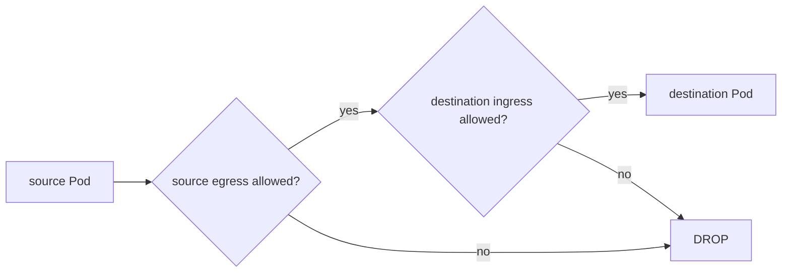

# Kubernetes NetworkPolicy, Default-Deny & Microsegmentation

**Seviye:** Junior → Staff  
**Alanlar:** Cybersecurity, Cloud/DevOps/SRE, Networking

## Neden önemli?
`replicas` availability sağlar; NetworkPolicy ise hangi workload'un hangisine ağ seviyesinde erişebileceğini sınırlar. Amaç compromise sonrası lateral movement ve blast radius'u azaltmaktır.

## Mental model

## Temel semantics
- Policy yoksa Pod ilgili direction için non-isolated'dır.
- Bir policy Pod'u ingress veya egress için isolate ettiğinde yalnız applicable allow kuralları geçer.
- Birden fazla NetworkPolicy additive union oluşturur; firewall-style first-match ordering yoktur.
- A→B bağlantısı için A egress ve B ingress birlikte izin vermelidir.
- `podSelector: {}` namespace içindeki tüm Pod'ları seçer.
- Default-deny egress DNS'i de kesebilir; gerekli DNS akışı ayrıca açılmalıdır.
- Enforcement için kullanılan network plugin/CNI'ın NetworkPolicy desteklemesi gerekir.

## Default-deny rollout
1. Mevcut connectivity graph'ını telemetry ile çıkar.
2. Namespace veya workload sınırını belirle.
3. Gerekli DNS/telemetry/platform akışlarını kaydet.
4. Default-deny uygula.
5. Minimum allow edges ekle.
6. Connectivity matrix testini CI/CD'ye koy.
7. Denied-flow ve application error telemetry'sini rollout boyunca izle.

## Mülakat soruları
1. NetworkPolicy yokken varsayılan davranış nedir?
2. Ingress ve egress neden bağımsızdır?
3. İki policy aynı Pod'u seçerse hangisi kazanır?
4. Default-deny neden DNS outage yaratabilir?
5. Senior: label drift policy güvenliğini nasıl bozar?
6. Staff: NetworkPolicy ile service-mesh L7 authorization'ı nasıl katmanlarsın?

## Cevap derinliği
- **Junior:** ingress/egress ve allow-list modelini bilir.
- **Mid:** selectors, policyTypes ve additive semantics'i açıklar.
- **Senior:** DNS, CNI, rollout ve observability failure mode'larını yönetir.
- **Staff:** workload identity + L4 segmentation + L7 authz + tenant boundaries'i tek zero-trust tasarımında birleştirir.

## Alıştırma
`frontend`, `api`, `db` için default-deny sonrası yalnız `frontend→api:8080`, `api→db:5432` ve DNS akışlarını aç. `frontend→db` bağlantısının neden başarısız kaldığını source-egress/destination-ingress mantığıyla doğrula.

## Proje
`k8s-microseg-lab`: kind/k3d üzerinde connectivity matrix testi yaz; yanlış label, DNS egress eksikliği ve beklenmeyen yeni service edge senaryolarını CI'da yakala.

## Failure modes / trade-off / production
Aşırı geniş selector blast radius'u büyütür; aşırı ince policy seti operasyonel karmaşıklık yaratır. Default-deny platform bağımlılıklarını kesebilir. Policy manifest'inin varlığı enforcement garantisi değildir. Production'da denied flows, policy coverage, label drift, DNS errors ve deployment sonrası connection regressions izlenmelidir.

## Kaynaklar
- Kubernetes — Network Policies: https://kubernetes.io/docs/concepts/services-networking/network-policies/
- Kubernetes API — NetworkPolicy v1: https://kubernetes.io/docs/reference/kubernetes-api/networking-resources/network-policy-v1/
- NIST SP 800-207 — Zero Trust Architecture: https://csrc.nist.gov/pubs/sp/800/207/final
