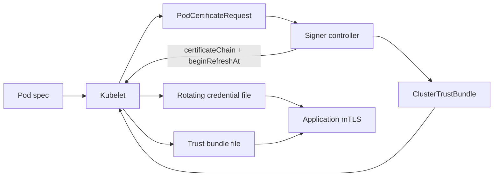

# Kubernetes Pod Certificates, ClusterTrustBundles & Workload Identity

## Neden önemli?
Kubernetes v1.37'de Pod Certificates ve ClusterTrustBundles Stable/GA oldu. ServiceAccount JWT bearer-token modeline ek olarak workload'ların X.509 proof-of-possession credential kullanmasını ve trust anchor'ların native projected volumes ile dağıtılmasını sağlar.

## Mental model

**Invariant:** certificate delivery, signer authorization, peer identity policy ve application reload ayrı güvenlik katmanlarıdır.

## Mimari
Kubelet Pod'daki `podCertificate` projected-volume kaynağını görür, private key üretir ve signer'a yönelik `PodCertificateRequest` oluşturur. Signer controller policy uygulayıp certificate chain ve yenileme zamanını döndürür. Kubelet credential'ı filesystem'e yazar ve yeniler. `ClusterTrustBundle` ise signer'a ait X.509 trust anchor'ların cluster-scoped dağıtım yüzeyidir.

Kubernetes core genel amaçlı signer sağlamaz; signer implementation ve CA policy ayrı trust boundary'dir. ClusterTrustBundle okunabilir trust material taşır; gizlilikten çok bütünlük ve write authorization kritiktir.

## Rotation ve correctness
- Uygulama credential/trust dosyalarını startup'ta bir kez okumamalı; inotify veya polling ile reload etmelidir.
- Tek credential bundle dosyası key/cert snapshot tutarlılığını kolaylaştırır; ayrı dosyalar mid-rotation race doğurabilir.
- CA rollover için eski+yeni trust anchor overlap penceresi gerekir.
- Kısa ömürlü sertifika replay penceresini azaltır fakat kötü authorization veya signer compromise sorununu çözmez.
- NodeRestriction, node izolasyonunun önemli bir parçasıdır; node'un başka node'daki Pod adına credential istemesini sınırlar.

## Mülakat soruları
1. Bearer JWT ile proof-of-possession X.509 arasındaki fark nedir?
2. Pod Certificates neden Kubernetes'in CA olduğu anlamına gelmez?
3. Rotation sırasında application hangi race'leri yaşayabilir?
4. Senior: signer compromise blast radius'unu nasıl sınırlandırırsın?
5. Staff: multi-cluster trust domain ve CA rollover nasıl tasarlanır?
6. Principal/CTO: native identity, service mesh ve cloud workload identity arasında build-vs-buy kararı nasıl verilir?

## Seviye beklentileri
- **Mid:** JWT/X.509, signer, trust anchor ve mTLS rollerini ayırır.
- **Senior:** expiry, reload, signer authorization ve node-compromise failure mode'larını tartışır.
- **Staff:** multi-cluster trust, staged CA rotation, policy ve observability tasarlar.
- **Principal/CTO:** identity platform ownership, compliance, incident response ve maliyeti birlikte değerlendirir.

## Alıştırma
24 saatten kısa ömürlü credential için normal rotation, signer outage ve trust-bundle rollover state machine'i çiz. Eski/yeni CA overlap penceresini ve fail-open/fail-closed kararını belirt.

## Proje
`pod-cert-rotation-lab`: Kind + test signer üzerinde iki servis kur; mTLS bağlantısında certificate/trust rotation, signer outage ve stale reload fault injection uygula.

## Failure modes / production
Startup-only credential load, aşırı yetkili signer, SAN/identity policy eksikliği, CA overlap olmadan rollover, clock skew ve “encrypted = authorized” varsayımı başlıca hatalardır. İzlenecek sinyaller: issuance latency/error, expiry horizon, reload success, TLS handshake failures, signer queue depth ve trust-bundle version dağılımı.

## Kaynaklar
- Kubernetes v1.37 Pod Certificates & Cluster Trust Bundles (2026-08-28): https://kubernetes.io/blog/2026/08/28/kubernetes-v1-37-pod-certificates-and-cluster-trust-bundles/
- Kubernetes v1.37 release: https://kubernetes.io/blog/2026/08/26/kubernetes-v1-37-release/
- Certificates API: https://kubernetes.io/docs/reference/kubernetes-api/certificates/
- ClusterTrustBundle API: https://kubernetes.io/docs/reference/kubernetes-api/certificates/cluster-trust-bundle-v1/
