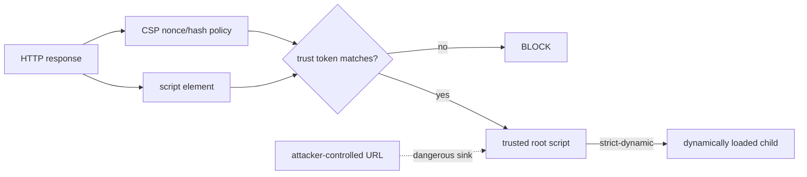

# Content Security Policy: Nonces, Hashes & `strict-dynamic`

**Seviye:** Mid → Principal  
**Alanlar:** Frontend, Cybersecurity

## Neden önemli?
CSP, browser'a hangi kaynakların yüklenip hangi script'lerin çalışabileceğini söyleyen defense-in-depth katmanıdır. XSS'in kök nedenini düzeltmez; injection'ın executable script'e dönüşmesini zorlaştırır.

## Mental model

## Nonce, hash ve trust propagation
- Nonce sunucu tarafından her response için yeni ve tahmin edilemez üretilmelidir.
- Nonce header policy'si ile izin verilen script elementindeki değer eşleşir.
- Hash statik script içeriğine trust bağlar; içerik değişirse hash de değişmelidir.
- `strict-dynamic`, nonce/hash ile güvenilen root script'in programatik yüklediği non-parser-inserted script'lere trust aktarabilir.
- Bu trust propagation, trusted loader attacker-controlled URL'den script yaratıyorsa saldırı sink'ini güvenli yapmaz.
- CSP3 davranışında `strict-dynamic` script trust modelini host allowlist'ten nonce/hash köklerine kaydırır.

## Deployment modeli
1. Mevcut inline handlers, `eval`, third-party loaders ve dynamic script sinks envanterini çıkar.
2. Önce `Content-Security-Policy-Report-Only` ile violation telemetry topla.
3. SSR'da per-response nonce üret ve trusted scripts'e enjekte et.
4. Gerekirse `strict-dynamic` ile loader dependency zincirini destekle.
5. Browser/release cohort bazında breakage'i ölç.
6. Enforcement'a geç; exception'ları süreli ve owner'lı tut.

## Mülakat soruları
1. CSP neden XSS'in tam çözümü değildir?
2. Nonce ve hash ne zaman seçilir?
3. Nonce neden her response'ta değişmelidir?
4. `strict-dynamic` hangi deployment problemini çözer?
5. Senior: CDN caching ile per-response nonce nasıl çatışır?
6. Staff: report-only → enforce rollout'unu nasıl yaparsın?
7. Principal: microfrontend/third-party script ekosisteminde CSP governance nasıl kurulur?

## Cevap derinliği
- **Mid:** directives, nonce/hash ve defense-in-depth rolünü bilir.
- **Senior:** SSR/cache, report-only rollout ve dynamic loader riskini açıklar.
- **Staff:** telemetry, framework integration ve supply-chain trust sınırlarını tasarlar.
- **Principal:** organization-wide baseline, exception governance ve product breakage riskini dengeler.

## Alıştırma
SSR sayfasında first-party bundle + analytics loader için `unsafe-inline` kullanmadan nonce-based policy tasarla. Analytics child script yüklediğinde `strict-dynamic` etkisini; loader URL'si user input'tan türetiliyorsa kalan riski açıkla.

## Proje
`strict-csp-lab`: permissive → report-only nonce CSP → enforcing strict CSP geçişi yap. Inline handler, eval, third-party loader ve attacker-controlled dynamic URL testleri ekle; violation report dashboard'u kur.

## Failure modes / trade-off / production
Sabit/reused nonce trust modelini bozar. `unsafe-inline` geniş saldırı yüzeyi bırakır. `strict-dynamic` attacker-controlled script-construction sink'ini otomatik güvenli yapmaz. Çok agresif policy UI'ı kırabilir; çok gevşek allowlist korumayı anlamsızlaştırır. Violation rate, blocked directive/source, browser cohort, release correlation ve XSS findings birlikte izlenmelidir.

## Kaynaklar
- W3C — Content Security Policy Level 3: https://www.w3.org/TR/CSP/
- MDN — Content Security Policy guide: https://developer.mozilla.org/en-US/docs/Web/HTTP/Guides/CSP
- MDN — Practical CSP implementation: https://developer.mozilla.org/en-US/docs/Web/Security/Practical_implementation_guides/CSP
