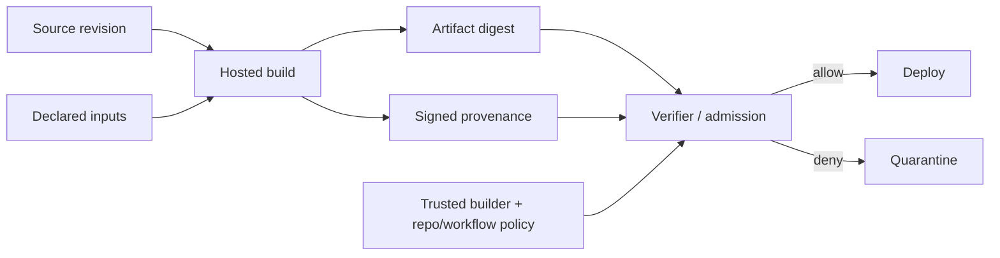

# SLSA v1.2 Provenance, Build Trust & Artifact Admission

## Konu anlatımı
Artifact hash'i byte bütünlüğünü tanımlar; artifact'ın hangi source revision'dan, hangi builder'da ve hangi süreçle üretildiğini tek başına kanıtlamaz. **Provenance**, artifact ile build süreci arasında doğrulanabilir bağ kurar.

SLSA'nın güncel onaylı v1.2 spesifikasyonu track modelini kullanır. Build Track'te L1 provenance'ın varlığını, L2 hosted build platformunun provenance'ı üretip authenticate etmesini, L3 ise build'ler arası influence ve provenance-signing secret exposure'a karşı hardened build platformunu hedefler. v1.2 Source Track'i de kapsar.

SLSA seviyesi “uygulama güvenlidir” demek değildir. Supply-chain integrity ve traceability'yi güçlendirir; kaynak kodundaki mantık açığını veya kötü niyetli fakat yetkili source change'i tek başına çözmez.

## Mental model

**Invariant:** geçerli imza yalnız provenance'ın authenticity/integrity'sini güçlendirir; verifier artifact digest, builder identity, source/workflow beklentisi ve policy'yi de kontrol etmelidir.

## İçeride ne oluyor?
- Provenance output artifact'ı cryptographic digest ile tanımlar; builder, build process ve top-level input'ları kaydeder.
- Build L1 traceability/mistake prevention sağlar; provenance eksik veya unsigned olabilir.
- Build L2 hosted platform provenance üretir ve authenticity doğrulanabilir hale gelir.
- Build L3 cross-build influence, signing-secret exposure ve persistent/cache poisoning gibi build-platform risklerine karşı daha güçlü isolation ister.
- Verification deployment/admission noktasında enforce edilmezse provenance pasif metadata'ya dönüşebilir.
- SBOM “artifact'ın içinde ne var?”, provenance “artifact nasıl ve nereden üretildi?” sorusunu cevaplar.
- Signer/builder identity trust root'tur; yalnız signature-valid kontrolü yeterli değildir.

## Mülakat soruları
1. Hash ile provenance farkı nedir?
2. SBOM neden provenance değildir?
3. Build L1/L2/L3 farkı nedir?
4. CI job değiştirilebiliyorsa provenance hangi koşulda anlamlı kalır?
5. Admission'da yalnız signature-valid kontrolü neden yetersizdir?
6. CTO olarak hangi artifact'ları önce daha yüksek assurance seviyesine taşırsın?

## Beklenen cevap seviyesi
- **Junior:** hash, signature, provenance ve SBOM'u ayırır.
- **Mid:** artifact→provenance→verification zinciri ile L1/L2/L3 farkını açıklar.
- **Senior:** builder identity, signing trust, cache poisoning ve compromised workflow risklerini tartışır.
- **Staff:** merkezi builder, policy-as-code, exception process, rollout ve audit evidence tasarlar.
- **Principal/CTO:** crown-jewel artifact'lar için assurance, developer friction, maliyet, compliance ve incident containment dengesini kurar.

## Mini alıştırma
Bir ödeme servisi container'ı için admission policy tanımla: digest provenance ile eşleşsin, builder yalnız onaylı hosted builder olsun, source repo onaylı org altında olsun ve release tag protected revision'a bağlansın. Provenance yok/invalid olduğunda prod ve dev için fail-open/fail-closed kararlarını karşılaştır.

## Proje fikri
`provenance-gate`: CI artifact + provenance üretsin; deploy öncesi verifier digest, builder ve repo/ref policy kontrol etsin. Registry artifact swap, fork build ve untrusted builder saldırılarını simüle et. Verification latency, denied reason ve exception age metriklerini tut.

## Failure modes / trade-off / production bağlantısı
“Signed = trusted” demek, signer identity'yi doğrulamamak, provenance digest'i artifact digest'iyle bağlamamak, self-hosted runner'ı hardened hosted builder ile eşdeğer saymak, SBOM'u provenance yerine kullanmak ve emergency bypass'ı süresiz bırakmak tipik hatalardır. Production'da provenance coverage, verification result/reason, unknown builder count, unsigned artifact rate, policy exception age, builder version ve admission latency izlenmelidir.

## Kaynaklar
- SLSA v1.2 specification (Approved): https://slsa.dev/spec/v1.2/
- Build Track basics: https://slsa.dev/spec/v1.2/build-track-basics
- Tracks: https://slsa.dev/spec/v1.2/tracks
- Provenance: https://slsa.dev/spec/v1.2/provenance
